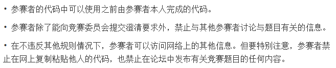
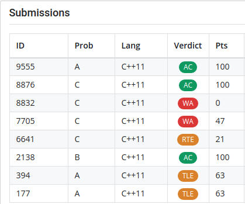

今年的APIO和别的比赛一样在线上举行，但令人震惊的是今年多了一条鬼畜的规则：

感觉这场APIO变得和CF差不多了。

既然可以用以前的代码，我今天比赛就用了自己的电脑写题，而且今天APIO的网站一直挺给力，访问都挺快的，开考前感觉十分良好。

开始考试后我就正序开题，先看了T1，很快想出一个 $O(n\max f(i)\log m）$ 的做法，但这是过不去题的，而且题目里规定了 $\sum f(i)\le 4\times 10^5$，我的做法的复杂度里却完全没有这一项，这让我有些怀疑自己的做法。

但我又往别的思路上想了一想，没想到什么别的做法，就开始写了。这东西我一遍就写对了，拿了63分。因为这题也没有别的部分分了，而我刚刚想了想别的做法有没想到，就先去做T2了。

T2我刚看完的时候以为是维护动态加边边双的每一个版本，想这不愧是APIO，有这么毒瘤的数据结构题。结果我再一想，发现我有情况漏想了，其实只要维护连通块和一些标记就可以了，根本没有边双的事，特别好写，我一下就写完过了题。

然后开始看T3，T3是个交互，看完觉得不是个简单题，就想先过了T1，但想了5分钟还是没思路，就决定还是先做T3。我一开始觉得，一个点如果有两个子树，他们的size差别不大，那好像就可以消掉好多个点，再一想，如果是3个子树，好像也可以消，但如果消不完剩下的点好像会出问题。接着我想，如果这个点是重心，是不是可以把所有点都消掉，想了一会儿，发现了一种消的办法。接着我开始想怎么求重心，本来我以为要利用随机点分治的性质，分析询问次数，后来一想，发现直接每次走重儿子好像就可以保证询问次数。

于是我就开始写，但我的代码能力现在真的不行，写出了好几个错，而且我一开始想的全部消掉的做法也有漏洞（虽然可以修锅）。

过了T3心情大好，又开始做T1，发现我当前的做法有一个单点加减1，全局询问 $max$ 的地方，我居然用了线段树来维护，真是愚蠢！去掉了一个 $\log$ 一下就过了题。

今天将近4个小时的时候AK的，主要在调试T3上花了太多时间了。考完后问了一下，wyj的T1思路上比我优秀一些，但我们学校居然没有别的AK，最高就一个过了两题的226，不是很懂。感觉我们学校又要像WC一样被暴打了。

