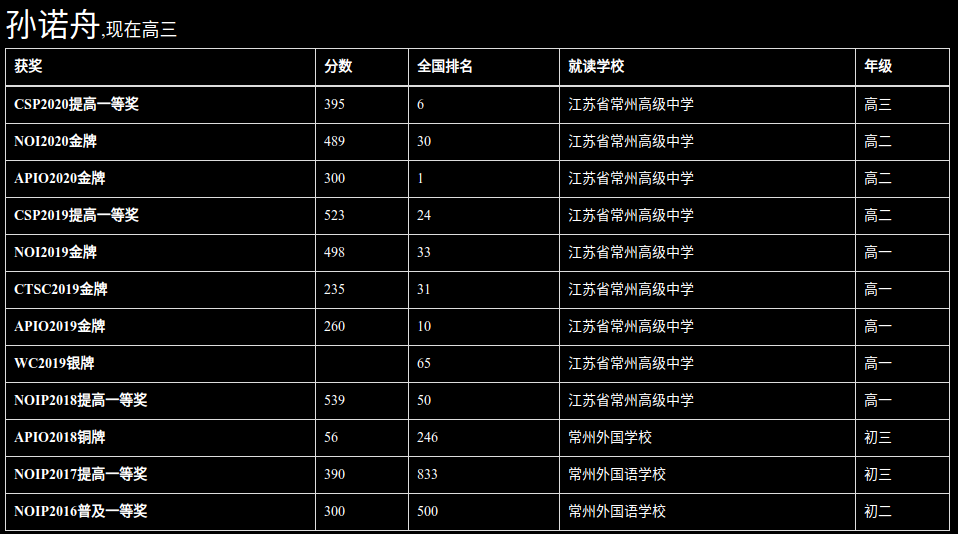

## 前言

> The end? The end.

于2020北大集训后写下本文。

本文是我整个OI生涯的回忆，记录了我所能回想起来的对我OI生涯影响重大的人和事。

<!--more-->

## 事件回忆

### 小学篇

和大多数cz市的OIer一样，我是从五年级开始接触OI的。但早在这之前，我就有过了一些简单的编程经历。在一年级时，我参加了机器人的兴趣班（这是我唯一坚持下来的兴趣班），并在学习过程中掌握了一些编程的基础（尽管是图形化界面的编程）和一些算法（尽管与OI无关），这让我对编程产生了兴趣。

小学三年级的时候，我就曾向家长提出过想学编程，但那时候并没有针对中低年级的编程培训班。直到在五年级的时候，一个班可以推荐3个人去参加OI的学习，我有幸成为了其中一员。

但当真正开始学习后，我并没有对OI产生过多的兴趣，因为单调的界面与简单的反馈显然不如机器人有意思。我当时就只在有课的时候在课上做做题，回家后根本不碰。

### 初一

虽然我在家一碰也不碰OI可以轻松地混过中级班、高级班的选拔，但要再进一步就有所困难了。我记得某次上课老师讲指针，我就完全没有听懂；讲最短路的时候我也只听懂了代码简短的dfs版spfa，而且我当时也完全不理解时间复杂度的意义。

于是，在某一次分班时，我就没有被分到最nb的那个可以去scz学习的班，而到了一个偏弱的班。由于这个班比较弱，我就暂时地体验到了吊打别人的快乐。并且，不知道是什么情况，我在这个班里第一次学习了DP，而那个强的班居然没有学习DP。我本来以为会了DP就可以在班里吊打别人（当时学OI的几乎都在教改班），结果ys直接丢给我一个合并石子，当时的我只会最最最最基础的DP，连区间DP这种东西听都没有听过，更不要说自己想出合并石子怎么做了。

初一的时候我参加了NOIP普及组的初赛，当时的我过于弱小，初赛只考了60几分。我自己觉得考得很差，以为自己没有达到省控线（用奖励名额的要求分数），就连复活赛都没有参加。

而文化课方面，我一直是个混子，从来不做课外题，成绩也相当不行，一次班级前五也没有过。

### 初二

初二我终于有了去参加NOIP普及组的资格，这是我OI生涯中的第一场正式比赛。当时我的对竞赛的流程，OI相关的政策都完全不了解。在考场上，我快速过了前三题，然后发现第四题非常难，我一点都不会。我在还剩“一个小时”的时候开始写暴力，发现怎么也写不对。到还有15分钟的时候，我就放弃了这题，准备交题。结果过了一会儿，我发现大家都还在继续写题，一看参赛证，居然还有30分钟才结束考试！！

就这样，我的第一场NOIP在失误中结束了，得分100+100+100+0=300。刚知道我的成绩有省一等奖的时候，我还挺高兴的。但自从知道如果在NOIP普及组中获得省前30，就可以在初中升高中的自主招生的获得5分的加分，我就开始后悔为什么没在考场上再发挥得好一点。

在初二的时候，我确立了要进省中创新班的目标，决定不当混子了。原因是我了解到如果进了创新班就可以和比较多的初中同学继续做同学，这对于不会社交的我十分有吸引力。在剩余的初二时间中，我一直在纠结初三到底是参加普及组还是提高组，以我的水平，普及组的省前30应该有95%的把握，而参加提高组如果拿到省一等奖就可以直接在自主招生中免笔试，但失败后的我会连5分的加分都没有。

最后，我还是决定了参加提高组，并度过了我最学的一个暑假。

在暑假里，我们班的几个准备参加提高组的同学都组团提前上了初三上半学期的课，并且参加了scz的提高组集训（省选的集训本来也打算参加的，但是去了一天就被题目劝退了）。

虽然说是很学，但当时的我（包括其他一起参加提高组的同学）在OI方面都还是挺弱的，我直到NOIP都不能熟练地使用线段树。

### 初三

期中考试前，我基本都是保持着很学的状态，甚至都开始做起了课外题。

到NOIP提高组的前一周，我们停课了一周来集训OI。在NOIP提高组的赛场上，我发挥的还算不错，把弱小的我的大部分实力都发挥了出来，并且获得了省一等奖，在本市初中生中排第4名（前面是lzq，wyj，tlt，当时的我对他们都不是很了解）。

在获得了省一等奖后，我就又恢复了以前的混子生活，课外题也不做了。但奇怪的是，我的成绩并没有因此下降，我擅长的3门理科也都在随后的大考中拿过第一（可惜文科太差），看来做课外题的作用并不大。初三上半学期应该是我整个初中最快乐的时间，既没有了升学压力，文化课成绩也在蒸蒸日上，一切看上去都在向好的方向发展。

到下半学期的新课学完后，我就和其他拿到省一等奖的同学一起去了scz学习OI了，这段时间是我对OI最感兴趣的一段时间。当时的我很弱，所以训练题中经常遇到连算法都不会的情况，每次遇到这种情况，我都会直接咕掉比赛把算法学了。因此在这段时间，我补漏了一些基础算法。

接下来遇到的赛事分别有省队选拔和APIO，我都打了一个挺差的成绩（水平不够的原因），省选是省40名左右，APIO是铜牌。当时tlt貌似准备退役了，而lzq和wyj则继续保持着对我的优势，都在省队选拔中暴打了我。可能是因为当时的政策还比较好，我并没有认为我的成绩很差。

接下来的训练，学长们都开始准备NOI了，我和lzq有幸可以和大佬一起训练。当时我的目标就是打败lzq，但这十分困难，于是我就只好接受接连垫底的命运。

暑假前的清华夏令营让我深刻感受到了我与其他选手的差距。当时我和zc，wyj都有幸参加，我的成绩是其中最差的，而wyj甚至都签到了约。 但这次比赛也让我对清华产生了憧憬。

初三升高一的暑假对我OI水平的提升来说是有着重大意义的。在这个暑假中，我和wyj，zc，qyl，yjq去往了上海交大进行为期一个月的训练，而其他人则留在本校训练。训练期间由于没有人管，整体还是比较颓的，宅在宿舍的时间也越来越多，但在这段时间我对OI还是一直保有较高兴趣的，也自行学习了一部分算法。也是在这个时候，我开始尝试使用了Linux。在这个暑假结束时，我在本届选手中的排名冲到了第一（尽管我觉得我水平没有提升多少）。

暑假中还有一件比较重要的事就是NOIonline了，当时我第一天获得了还算可以的分数，但第二天最简单的题爆零导致总分很低。在当时的政策下，D类选手只要拿到银牌，甚至都有去交大的机会。所以我面对着这样一个成绩，依然觉得可以接受。

### 高一上

从这个时候开始，我的水平相较其他同届本校选手有了不小的优势。当时训练的时候教练为了鼓励大家，会给打得好的选手发一些奖金，我经常是拿奖金最多的那个。也是从这个时候开始，我不断地从训练的反馈中获得快乐，汲取动力，开始有意地想让自己变得更强。

高一上应该是我刷题最勤奋的时候了，当时我天天和wyj、ys比每天、每月谁做的题多。

江苏的集训队集训应该是使我水平提升的重要事件之一。参加集训队集训的选手有当年的集训队员和各个学校的强手，本校参加的选手有我和lzq，以及上一届的大佬。参加这个训练时，我给自己定的目标就是打败lzq，并没有对自己有过高的期望。事实上，训练的结果大大地出乎了我的意料：我发挥得很好，不仅圆满地完成了我的目标，还冲到过第3名。要知道，这场比赛包含着几乎全部的在下一次省选中有竞争力的选手。我的排名一般在10~20之间，江苏省队有14人，并且集训队员中会有相当一部分不参加下一次选拔，也就是说，我这次还是有不小的希望进入省队的。除了给予了我自信，这次集训也让我学到了不少以前听都没听过的算法，进一步扩大了我对于其他本届选手的优势。

竞赛的路也不是一帆风顺，就在NOIP前夕，xyx学长通过某些渠道得知自招会有改动，以前的一本约可能就没了。我一开始还是将信将疑的，但随着时间的推移，越来越多的事情说明着它的真实性。在当时，大部分竞赛生的出路，都是靠着降分的协议，通过自主招生升学。如果这些优惠不在，那大部分的升学之路可能就被切断了。这样的消息对我可以说是一记重击，让我原本欢乐的竞赛之路充满了压力。

随后就是[NOIP2018](https://sunnuozhou.github.io/2020/01/08/noip2018%E6%B8%B8%E8%AE%B0/)的时间，我在全省的排名非常靠前，有着这么好的分数，我肯定是不会选择退役回班的。但其他同届选手就没有这么好的运气了，zcy和qyl考得还行，而其他人就都不太行。

接下来一段时间的训练，我这一届最开始只有我一个人停课训练，在这段时间，我开始逐渐和上一届的大佬熟悉起来。后来在确认了THUWC的名额后，zcy，qyl，wyj也陆续停课了。当时政策尚不明朗，大家都是普遍认为一本线的优惠可能没了，但降60分的优惠可能还有。于是当时我的目标就是在THUWC上拿到最优惠的政策。

这段时间的训练是第一次开始使用Ubuntu环境写题，不过由于我已经有了一些使用Ubuntu的经验，适应起来并不困难。这段时间也是第一次使用UOJ来评测，当时xyx和dwh鼓捣了很久才让这个UOJ可用（虽然现在又没人用了），而我什么都没有学会，到现在还对搭建UOJ完全不了解。

在这段时间，我的水平也有不少的提升，每次比赛的排名已经可以混杂在上一届的大佬中了，甚至有的时候还会有某一题只有我一个人过。

这次THUWC与以前相比多了一个day2+，虽说这个day2+实际好像没有产生太大影响，但第一次有这种东西，谁也不知道考些什么，让我在考前多添了一份紧张。这次THUWC我整体成绩还是挺低的，总分比上一届的hlh低了将近100分，但可能是NOIP分数和年级的加持，我取得了THUWC的一等奖（即最优惠协议），而hlh没有。

这次面试也给我留下了挺深的印象，在这之前我也有过一些面试，但和这个的正式程度和严肃程度根本不在一个级别上。由于我的英语自从进了高中就没有好好学，那次面试的读英文和翻译英文部分我就做得很差，但面试的数学题（$2^n-1$ 是7的倍数的条件）我还是很快地做出来了。自我感觉面试的表现还不错。

接着就是WC2019了，对于这段时间我并没有什么深刻的印象，只记得在这场比赛中获得了我OI生涯中唯一一块银牌。

### 高一下

从下半学期开始，就要面对NOIP$\to$省选$\to$NOI的完整道路了。信息学竞赛的省选有三分之一限制（一个学校的名额不能超过省名额的三分之一，这一年限制为4），由于上一届学长们过于强大（可以说是scz有史以来最强的一届），我如果想要进省队必须要挤掉两个学长（这次我们学校NOIP考得非常好，导致我NOIP并没有什么优势），因此我当时并没有觉得自己很有进省队的希望。

在[第一场省选](https://sunnuozhou.github.io/2020/01/08/JSOI2019-Round1%E6%B8%B8%E8%AE%B0/)中，我第一天有一题因为漏清零了一个数组，比预期得分低了70分；第二天也发挥的不是很好，两道在我能力范围内的题一题也没有过，甚至还因为数组开小少了一些分数。在这场比赛后，我，liji不在省队线里，liji也因此回班上了几天的文化课。当时我也受了挺大打击，连着挺长一段时间训练都不在状态。

在[第二场省选](https://sunnuozhou.github.io/2020/01/08/JSOI2019-Round2%E6%B8%B8%E8%AE%B0/)中，我可以说是发挥地很完美，直接翻进了省队。这次比赛我在全省正式选手中的排名是第1名，这给了我很多自信。在这场比赛后，我在省队里排到了第5名，甚至到了bly的前面。

但从这段时间开始，我的自主刷题就明显有了减少，每天基本上就只做做上午训练题中没做出来的题。从那时候开始，我自主学习新算法的动力就有所减小了，让我坚持OI的动力也更多的变成了赛场上战胜别人的快感。

很快CTS和APIO就来了，当时因为APIO是否举办不能确定，而CCF又不给退费，有一些和我同届的选手就没有报名APIO，CTS也因为大家NOIP的分数普遍不高而可以参加的人不多。先举行的是CTS，当时我跟liji住的是一个房间，同居一室的机会让我和上一届大佬加深了了解。

这一场[CTS](https://sunnuozhou.github.io/2020/01/08/CTS2019%E6%B8%B8%E8%AE%B0/)的题目风格非常奇怪，有4个计数题，一个题答题和一个计算几何题。本来在赛前xyx说CTS和NOI题目类型、难度差不多，可以把CTS当成NOI的模拟赛，结果一上场我就自闭了，两天一共A了0题，要不是我本地WA飞的程序在某一题拿了80分，我甚至连Au都没有。

与CTS相比，我在[APIO](https://sunnuozhou.github.io/2020/01/08/APIO2019%E6%B8%B8%E8%AE%B0/)上的发挥就好得多。这块亚太地区的金牌还是给了我很多精神动力的，当时ob也安慰我说有亚太地区的金牌香港大学总是能去的。从这个时候开始，我就越来越坚信我是有冲击集训队的水平的，并也在这是时候把目标定在了集训队。

接下来一段时间的训练，我还是和以前一样不怎么自主做题。而且和以前不一样的是，那段时间我回去之后也颓得很，就算有的时候想做一些学习相关的东西也没办法集中精力。我记得在我进省队之前，我想得还是今年进不了省队也问题不大，但进了省队后，我似乎已经有点接受不了不进集训队的结果了。由于我参加的全国性比赛并不多，我也不清楚自己水平到底怎么样，虽然xyx把进集训队说得很简单，但我还是越来越慌。在学校和其他同学在一起的时候还好，但到家只有我一个人的时候我就有一些不敢面对这些问题，并通过逃避学习来逃避它。当时我的几乎所有精力都被用在了这种自我的怀疑上，如果不是这样的政策变动，我投入在OI学习上的时间和精力可能会更多一些。

期间还有一段时间，除了hlh以外上一届选手都去了雅礼集训，于是当时小机房就没什么人了。可能因为在学校的学习时间，做与学习不相关的事情也会让我感受到煎熬，我并没有在这段学校没人的时间像在家里一样颓。由于那个时候没有人组织训练，我就做了一部分上一年的集训队作业。

这样的状态持续了一段时间，就到[NOI](https://sunnuozhou.github.io/2020/01/08/NOI2019%E6%B8%B8%E8%AE%B0/)了。作为一个对我来说是升学性质的考试，我的紧张程度自然是不言而喻。我第一天考了一个不算高也不算低的成绩，既不能让我喜笑颜开，也不能让我感到痛苦和绝望，现在回想起来，我也不知道我是怀着怎么样的心情度过那个没有考试的一天的。非常幸运的是，我第二天考得也不错，最终进入了集训队。当时和我同宿舍的是zhf和dy，由于dy经常神出鬼没，所以我没有和他有过多的交流。与zhf交流过一番后，我深感他的强大，并在后续一段时间都是以他为竞争对手的。

这个暑假的后续时间，我就基本都在放飞自我了。同时我也出了我OI生涯中第二套完全原创的高质量（以我的出题水平为参照）题，给lzq，wyj他们做。（第一套是在初升高的暑假在交大出的，但因为难度过难收效不好）

### 高二上

在上个赛季末尾的训练，我就已经待在小机房了。这个赛季我自然也是待在小机房里，然而与我同届的其他选手都没有来小机房训练，导致我经常要在5机房和小机房两边反复横跳。一般情况下，我都是上午他们训练的时候待在小机房，下午就去5机房，因为刚进了集训队，还保持着比较轻松的状态，我下午就基本不怎么学习，都在看他们干事情（学习或颓废）。

与此同时，我也加入了上一届学长打羽毛球的队伍，上个学期我也和他们去打过一次，但由于缺乏运动，打了一两次就肩膀酸痛，就没有坚持。由于平时不怎么运动，我明显在去打球的人中是最菜的那个，但我依然玩得不亦乐乎。

虽然有时我也会和其他人一起训练，但总而言之那段时间我还是过得比较轻松悠闲的。

接下来事情就慢慢多了起来，首先是我开始学习英语了，由于从进高中开始就没有学的缘故（除了几节大家一起上的补课），我的英语底子是很差的。我记得当时机构的老师给我分级测词汇量的时候，我很大一部分单词都不认识，可惜当时的测试并没有留下具体词汇量的数据，不能和现在进行一个对比。

不久集训队作业也布置下来了，可惜当时我并没有对每道题都深入思考，有不少题都是想一会儿不会做就看题解了，导致这个作业没有提升太多我的水平。记得当时作业一出来，我发现我几乎一题都没有做过，而xyx已经做过一半了（指[atcoder](http://atcoder.jp/)）。

这个学期，我还参加了我高中唯一参加的ACM比赛，当时是和xyx，liji组队的，队友非常强大，让我十分担心我会在赛场上打出负贡献。在网络赛中，我也经常发生看错题然后暴毙的事情，但由于网络赛是一人一机，至少对队友没有太大影响。在我印象中，我在所有比赛中最大的贡献是在试机赛里想出一个搜索的优化，用搜索过了一个状压DP题。

由于种种原因，今年的NOIP“变成”了CSP-S，在这场[CSP-S 2019](https://sunnuozhou.github.io/2020/01/08/CSP2019%E6%B8%B8%E8%AE%B0/)中，我侥幸获得了个好成绩，甚至比xyx还要高。这次的题目画风很奇怪，day1在两道简单题后放了一个大难题，我把大难题当成是简单贪心，结果算法挂了无数次，所幸最后这题还拿到了35分的成绩（不算低了）。day2是3个中等难度题，而且并没有那种难度递增的感觉，甚至wyj，lzq他们都没有切掉T1。我在考场上也犯了不少错误，导致我T2只写了88分。非常幸运的是，T2是一个卡常题，不少写100分的人最终也没有100，这让我的名次好看了不少。

当时jyg和wyj都说下一届的人很强，但我不这么认为，并且和我预想的一样，下一届的CSP-S普遍不高。这一点，也让我们这届的其他人进省队的概率上升了不少。

为了应对北大集训，我，wyj和liji去参加了学军集训（xyx和dwh去日本参加某活动了，所以xyx中途才加入集训）。当时我训练的成绩也只能说是中规中矩，没有那一次是考得特别好的。接着的北大集训我也发挥得不行，一道计算几何和一道单位根反演直接拉开了我和别人的距离。不过这次北大集训我本来就没给自己设立什么目标，又有考炸了的liji帮我垫底，最终成绩的不好反倒没有对我产生多大打击。出人意料的是，bly作为一个已经退役的OIer，居然考得相当好，甚至都进了候选队线，吊打了我。

紧接着北大集训又是合格考，把这些事都弄完就已经到一月份了。当时小机房里xyx在一边训练OI（准备论文），一边学习着物理；dwh和bly都在刻苦地学习物理，数学和英语；而liji则在鼓捣一些环境配置相关的东西——他当时在学Python。我记得在他解决完一个问题的时候，xyx建议他可以写博客把这些东西记录下来，这样换电脑的时候就可以方便一些了。liji没有听xyx的话，但我却被打动了，因为我觉得当时我在Ubuntu下自己摸索出来的一些问题的解决方法我可能已经忘了80%了。正巧前不久xyx把他的博客搬到了本地，并且他搭建博客的方法看上去就比wyj弄的方法要简单，于是我就和他一样，使用[hexo](https://hexo.io/zh-cn/docs/)搭了博客，并写了我的第一篇文章[博客搭建](https://sunnuozhou.github.io/2020/01/07/hexo%E5%AE%89%E8%A3%85/)。

### 高二下

随后就是疫情时期了，由于疫情导致寒假和高二下粘合在了一起，我就把寒假部分也归入这一部分了。

由于疫情的影响，本来在2月份的WC2020没了，集训队作业的DDL也被无限延长，记得在刚发作业的时候，我还能一天3~4题，到了这个时候我变成了2天一题，勉勉强强地算是在原定的DDL写完了要求的量。

在寒假里，我基本没有碰OI，最开始还可以做到每天花个一两个小时学学物理，到后面这个时间也是越来越少。每天待在床上的时间越来越多，人也变得慵懒起来。现在回想起来，值得庆幸的是在那段时间我还可以坚持做到每天背英语，这让我在现在拥有还算充足的词汇量。

由于进了集训队后，我的大部分学习计划都是我自己排的，所以除了主观上变颓了以外，疫情对我的学习安排并没有太大的影响。但对其他同届选手就不一样了，那些尚未退役的选手本来大都期望于在NOI上进入集训队，而这一年是他们最后的机会了。疫情当前，连省选，NOI是否可以存在都不能确定，我觉得在这种情况下要做到摒弃杂念专心OI是件挺困难的事。

在寒假前夕，ob让我校的几个集训队编写《OI自学指南》，在寒假里ob又让我们编写进阶内容，而我分到的是OI相关方面的线性代数。可能是这个原因，在寒假中我自学BM和单纯形法，这两个算法我当时都花了很久才把它们想懂，但不同的是BM的细节我都记住了，并且也在训练中实际用过，而单纯形法我在学之后就一次也没有在比赛中用到过。

终于到了开学的时间，我还挺向往可以去学校的，但由于学校的疫情防控，我每隔一个月去上海打一次脱敏针后，就要在家里隔离半个月，这让我很是不爽。同样是由于疫情原因，大机房还不能拿来给训练用，所以在机房的就只有几个集训队。

等可以开始省队训练，离省选的时间已经不长了，过了一个寒假，一部分高一的选手水平明显有了提高，训练的成绩基本比较靠前，这就让我比较担心和我同届的选手了。虽然我有时会去给他们讲一些我觉得有用的技巧，但从最终结果上看下来对他们的水平提升的帮助并不大。

[这次省选](https://sunnuozhou.github.io/2020/06/21/2020-NOI%E7%9C%81%E9%98%9F%E9%80%89%E6%8B%94%E6%B8%B8%E8%AE%B0/)是CCF组织的多省联考，题目风格与前几年大不相同，总体难度简单了很多。我虽然没有在难题上拿到很高的分数，但至少简单题都算是没有失误。由于其他高水平的选手都发挥的不是很好，我机缘巧合地成为了这一年的江苏队长（很明显我的水平是远远没有强省队长的水平的）。而其他与我同届的选手就都发挥的不太行了，Day1T2这道简单的数学题除我以外只有wyj过了，而wyj也在Day2T1这道简单题上出现了严重失误。最终省选的结果是，wyj靠着NOIP的优势进了省队，srf靠着省选的优秀发挥进了省队，队线的边缘挤了4个人，pcf和csl进队了，lzq拿了C类名额，而czy就回班了。这次省选就直接宣判了不少人OI生涯的结束，在现在的政策下，竞赛的残酷就显现的尤为彻底。

疫情得到控制后，许多事情的时间定了下来，WC在暑假举办，APIO紧随其后，NOI也有了音讯。[WC2020](https://sunnuozhou.github.io/2020/08/07/WC2020%E6%B8%B8%E8%AE%B0/)和[APIO2020](https://sunnuozhou.github.io/2020/08/15/APIO2020%E6%B8%B8%E8%AE%B0/)都是网络赛，我发挥得也算是可以。不过让我没想到的是，我们学校别的人居然打得都很差。我认为有冲击集训队水平的srf也在两场比赛中打出了出奇的低的成绩。有点可惜的是，WC中集训队选手不能拿奖牌，这让我并不能补齐NOI系列赛事中的每一块金牌。

接下来就是这学期最重要的内容：[NOI2020](https://sunnuozhou.github.io/2020/08/19/NOI2020%E6%B8%B8%E8%AE%B0/)了。由于疫情原因，NOI同时承担了选拔国家队的功能，因此xyx，liji，bly也参加了。在第一天考试前，我的心情还是比较轻松的，毕竟与其他选手不同，我并不依赖于这次比赛所能提供的升学机会。然而，我的内心远没有我想象中的那么强大，在得知我的成绩甚至连集训队线都没有达到时，我的心态瞬间变得很崩，开始恐惧进不了集训队的结果。在第二天我拿完会拿的分发现200都上不了的时候，我都觉得我这次真要进不了集训队了，开始回顾OI生涯了，结果由于其他人day2打得也不好，我的day2成绩反而不算低。

lzq靠着第一天的高超乱搞技巧进入集训队；srf第一天成绩也不错，但由于第二天的超低分出了集训队；xyx第一天拿了个高分，但第二天的分数在集训队里并不算高，因此与他进入国家队的目标失之交臂。其他人不知道为什么都考得很低，虽然也是银牌，但和srf的银牌分数差了一大截。

### 高三

虽然我不需要参加高考，但是到了高三，一切都在警示着我距离大学只有一年了。为了获得足以在大学生存下去的知识，我必须要兼顾其他学科，不能光顾着OI了。因此，在高三中，我做得OI相关的事情其实并不多，本来我还梦想着在WC中拿了令人满意的成绩，没想到在北大集训就退役了。

这个高三我出了不少题，可能是我知道自己离退役不远了，这几次出题我出得都挺认真的。给多校的题的初中组的题从反馈看来也是挺有区分度的，[集训队的交流题](https://loj.ac/p/3403)也是我少有的算法部分完全原创的难题（我认为），可以说这也算是我高三OI部分中我最满意的部分了。

集训队作业中，我觉得我做[GOMOKU](https://sunnuozhou.github.io/2020/11/12/ACM-ICPC-Northeastern-European-Regional-Contest-2014-G%E9%A2%98/)这题的经历也挺有意思，在做完这题后，我还把我的程序加强了一下。现在，它也被wyj做成了[小游戏](https://2o181o28.github.io/gomoku/)中的AI丢到了他的博客上。

这次的[CSP](https://sunnuozhou.github.io/2020/11/08/CSP2020%E6%B8%B8%E8%AE%B0/)我去参加了，但当时我基本没什么考试状态，做题的时候也已经对自己的分数没什么要求了，就当是娱乐赛打的。而后续的NOIP我就没有参加。

[北大集训](https://sunnuozhou.github.io/2020/12/07/2020%E5%8C%97%E5%A4%A7%E9%9B%86%E8%AE%AD%E6%B8%B8%E8%AE%B0/)前几天，我一直都感觉到压力很大，但真到了比赛的时候，我心态反而好了很多。虽然我考得不行，但我并没有想我预想的一样感到很难受。

在北大集训后，我的OI生涯就结束了，一切都发生得非常平静。但仔细思考，即使我在北大集训进入了前30名，我的OI生涯真的可以继续下去吗？

## 人物回忆

### 徐翊轩

回想和OI相关的学长，我第一个想到的就是徐翊轩。作为一个陪伴了我们很久的学长，徐翊轩拥有着超强的OI水平。可以说，在我熟悉的人中，再找一个和他同级别的都很难。

进入高中之后，徐翊轩的带领对我OI水平的提升有着巨大的帮助。当时的我不用担心任何困扰我的OI问题得不到解答，也不用担心迷失前进的方向。

而且在我的印象里，徐翊轩从来没有让我们感受到消极、负面的情绪，一直都是积极地带领着大家。就连在NOI2020中，他没有如愿进入为之奋斗两年的国家队时，他也依然保持着积极的一面。

### 王宇骥

王宇骥是在初升高阶段给我帮助最大的学长。那个时候刚到scz，和学长不是非常熟悉，与有着强大气场的xyx不同，王宇骥比较憨厚的性格更让人有亲和感，所以那段时间我有OI上的问题基本都是问的他。

王宇骥可以说是刻苦用功的典型代表，刷过的题数也是我完全不能比的。而且在NOI2019失利后，他很快就回到了高考的状态，成绩一直名列前茅，最终也成功进入了清华，这对我来说恐怕是难以做到的。

### 李骥

超级聪明的学长，并且在各个方面都懂不少东西。平时经常颓废，并吸引我入了好多游戏的坑。

### 魏祎隽

初次了解魏祎隽是在APIO2018的时候，从那个时候起，我就一直感觉他是个与众不同的人：在数学上有较高的直觉，对一些奇怪的东西有兴趣（如语言学，昆虫，将棋），对某些方面以外的不擅长（如贪心算法）。通过和魏祎隽的交流，我了解到许多我本来不会去了解的东西。如果不是我看他用Ubuntu并自己装了一个，我可能到现在都只会用dev-c++编程，更别提其他稀奇古怪的黑科技了。

在NOI2020失利回班后的半个学期内，他就已经基本达到没有停课的ys的水平了。（而且在高三，甚至每天学习完后还有时间颓废）

### 李泽清

李泽清是我这一届中除我以外的唯一集训队，同时也是我刚进入高中时竞争的对象。和wyj一样，李泽清在OI上也有着“偏科”的现象，并且与大多数OIer不同的是，他在文化课中擅长的方面更偏向文科，而非理科。

也许和“偏文”有关，李泽清是一个重感情的人，非常乐于助人，对于别人的请求总是全力相助。

### 蒋一歌

从小学就认识的一起学OI的伙伴，对各种活动一向都非常热情，是我熟悉的人中数一数二的社交达人。高二冲省队的时候，我挺关注蒋一歌的成绩的，也经常督促他学习。但最后因为各种原因功亏一篑，没能进入省队。蒋一歌在拿了一个D类银牌后也就回归文化课了，虽然成绩没有像wyj一样上去的很快，但我还是可以看到蒋一歌有学习的计划和方向的。

### 张成禹

从小学到高中的同学，在数学方面一直很nb，OI上也经常想出别人想不出的方法。在高中的时候，张成禹的OI和文化课都受了一些挫折，但好在现在已经稳住了心态，文化课成绩开始恢复了。

### 颜树

刻苦用功的典范，在高一时经常和我，wyj竞争过题的数量。在OI上失利后果断文化课，并取得不错的成绩。同时，颜树也是一个很可靠的人，由于在高二分班的时候，和我比较熟的zcy，zc都离开了10班，基本上每次有班级里的事情我都找的是颜树。

### 张弛

散步达人，可以出现在学校的任何地方。心态一直很乐观，回班文化课后也成绩不错。

### 张好风

因NOI同宿舍而熟悉的外校神仙，高一的时候一直压我一头，因此我一直将他作为竞争对手。现在去北大读了预科（并且因此也没进候选队）。

## 一些感想

### 学习OI的动力

其实，在小学乃至前半部分的初中，我都没怎么把时间放在OI上。在小学，接触编程是因为好奇，保持上课是因为我在课上的发挥比较好，并不会让我对编程反感。前半部分的初中，我OI的成绩并不算好看，去坚持上课的原因是有更多时间和同学一起交流、玩耍。

等我真正想在OI上下功夫，是从我NOIP普及组拿了300分开始的，一是我当时意识到我在OI方面还是有一些天赋的，二是我发现OI是一条进入scz创新班的“捷径”。而真正花时间上去，又等到了初二升初三的暑假，虽说当时开始努力的动机包含了一些功利的因素，但在训练时我完全没有这种想法，只是和同学一起度过一个充实而快乐的暑假罢了。

在NOIP提高组过后，我更加确定了我有学习OI的天赋（尽管现在我并不认为提高组的成绩可以看出什么），接下来一段时间我人在学校学习文化课，一部分心思却已经飘到OI上了。从NOIP2017之后一年到两年，我开始因为对OI的兴趣和热爱而学习，尤其是初三提前到scz的那段时间，我真的可以从OI的学习中获得很多乐趣。当然，不可否认的是，我之所以可以放心大胆地为自己的兴趣而学习，当时对OI乃至整个竞赛的友好政策是不可忽略的。

因为兴趣而钻研OI的同时，其他学习OI的动力也会慢慢产生。在2018年，我是绝对没有把目标定在集训队过的，之所以我可以在政策变得糟糕的时候依然没有回班文化课，而选择坚持停课训练，主要是因为我不希望我在NOIP2018中优秀的表现就这么被浪费，并且我也希望我多年学习OI的付出可以换到一些对升学有帮助的东西。在高一的上半学期，我保持停课的时候还是比较有自信回班就可以把文化课搞好的，但到NOI前那段时间其实就没什么自信了，因此当时的心态也不是很好。

高一进了集训队，可以说让我稳住了心态，如果没进集训队，我多半会打算在下一次NOI之前一直回班，直到NOI前停课一段时间，然后在尝试一次吧。虽然一直停课想要像我现在这样拿到江苏队长不太可能，但进个省队的自信我还是有的。现在回想起来，其实我近一年在OI上水平的增长微乎其微。

作为一个新晋的集训队员，一些热情还是保有着的，因此直到北大集训前学习OI的动机没什么好说的，但是，我是为什么在北大集训之后没有退役呢？我在北大集训前其实也多次感到自己水平不行，表达过想要退役的想法。当时我记得xyx问过我，如果我下一年进了候选队我会不会感到开心，我想我当然是会的，但这就可以作为我继续学习OI的动力吗？

其实我现在也不太清楚，但我认为突如其来的一场疫情对我的决定还是一定影响的。正如我在事件回忆里描述的那样，我在寒假中是很颓的，没有那种学习氛围，我觉得我是很难鼓起勇气去重返文化课的。

今年，候选队的名额扩展到了30个，但我却出乎意料地没有进队。我本以为我会为没有进候选队的事难过很久，但真到这事发生的时候，我发现我已经放下它了。我也说不清我为什么对此并不在意，但至少这不是一件坏事。

### OI的天赋

经历了8年OI学习，我自认为对OI有一定了解。

我认为，天赋是决定一个人OI水平的高度的。因此，缺少的天赋很难用努力弥补的。努力可以提升成长的速度，在有着适合的训练环境，内在动力和教学资源时，OI水平可能会在机缘巧合之下快速提高，但最终也会在天赋所决定的高度停下来，或者说慢下来。我认为这也是我在高二一年内水平提升不大的原因。并且这个水平增长莫名其妙慢下来的现象在我认识的人中并不少见。并且，天赋是不能简单判断的，每个人的“发力点”是不一样的，变强的速度和持续的时间也是不一样的。在初中的时候，我曾判断我有不错的OI天赋，但现在我觉得其根据（NOIP的成绩）是相当不靠谱的。

简单地概括一下我的观点：

- 一个人OI的水平上限会被天赋大幅度的限制。

- 大部分人的OI天赋难以简单判断。

这个观点也是我对于OI政策看法的一个依据。

### OI的政策

作为一个在初高中都经历了政策变动的OIer，我对关于OI的政策还是有一些想法的。

在初三我取得NOIP一等奖后的一段时间，曾有小道消息称初升高的保送会取消，但当时我是并没有因此而慌张的，还是一如既往地该干什么干什么。毕竟，当时的我除了多一个或许可以令我保送的奖项外，和普通的学生没什么区别，文化课丝毫不落。结合身边以及自身的例子，我发现，文化课的学习对心态的影响还是很大的，即使是全力冲击OI，良好的文化课状态也可以让人不容易陷入焦虑恐慌之中。

焦虑与恐慌和政策的变动脱不开关系，如果说初升高还只是有点风声，那高中时政策的变化可是动真格的。虽然说着要求竞赛不与升学挂钩，但在中国的大环境下，即使满腔热血充斥着对竞赛的热爱，没有升学上的优势是真的没人敢往上冲的。竞赛对升学的帮助给予那些热爱竞赛的人的是一份安心，让他们在前进的道路上遇到更小的，来自现实的阻力。以前的政策中，竞赛对于升学的帮助是阶梯状的，每在竞赛中跨出一步，就在升学中收获一分。而现在，只有每个省十几人的省队，承载着借此升学的希望。高考顶部的上升空间有限，而阶梯状的升学帮助会给原本拼搏高考的学生多了一个“维度”的努力方向，只要在竞赛上努力的收益大于在高考上努力的收益，来自高考的竞争就会不断蔓延。如果不进行有效的阻止，内卷也将大规模地出现在竞赛中。有天赋的要求作为限制，在OI顶端这种恶性竞争导致的不良影响可能比较有限，但在对“省一”的竞争中，内卷会产生多大的影响就不得而知了。这种一刀切的新政策，对那些满腔热血的选手确实造成了重大的打击，但也的确阻止了竞争的蔓延。

那些未入泥潭的选手，可以暂时收敛起对竞赛的热忱，回归高考。但对于那些一只脚已经在泥潭的选手就不是那么幸运了。身处其中，就不容易做出理性的思考。更何况，和我同届的选手在知道具体政策时高二已经过了一半了，虽说早有传文，但政策真正确定之前大家总还是保有着希望，但往往伴随希望的就是失望。恐怕身处在暴风中心的这几届竞赛生，就是这次政策改动最大的受害者吧。

关于以后OIer的前途，我认为大规模停课训练的时代已经过去了，难以判断的天赋和仅仅两次的NOI机会，让大部分人都难以打包票说可以进入集训队。毕竟在现在的政策中，50名和51名，银牌和铜牌，就是天壤之别。对于停课选手来说，没有一个优秀的文化课成绩，在这种政策下我觉得是很难保持正常的心态的。

## 其他

其他一些退役选手的生涯回忆：

- [wyj的生涯回忆](https://2o181o28.github.io/2020/08/20/%E7%94%9F%E6%B6%AF%E5%9B%9E%E5%BF%86/)

- [lzq的退役杂谈](https://www.luogu.com.cn/blog/ReseeCher/tui-yi-za-tan-wo-yu-oi)

- [jyg的退役杂谈](https://www.luogu.com.cn/blog/Kiwi-An/guan-yu-oi-di-yi-suo-hua-yi-suo-ren-yi-suo-shi)

- [xyx的OI生涯回忆录](https://blog.csdn.net/qq_39972971/article/details/108307428)