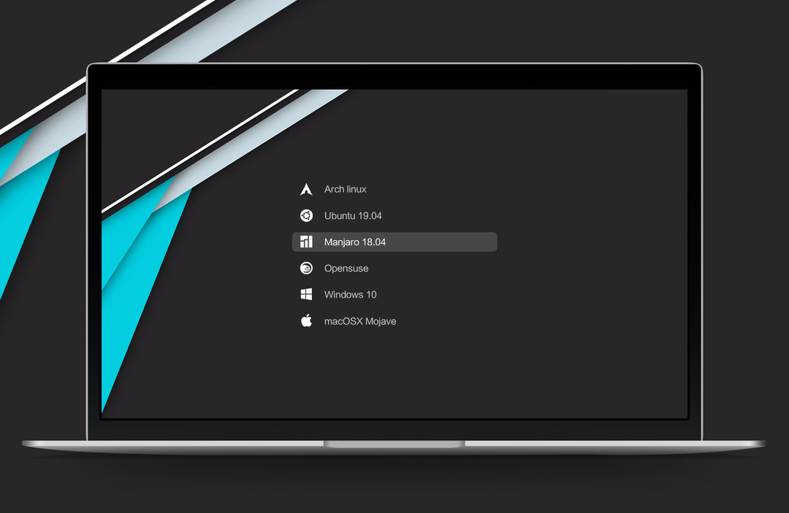
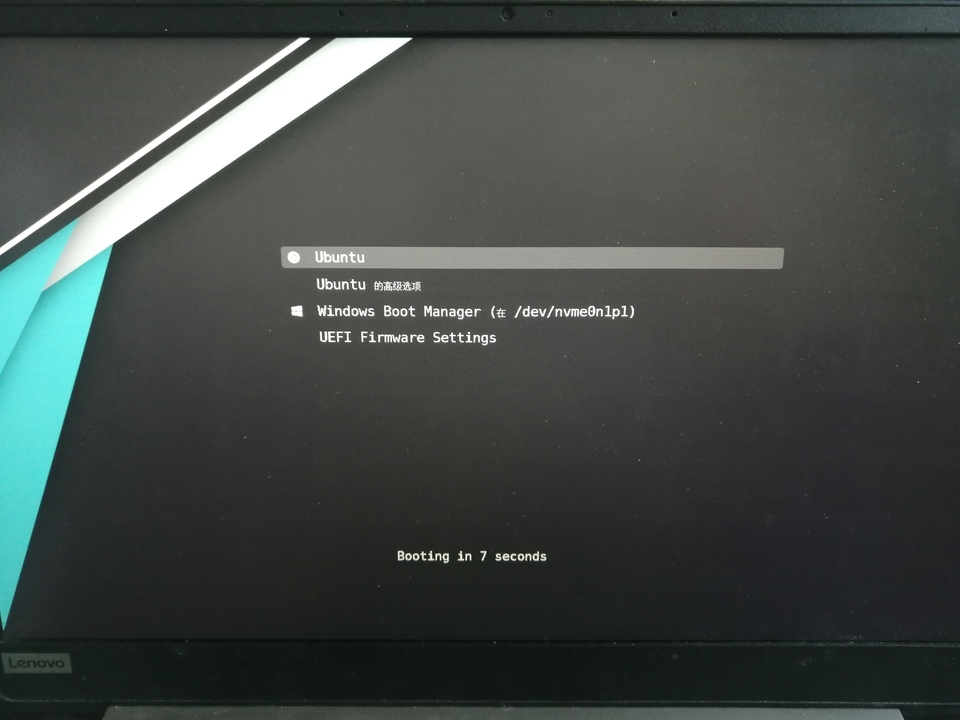

grub界面丑也不是一天两天了，字体又小又丑，纯黑的界面上就一个白框框。以前我嫌烦一直没搞，今天突然心血来潮就把这事做了。

<!--more-->

## 主题

首先要做的就是换个主题，我就到[某个网站](https://www.gnome-look.org/browse/cat/109/ord/latest/)上随便下了一个最高分的[theme-vimix主题](https://www.gnome-look.org/p/1009236/)。大概长这样：



然后就是非常常规地解压+安装。

但这时出了一点小问题，我找到的教程上主题文件夹的路径都是`/boot/grub/...`，而我的是`/usr/share/grub/theme/...`，但问题不大。

接着我直接重启看一下效果，发现主题果然改了，但字体一如既往的丑。（这次忘记截图了）

## 字体

打开主题的配置文件`/usr/share/grub/themes/Vimix/theme.txt`，然后搜索里面的字体（font），把它们都替换成想要的字体。

但这个时候出现了一些问题，这里面所有字体的选项都是填的字体名字，主题文件夹下虽然已经有若干字体了，但我并不知道它们叫什么。

于是我只能学着网上教程说的，自己生成字体：

```bash
sudo grub-mkfont -v --output=/usr/share/grub/themes/Vimix/DejaVuSansMono24.pf2 --size=24 /usr/share/fonts/truetype/dejavu/DejaVuSansMono.ttf 
```

其中，`-v`选项可以在终端中输出字体的名字。

同时，我还在`/etc/default/grub`里把分辨率改成了 $1920\times 1080$，不知道有什么效果。

最后，执行`sudo update-grub`，就可以重启了。

效果如下：



## 时限

还有一个困扰我良久的问题就是这个界面的时限只有10s，一不小心就错过了，于是我就顺手在`/etc/default/grub`里把时限改成了30s。

顺手还把`/etc/systemd/system.conf`里关于`timeout`的时限也改了，解决了有时关机慢的问题。