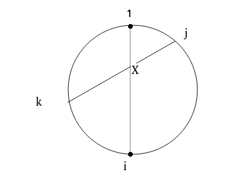

## Pairing Points

### 题目大意

在一个圆上顺序排列着$2N$个点，保证任意3个点对的连线不交于一点。求有多少中将$2N$个点分成$N$个点对的方法，使得$N$个点对间的连线连通且无环，并且有一些点对不允许出现。


### 数据范围

$1\le N\le 20$

<!--more-->


### 解题过程

令$n=2N$，即总点数。

先考虑1号点的对应点，假设为$i$。现在问题变成了在$[2,i)\cup (i,n]$中连一些点对，至少有一组点对$(P,Q)$满足$P\in [2,i),Q\in (i,n]$并且所有$(P_1,Q_1),(P_2,Q_2),P_1,P_2\in [2,i),Q_1,Q_2\in (i,n]$，满足$[P_1 < P_2]==[Q_1 < Q_2]$。我们现在用$F(2,i,n)$来表示上述问题。

考虑如何解决这个问题：

因为至少有一个点对横跨两边。所有考虑枚举横跨两边的点对$(P,Q)$中，$P$最小的点对，设该点对为$(j,k)$。



可以发现，在$(j,i)$中，有一部分点会和线段$（i,X）$连通，有一部分点会和线段$(j,X)$连通，并且它们存在一个分界点$p$。

同样的，在$(i,k)$中有一部分点会和点$i$连通，有一部分点会和点$k$连通，并且它们存在一个分界点$q$。

由于$[2,j)$和$(j,p]$都不会连出与$(1,i)$相交的点，所以区间$[2,j)\cup (j,p]$的问题为$F(2,j,p)$，由于$[q,k)$和$(k,n]$都不会连出与$(1,i)$相交的点，所以区间$[q,k)\cup (k,n]$的问题为$F(q,k,n)$。

再来考虑$[p+1,i)$和$(i,q-1]$，它们不会和$(j,k)$相交，所以这个问题也是$F(p+1,i,q-1)$。

考虑记忆化搜索，状态数为$O(n^3)$，转移为$O(n^4)$，总复杂度$O(n^7)$。现在的时间复杂度已经通过这道题了，但是比较慢，考虑优化这个算法。

因为记忆化搜索不太好优化，我们先把记忆化搜索转化为DP。现在我们的状态为$(l,i,r)$，转移时枚举了$(j,k,p,q)$。因为DP转移依赖性的必要，先按$r-l+1$的大小枚举$(l,r)$。考虑优化DP，转移时枚举$(p,q)$，因为原DP转移是$F(l,i,r)+=F(l,j,p)\times F(q,k,r)\times F(p+1,i,q-1)$，转移条件为$l\le j\le p< i < q \le k\le r，A_{j,k}=1$，所以考虑记$Fs(l,x,r)$表示$\sum_{A_{x,i}=1}{F(l,i,r)}$,计算$S=\sum F(l,j,p)\times F(q,k,r)=\sum Fs(l,k,p)\times F(q,k,r)$。计算时只需枚举$k$。

对于DP转移的另一项$F(p+1,i,q-1)$，因为$p,q$已经枚举了，可以直接枚举$i$，并将$F(p+1,i,q-1)\times S$转移到$F(l,i,r)$。每一轮转移完后更新$Fs$。

此时的复杂度为$O(n^5)$。

```cpp
#include<bits/stdc++.h>
#define ll long long
using namespace std;
template<typename tn> void read(tn &a){
	tn x=0,f=1; char c=' ';
	for(;!isdigit(c);c=getchar()) if(c=='-') f=-1;
	for(;isdigit(c);c=getchar()) x=x*10+c-'0';
	a=x*f;
}
int n;
char mp[45][45];
ll f[45][45][45],fs[45][45][45];
int main(){
	read(n);
	for(int i=1;i<=2*n;i++){
		cin>>mp[i]+1;
		f[i][i][i]=1;
		for(int j=i+1;j<=2*n;j++)
			fs[i][j][i]=mp[i][j]=='1';
	}
	n*=2;
	for(int len=3;len<=n;len++){
		for(int l=1;l<=n-len+1;l++){
			int r=l+len-1;
			for(int p=l;p<r;p++)
				for(int q=l+1;q<=r;q++){
					ll now=0;
					for(int k=q;k<=r;k++) now+=f[q][k][r]*fs[l][k][p];
					for(int mid=l+1;mid<r;mid++) f[l][mid][r]+=now*f[p+1][mid][q-1];
				}
			for(int mid1=l+1;mid1<r;mid1++)
				for(int mid2=r+1;mid2<=n;mid2++)
					if(mp[mid1][mid2]=='1')
						fs[l][mid2][r]+=f[l][mid1][r];
		}
	}
	ll ans=0;
	for(int i=2;i<=n;i++)
		if(mp[1][i]=='1') ans+=f[2][i][n];
	cout<<ans<<'\n';
	return 0;
}

```

