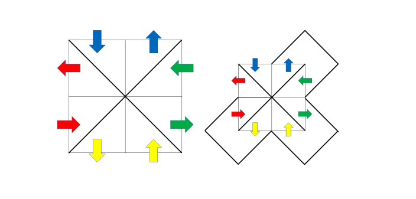

[题目链接](https://codeforces.com/contest/578/problem/F)

对图黑白染色，对原图添加一些边，如下：



由于光路一次走过了所有格子，可以发现以下性质：

- 图分成了内外两部分，每一部分非空。
- 整张图一共有且仅有2个连通块。
- 黑点和白点不连通。

所以如果不考虑添加的边，黑点和白点中只有一个连成连通块，下面只考虑黑点连通的情况。

因为连通且无环，所以黑点连成一棵树。又因为不确定的边只有200条，可以先缩点，再使用矩阵树定理求出答案。

时间复杂度$O(nm \log{n m}+cnt^3)$，其中$cnt$为不确定的边数。

<!--more-->

```cpp
#include<bits/stdc++.h>
#define ll long long
#define lld long double
using namespace std;
template<typename tn> void read(tn &a){
	tn x=0,f=1; char c=' ';
	for(;!isdigit(c);c=getchar()) if(c=='-') f=-1;
	for(;isdigit(c);c=getchar()) x=x*10+c-'0';
	a=x*f;
}
const int N = 410;
int n,m,a[2][N][N],now[2],h[N*N],col[N*N],fa[N*N],mod,tot;
char c[N][N];
vector<pair<int,int> > E;
void add(int a[][N],int x,int y){
	a[x][y]--;a[y][x]--;
	a[x][x]++;a[y][y]++;
}
int find(int x){return fa[x]= fa[x]==x?x:find(fa[x]);}
void merge(int x,int y){
	if(find(x)==find(y)){
		puts("0");exit(0);
	}
	fa[find(x)]=find(y);
}
int id(int x,int y){return x*(m+1)+y-m-1;}
ll fp(ll a,ll k){
	ll ans=1;
	for(;k;k>>=1,a=a*a%mod)
		if(k&1) ans=a*ans%mod;
	return ans;
}
int gauss(int a[][N],int n){
	ll ans=1;
	for(int i=1;i<=n;i++){
		for(int j=i+1;j<=n;j++)
			if(!a[i][i]&&a[j][i]) swap(a[i],a[j]),ans=-ans;
		if(!a[i][i]) return 0;
		for(int j=i+1;j<=n;j++){
			ll coef=a[j][i]*fp(a[i][i],mod-2)%mod;
			for(int k=i;k<=n;k++)
				a[j][k]=(a[j][k]-a[i][k]*coef)%mod;
		}
	}
	for(int i=1;i<=n;i++)
		ans=ans*a[i][i]%mod;
	return ans;
}
int main(){
	read(n);read(m);read(mod);
	tot=(n+1)*(m+1);
	for(int i=1;i<=tot;i++) fa[i]=i;
	for(int i=1;i<=n;i++)
		for(int j=1;j<=m;j++)
			cin>>c[i][j];
	for(int i=1;i<=n+1;i++)
		for(int j=1;j<=m+1;j++)
			col[id(i,j)]=i+j&1;
	for(int i=1;i<=n;i++)
		for(int j=1;j<=m;j++)
			if(c[i][j]=='\\'){
				merge(id(i,j),id(i+1,j+1));
			} else if(c[i][j]=='/'){
				merge(id(i+1,j),id(i,j+1));
			} else{
				E.emplace_back(id(i,j),id(i+1,j+1));
				E.emplace_back(id(i+1,j),id(i,j+1));
			}
	for(int i=1;i<=tot;i++)
		if(find(i)==i) h[i]=++now[col[i]];
	for(auto e:E){
		int u=find(e.first),v=find(e.second);
		if(now[col[u]]>200) continue;
		add(a[col[u]],h[u],h[v]);
	}
	ll ans=0;
	if(now[0]<=200) ans=gauss(a[0],now[0]-1);
	if(now[1]<=200) ans=(ans+gauss(a[1],now[1]-1))%mod;	
	cout<<(ans+mod)%mod<<'\n';
	return 0;
}
```

