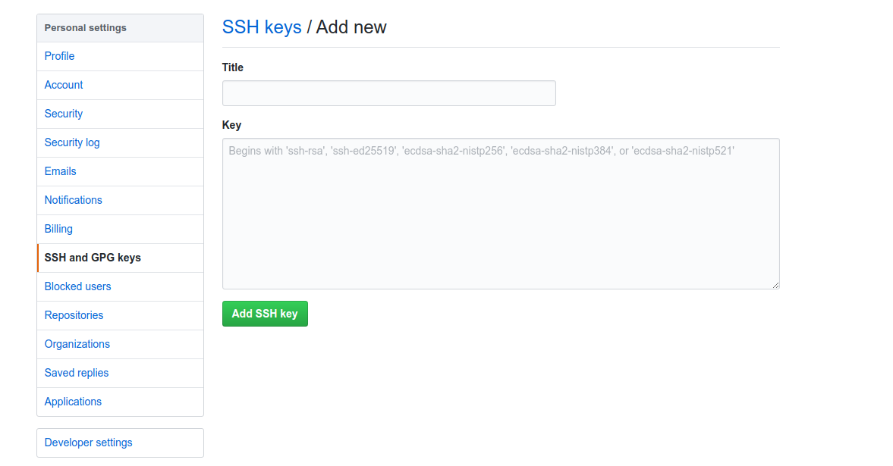
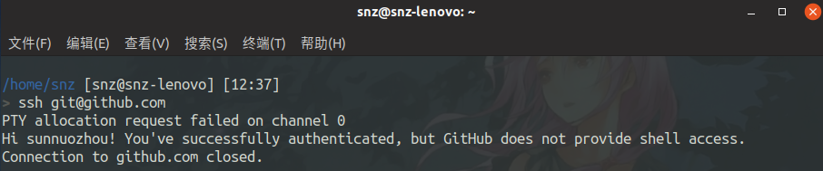
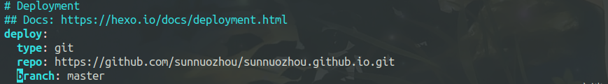
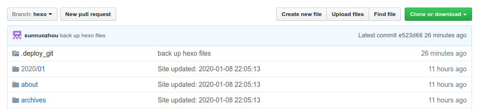
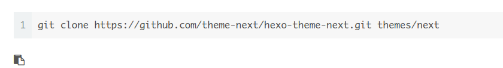
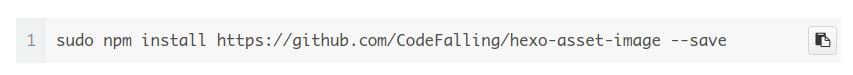

今天安装了hexo，并成功搭建了第一个blog。

## hexo安装

hexo是使用npm安装的，其实npm在apt中就有，可以直接一句话就装好。

```
sudo apt install npm
```

可惜我当时不知道，只好在网上下载二进制文件。

然后我把我下的东西丢到了/usr里，这导致我后面每一个npm的命令都要加一个sudo。

<!-- more -->

下好npm后，直接

```
sudo npm install -g hexo-cli
```

就装好hexo了。

然后我尝试使用hexo，发现失败了。我一看，发现hexo被npm丢到了自己的文件夹下，只要在/bin里创建一个链接就好了。

使用

```
hexo init xxx
```

就可以将一个文件夹初始化为一个hexo博客的文件夹。

```
hexo new xxx
hexo g
hexo s
```

成功创建了一个博客，并可以在本地通过localhost:4000访问。


## 推送网站

先在[github](https://github.com)上创建一个名为username.github.io的仓库，然后设置匹配信息。

```
git config --global user.name "username"
git config --global user.email "email"
```

然后生成秘钥

```
ssh-keygen -t rsa -C "email"
```

密码和存储地址都可以不用设置。

把`id_rsa.pub`里的所有内容全扔到[github](https://github.com)中的SSH keys / Add new里。



尝试一下是否成功




接下来打开博客目录下的配置文件_config.yml，将最后改为



然后在博客目录下安装插件

```
sudo npm install hexo-deployer-git --save
```

就下来就可以推送到网上了。

```
hexo clean 
hexo g 
hexo d
```

然后你就可以在username.github.io上看到你的博客了。

但现在使用`hexo d`的时候需要输入账号和密码，非常烦。

可以在`_config.yml`中搜索`deploy`，进行以下修改。

```
https://github.com/username/xxx
```

改为

```
git@github.com:username/xxx
```


## 添加常用功能

### 使用Latex公式

[见此文章](https://www.jianshu.com/p/68e6f82d88b7)

### 插入图片

先将_config.yml中的post_asset_folder的值改为true，这样就可以使用资源文件夹（与文章名字相同的文件夹）。

然后执行以下命令

```
sudo npm install https://github.com/CodeFalling/hexo-asset-image --save
```

其中lodash库爆出安全漏洞，但是我也不懂什么是原型污染，就先用着了。

然后将要用的图片放在同名文件夹下，就可以像正常的markdown一样显示了。

如果显示失败的话要先执行

```
hexo clean
```
注意，如果使用了`next`主题，需要在`theme/next/_config.yml`中修改`math`参数。

### 同步到github

先在[github](github.com)上新建一个分支。



在左上角的`branch`中输入新分支的名字，点击`create`。

然后在`Settings/Branches`中将新分支设为默认。

在本地用`git clone`把新分支复制下来，然后把博客的部署文件全复制到新分支下，并在新分支下输入:

```
git add .
git commit -m "注释"
git push
```

每一次写博客前先

```
git pull
```

写完后在输入

```
git add .
git commit -m "注释"
git push
```

来更新部署文件。

### 置顶功能

在`node_modules/hexo-generator-index/lib/generator.js`中的`const post=xxx`后插入以下代码。

```js
posts.data = posts.data.sort(function(a, b) {
    if(a.top && b.top) {
        if(a.top == b.top) return b.date - a.date;
        else return b.top - a.top;
    }
    else if(a.top && !b.top) {
        return -1;
    }
    else if(!a.top && b.top) {
        return 1;
    }
    else return b.date - a.date;
});
```

然后就可以在博文的顶栏添加`top: `，表示置顶的等级，默认`-inf`。

并且可以在`scaffolds\post.md`加入`tops:`是`new`出来的文章自带这个属性。

## 美化博客

首先先下载Next主题，在博客文件夹中

```
git clone https://github.com/theme-next/hexo-theme-next.git themes/next
```

然后选择`theme/next/_config.yml`中选择其中的主题，我选的是Pisces。

在`theme/next/_config.yml`下有各种设置。

### 页脚设置

搜索`footer`，根据自己的喜好设置。

### 关于&标签&分类

搜索`menu`，将需要的设成`true`。

然后在博客文件夹中

```
hexo new page "tags"
hexo new page "categories"
hexo new page "about"
```

将`about`网页的内容写在`source/about/index.md`中。

并在`source/tag/index.md`的顶栏中添上`type: tags`，`categories`同理。

对于每一篇博客，在顶栏添上

```
tags: xxx
categories: xxx
```

如果有多个`tags`，可以写

```
tags:
- xxx
- xxx
- xxx
```

### 搜索

在博客文件夹中

```
sudo npm install hexo-generator-searchdb --save
```

然后在博客文件夹中的`_config.yml`添加以下内容：

```
search:
  path: search.xml
  field: post
  format: html
  limit: 10000
```

并在`theme/next/_config.yml`将`local_search`改为`enable`

### 社交网站

搜索`social`，根据喜好设置。

格式为`名称：网站||图标`

其中，图标为font awesome的图标。

### 阅读百分比&回到顶部

搜索`back2top`，将里面的内容`enable`

### 不展示全文

在博文中插入`<!-- more -->`

### 代码块复制

搜索`copy_button`，设为`enable`。

### 访客统计

搜索`busuanzi_count`，设为`enable`。

要注意的是，总统计数在本地会显示错误，但推送到网站上就没问题。

### 头像

搜索`avatar`，根据喜好设置。

### 背景图片

这里是针对NexT版本高于7.3的设置方法，低于7.3的设置方法在网上有大量教程。

在`theme/next/source/css/main.styl`中添加一下内容：

```stylus
//个人设置
body {
    background-image:url(/images/background.jpeg);
    //图片位置，/images为theme/next/source/images
    background-repeat: no-repeat;
    background-attachment:fixed;
    background-size: cover;
}

.main-inner {
    opacity: 0.9;
    //透明度
}
```
或者在`theme/next/_config.yml`中将`custom_file_path`中的`styles`的注释消掉，然后创建`source/_data/styles.styl`，并添加相应内容。


## 遇到的问题

### 本地预览和网上不同

推送到github上的网页和在本地预览的不一样。

github上如下：



本地如下：


以及其他一些小的显示错误。

可能是本地缓存的问题：

- 在部署前先
```
hexo clean
hexo g
```

​	重新生成一遍。

- 如果在本机还是有显示问题，可能是浏览器缓存的问题，按`ctrl+F5`强制刷新就好了。

### git push时要输入密码

秘钥的设置见上文**推送网站**章节。

```
git remote -v
```

进行检查，如果结果是`https://xxx`说明连接方式是`https`，而不是前面配置的`ssh`。

输入：

```
git remote set-url origin git@github.com:NAME/PROJECT.git
```

或者在`.git/config`中进行修改。

**注意**：`github.com`后面是冒号":"而不是斜杠“/”。

### 添加背景图片失败

在NexT版本7.3以后，没有了`_custom`文件夹，添加的方式就和以前不一样了。

本来正确的方法是在`theme/next/_config.yml`中将`custom_file_path`中的注释消掉，然后创建`source/_data/styles.styl`，并添加相应内容。

但是我失败了，输入`hexo g`的时候并没有异常(如果没有`source/_data/styles/styl`，在这一步会直接报错)，但是`hexo s`的时候会报错。

于是我就使用了上文**背景图片**的第一种方法。

但其实我出现的问题仅仅是因为没有先`hexo clean`，先`hexo clean`一下就好了。