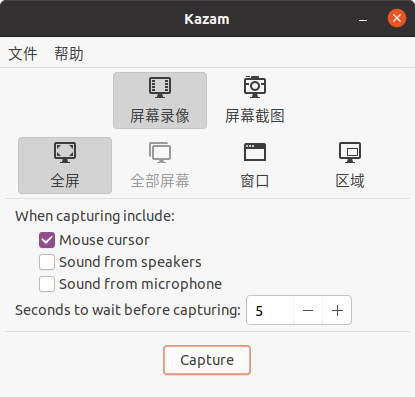
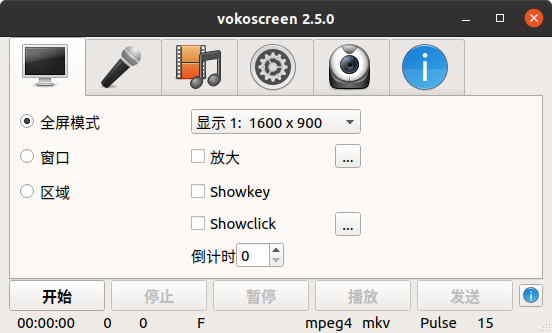
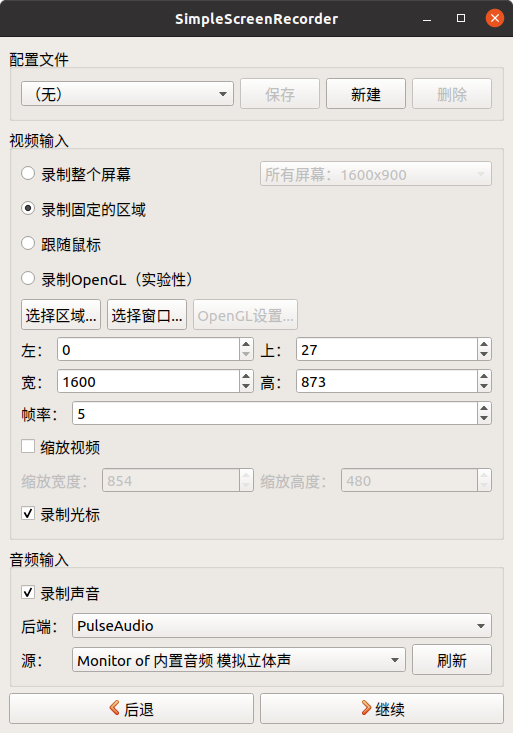
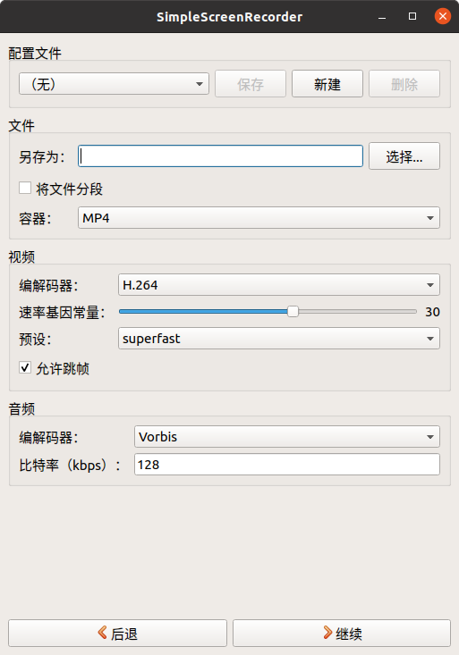
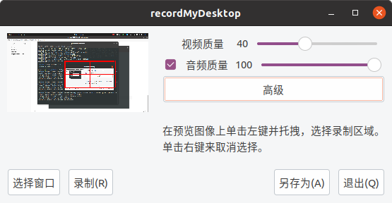
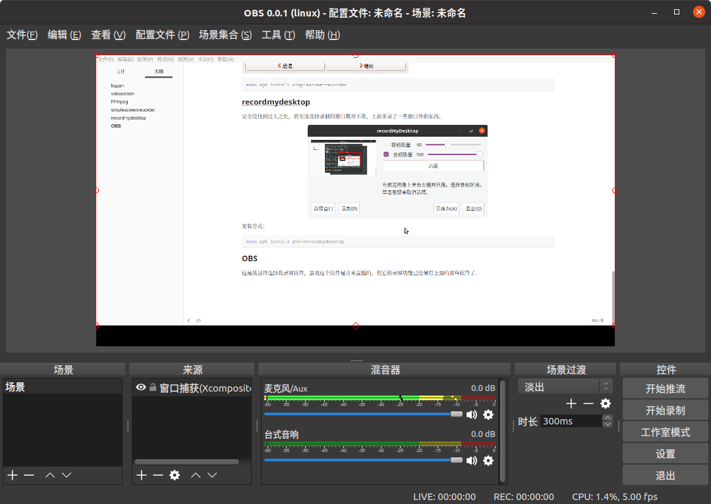

因为这次要录屏来讲课，我需要找一个好用的录屏软件。因为我和OI相关的东西都放在了ubuntu下，所以我准备在ubuntu下录屏。这次录屏对视频大小有限制，而我又不太会~~不想学~~压视频，就准备找一个功能齐全的录屏软件。

### kazam

这是我看到推荐最多的录屏软件，然而我使用下来觉得他的功能少得可怜，完全不能调节码率，故舍弃。不过在我找到的几个简洁型录屏软件中，我觉得`kazam`已经算好了。



安装方式：

```bash
sudo apt install kazam
```

<!--more-->

### vokoscreen

我本来看到这个可以调节的$1600\times 900$，以为这个软件可以调录屏的分辨率，没想到根本不能调！

也是因为不能调码率，而且我没找到这个软件有什么比`kazam`好的地方，我很快就放弃了它。



安装方式：

```bash
sudo apt install vokoscreen
```

### FFmpeg

没有图形界面，看着就难用，不想安装。

### simplescreenrecorder

终于找到一个可以调节码率的录屏软件了，虽说调节的是视频质量，不能准确控制码率，但我也可以接受了。

经过多次尝试，视频的码率和清晰度被控制在了我想要的范围，我本来都要决定用这个了。突然我发现，这个软件他不能录制窗口，只能录制区域，如果窗口被遮挡了就录不到了（也可能是我没研究出来怎么录）！！因此我放弃了它。

 

```bash
sudo apt install simplescreenrecorder
```

### recordmydesktop

完全没找到过人之处，甚至连选择录制的窗口都对不准，上面多录了一些窗口外的东西。



安装方式：

```bash
sudo apt install gtk-recordmydesktop
```

### OBS

这是我最终选择我录屏软件，虽说这个软件是用来直播的，但它的录屏功能已经暴打上面的那些软件了。目前我还没找到什么不满的地方。但我在选择窗口捕获的时候，有一个选项叫交换红色和蓝色，可是如果我不选它，它就会交换红色和蓝色，就很奇怪。



安装方式：

```bash
sudo apt install obs-studio
```

