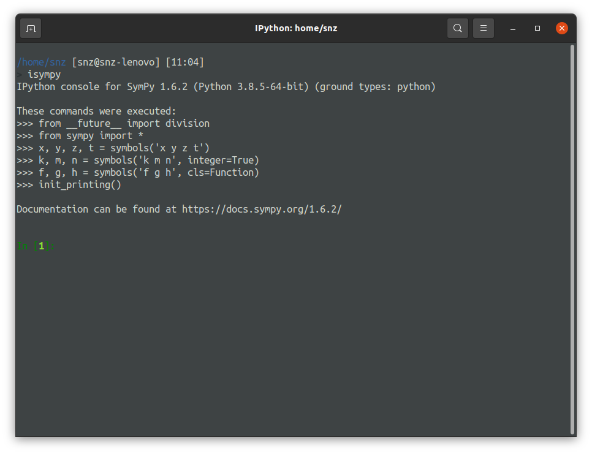
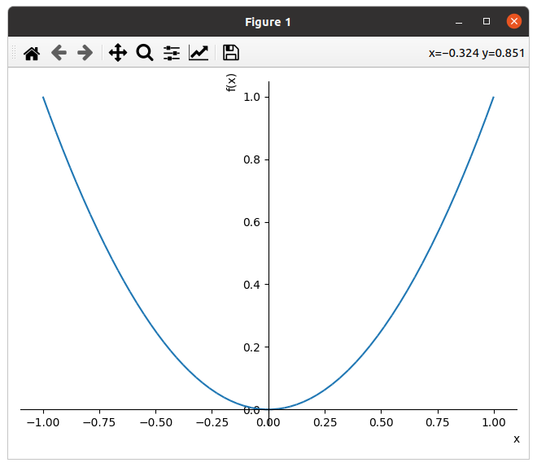
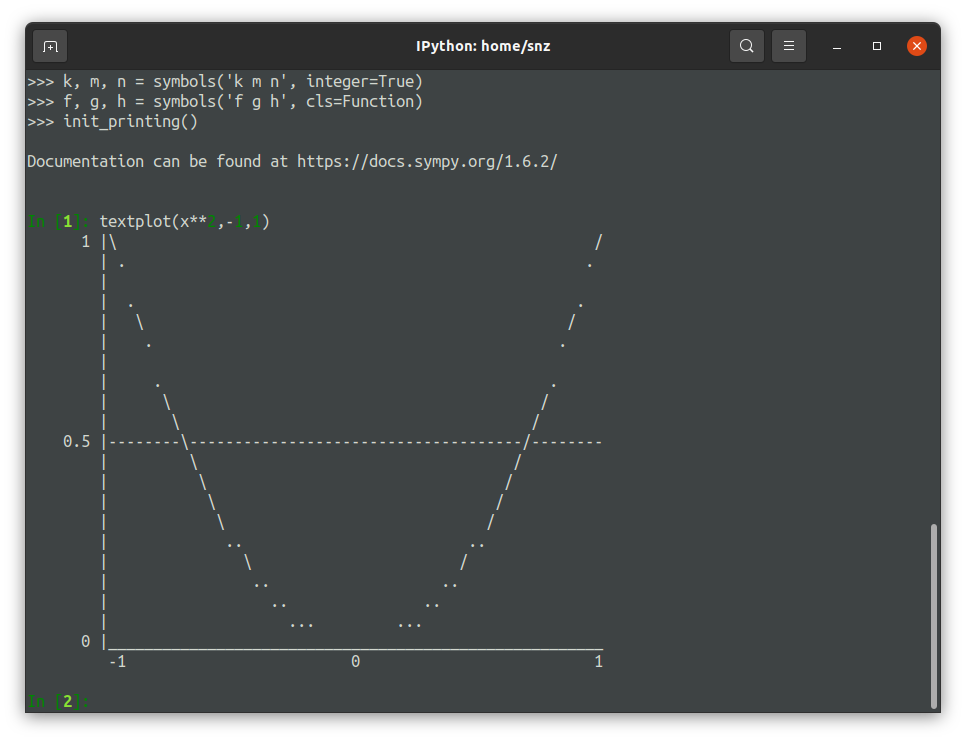
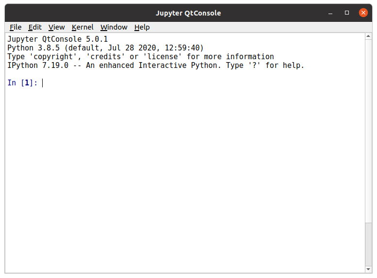

## 前言

为了方便我日后的数学学习，我准备找一个好用的数学工具。在这之前我一般是用[wolframalpha](https://www.wolframalpha.com/)的，但实际上我有很多功能不太会，语法也不知道在哪里学。于是我尝试使用wyj跟我讲过的[sympy](https://www.sympy.org/en/index.html)。

<!--more-->

## 安装

### isympy

在Ubuntu下安装还是非常简单的。

```bash
pip install sympy
pip install ipython
```

在有这两个东西后基本就可以使用了：



但是当我在使用过程中，我发现了一些问题，我的`plot`的效果和`textplot`一样！

正常的`plot(x**2,(x,-1,1))`的结果应该是这样的:



而我显示的则是这样的（因为问题修好了所以用`textplot`演示）：



这很明显是令人不能接受的。经过我的一番研究，我发现是我没有`matplotlib`，所以还需要:

```bash
pip install matplotllib
```

但光这样我是并不满意的，因为在终端中有一些`LaTeX`的编码是显示不了的，于是我准备装`qtconsole`。

### qtconsole

首先我先安装了`qtconsole`，`python3-pyqt5`，` python3-pyqt5.qtsvg`（最后这个我也不知道是什么，就是根据错误信息装的）。

```bash
pip install qtconsole
sudo apt install python3-pyqt5
sudo apt install python3-pyqt5.qtsvg
```

然后就可以正常的`jupyter qtconsole`了，界面是这个样子的:



但现在才只是装好了`qtconsole`，为了让我用的舒服，我至少要让它帮我自动执行`import`之类的命令。但由于我水平低劣，不会操作，就只能在`ipython`的自启动程序中加一个我想要的，即创建文件`~/.ipython/profile_default/startup/startfirst.py `。然后把`isympy`会预执行的语句写进去：

```python
from __future__ import division
from sympy import *
x, y, z, t = symbols('x y z t')
k, m, n = symbols('k m n', integer=True)
f, g, h = symbols('f g h', cls=Function)
init_printing()
```

然后我还觉得窗口有点小，可惜我研究了半天也不会用它自带的`config`，一直出错，就放弃用`config`文件，改为用`jupyter qtconsole --ConsoleWidget.console_width=132 --ConsoleWidget.console_height=60'`来启动，然后再在`.zshrc`中加一个`alias qtconsole_sympy='jupyter qtconsole --ConsoleWidget.console_width=132 --ConsoleWidget.console_height=60'`就可以了。

## 使用方法

这里记录一些我可能一时想不起来的东西。

[官方教程](https://docs.sympy.org/latest/index.html)

- 在一个命令（或类型）后面加`?`可以查看帮助，如`integrate?`。

- 用`x=symbols('x')`来新增变量。
- 如果直接输出`1/2`会变成实数`0.5`，可以使用`S(1)/2`来保证依然是有理数。
- `limit`，`limit_seq`用来求极限，不过这东西很菜。

