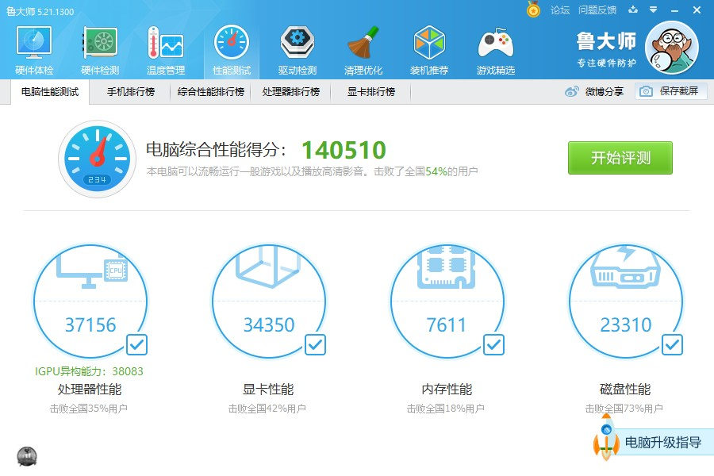

新电脑终于到货了，比想象中的厚一些，重量还可以接受。

<!--more-->

### 简易的Windows配置

先按引导配置好Windows的设置，然后把常用的软件都装了一下，具体见[软件列表](https://sunnuozhou.github.io/2021/05/22/Windows-Ubuntu%E8%BD%AF%E4%BB%B6%E5%88%97%E8%A1%A8/)。

然后用鲁大师（经典版）测了一下新旧电脑的性能对比，发现还是有不少提升的：

 

接着把Microsoft office激活了一下，没遇到太大的问题。

## 配置过程

### Ubuntu安装

接下来就是激动人心的Ubuntu安装环节了，Ubuntu20.04的安装盘我已经早早弄好了，先用Windows自带的磁盘管理给Ubuntu分了150G的空间，然后插U盘进BIOS。没想到thinkbook的BIOS键居然是F1，根本猜不对。

好不容易进了Ubuntu的安装界面，结果发现这Windows居然有bitlocker的磁盘保护，我只能在回到Windows把它关掉。到安装环节，我已经不记得是选和Windows共存还是选其他了，看了看网上的教程，貌似是选其他的多，我就也选了其他，运气不错，安装过程中没遇到什么问题。

### Ubuntu配置

第一步当然是换源后跑`sudo apt update`和`sudo apt upgrade`。换了源速度还是比较快的。

众所周知，Ubuntu的拼音相当智能，所以第二步就是装上搜狗输入法。如果不是对着我当时升级20.04的博客看，我都不知道怎么启用fcitx了。

本来想先装Chrome的，但快速的下载地址不是很好找，我就准备等等在装了，毕竟在Ubuntu上安装软件基本不用Chrome。

先把sudo免密开了，不然每次输密码太烦了。

先装了ssh方便传输文件，先把ssr传过去了，结果发现在右上角根本没有显示，以至于什么都做不了。了解了一下，原来是没装topicons plus。一通折磨后，用我以前不会用的`chrome-gnome-shell`装好了。调配ssr过程遇到了一些问题，见下文。

bash实在是太难用了，赶紧装个zsh。顺便给git设置了一个代理。

把以前用的Desktop icons的插件装好了，装过一次就比较轻车熟路了。

外观问题是最先需要解决的，于是我依葫芦画瓢地把grub界面的优化搞了一搞。

顺便把vim的配置用ssh全扔过去了。

在wyj的帮助一键装好了qq，比现在这台电脑好用多了。

尝试使用指纹识别，但由于设备太新了，Ubuntu没有对应的驱动，故放弃。

尝试在新电脑下编辑hexo博客，没有遇到任何问题，clone下来可以直接用。顺带下载了typora。

剩下的就是按照软件列表一个一个装过去了。

## 遇到的问题

### 配置代理

其他部分一切顺利，除了不能上网。研究了半天electron-ssr的报错，发现一点用也没有，因为老电脑上也有这些报错。测试端口情况，一切良好；测试代理通道情况，一切良好。于是我在Firefox上装了switchyomega，设置了一个通过socks5代理的情景模式，居然就能上网了。装了Chrome，发现Chrome一切正常，全局代理也可以上网。

推测是Firefox的问题，但老电脑上并没有这个问题。

过几天自然而然的好了。

已解决。

### 连接 raw.githubusercontent.com

用wget和curl都会出现拒绝连接，观察返回信息发现访问的IP是0.0.0.0，很奇怪，网上一搜发现在hosts里加一项就好了。不知道为什么会这样。

原来是在墙外的原因，我都不知道。

已解决。

### 系统问题

每次开机都会显示系统出现内部问题，大概看了一下，是fcitx导致的。但我以前用18.04的时候也天天出现类似地问题，只要不影响我正常使用我就先不管了。

未解决。

### QQ字体问题

wyj遇到的问题我也没逃过。

如wyj博客里提到的方法修改即可，注意tim路径要有所变动。

### sympy无法画图

这个问题我在原来的电脑上就遇到了，但当时我直接装一个画图要用的库就好了，而这次`pip`说没有适合的版本。我在网上找了不少解决方法，但没有有效的。wyj也操作了一番，把我用`apt`装的sympy变成了用`pip`装的sympy，但是并没有什么用。

最后只能退而求其次，用`apt`装一个老版本的画图库了。

已解决？

