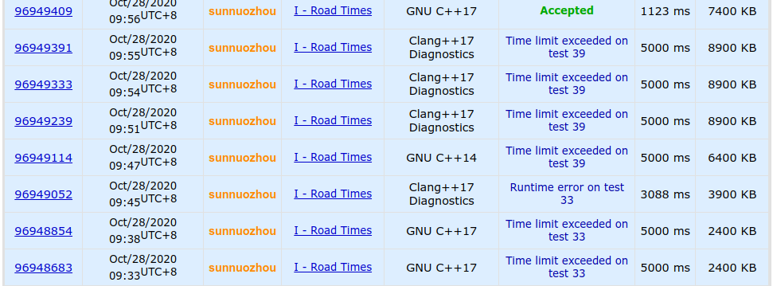

## 前言

虽然我不是一个文化课选手，但到了高三，我的生活也较以前发生了很大的变化——高三学长们全都去上大学了，机房里一下冷清了不少，一些同年级的选手也因为竞赛失利不得不面对高考，投入文化课生活。今年我校的集训队选手只有2个，实在是不像去年那样声势浩大，在没有了集体氛围后，我觉得我需要做点什么来让我保持一个学习的状态。

<!--more-->

在看了wyj的[高三文化课学习周记](https://2o181o28.github.io/)（因为wyj的博客文章的网址一直反复横跳，就直接挂博客主页了）后，我觉得这种记录的方式是个不错的办法。虽然我也不期望我可以像高三班级里的人一样没日没夜地学习，但至少我的学习状态和进度要能让我在进入大学时各个方面都不算太菜吧。

## 第一周（~2020-09-06）

进入候选队是我现在在OI方面唯一一个想要取得的成就了，我本来有过在这个学期全力OI的想法，但奈何我高二太颓了，不仅现在英语水平没有达到我预期的水平，甚至连高中物理数学都没有学完。经过我的再三思考，我决定把OI的事推到集训队作业布置以后，在OI学习开始前先冲一波物理和英语。

这周的时间安排基本都是上午英语背单词+阅读，下午物理+体育锻炼+OI出题，晚上英语课。

我本来以为物理把电学学完就快要收尾了，没想到光学居然不比电学简单，或许是我几何和三角函数太弱了吧。

与进展缓慢的物理不同，我感觉我英语阅读的进步挺明显的，这周的刚开始的时候，我的TOEFL英语阅读平均还要错到2个，做的差的甚至会错4个，但一周结束的时候，我就平均只错1个了（尽管还是每篇文章都有点一遍看不懂的地方）。

本来我还打算每天中午到高三班级那里转转的，但那里压抑的学习氛围让我觉得有点怂，就咕了。

就一个暑假没怎么运动，我的体能就大幅下降了，明明上学期我还可以跑完4圈的，现在我跑3圈就累的不行，感觉练好3000米很难。

现在周六是我每周唯一的不用上课的一天，好不容易到了周六我本来准备好好地颓废一下，但因为太累了起不了床，等到开始颓废都已经中午了。NOI之后我就入了弹丸的坑，我本来准备把1代和V3的游戏都玩一遍的，但现在我发现时间完全不够，就只能看看实况解解馋。前几天看到我关注的up主中有两个都在安利信条，我晚上就去看了，虽然没有全部看懂，但给人的观影体验还是挺好的。

周日就到了全天英语时间，上了课我发现我的英语听力就和学龄前儿童一样，啥都听不懂，非常自闭。

## 第二周（~2020-09-13）

和上周相比，我的每日任务中新增了一项英语听抄和跟读，虽然这在老师眼中是1个小时就可以完成的任务，但我一般都要接近2个小时，这导致我晚上的时间被大幅挤占（~~打不了炉石了~~）。老师说坚持练习十几二十天听力水平就可以有不错的进步，希望如此。

上个周末好像是物理竞赛的初赛，没想到ys居然没过。下午zc来小机房的时候，告诉我他过了初赛，但完全不想停课，我就很好奇地搜了一下物竞的复赛卷子，发现题目都很恐怖，解答过程中的算式全是用奇怪方式组合在一起的字母，让人完全没有看下去的欲望（~~看不懂~~）。

实际上我的英语阅读水平根本没有进步，只是上周连续很多次只错0~1个让我膨胀了，现在我每篇错的个数已经增加到了2~3个，甚至有的时候一篇文章我觉得我读得很懂都可以错到3个。

这周学长们的英语分级考试结果出来了（1~4级，1级菜，4级强），轩导是4级，lj，wyj和lmq是3级，dwh和bly是2级。让我有点震惊的是dwh前面学英语学得这么肝，而且词汇量还超级多，还能轻松自如地读英文小说，居然都只有2级。而轩导就是一如既往地吊打全场，听说他在4级的人里面排名也是比较靠前的，真不知道他是怎么变得这么强的。

这次叉院的二选，居然所有去参加的学长都过了，获得了5/5的好成绩。这虽然是一件很让人高兴的事，但同时也让我变得压力巨大。以前我觉得就算没考上叉院也没什么，但现在我好像就不太能接受这个结果了。而且从面试的情况来看，OI的水平和成就好像也挺重要的，这就让我很纠结现在到底是侧重文化课还是OI。

这周六我终于把弹丸论破V3的实况看完了，感觉游戏整体还是不错了，结尾我也挺喜欢的，但感觉这么设置结尾会让角色的个人魅力有所下降。

这次周日又是全天英语，但这次的英语听力我居然从什么都听不懂变成稍微可以听懂一点了，感觉不错。

## 第三周（~2020-09-20）

现在感觉已经比较适应英语作业的量了，花在听抄和跟读上的时间也降下来了一点，~~感觉听力有进步~~。但我的阅读不知道为什么一直很拉跨，根本看不到我第一周只错0~1个时的影子。这周写作也开始了，但对我来说综合写作的难点还是在于听力，这周文章一共写了2篇，虽然我写得很慢，但感觉难度不算很大。

这周末好像物理复赛了，不知道大家考得怎么样。

这周的周二周三lzq居然都咕了没来学校，然后这两天我在学校就颓得很，在油管上云了好久的MC。我发现不知道为什么油管用流量的速度比B站块这么多，感觉油管看2个视频的流量够我B站看一下午。

在这周四周五的时候我不知道为什么突然就感受到了多校出题DDL的压力，开始肝数据，后悔出T1的时候给自己造数据挖了这个大坑，数据不能直接随的题真是太讨厌了。我现在都不知道我的数据到底强不强，希望不会被乱搞过去。

这周我终于结束的我的物理新课学习，感觉狭义相对论是真的难，我在网上搜了好久都找不到一个能让我很好理解质量变换公式的推导，就只好把这个当成是固有知识了。而且我是真的菜，在学完并且做完题后，我都没有意识到动能公式并不是仅仅只把 $m_0$ 改成 $m$，一直以为 $\frac12 m v^2$ 和 $mc^2-m_0c^2$ 是等价的。我在晚上做英语的时候，不知道为什么突然开始想这个问题，随便代了一组数据进去，才发现这两个并不等价。原来我上午做题的时候，列出来的式子不仅比他的难算，而且就算算出来了也是错的。

## 第四周（~2020-09-27）

周一开始了物理刷题计划，发现我现在还是一个不会做题的彩笔。而且我发现我好多以前的知识都忘了，甚至都把电势能和电场强度弄混了。

周二和周三跟lzq出去颓废了(~~老年生活~~)。周二我还勉强写完了英语作业，但周三外出时间太多我就把英语给咕了。这周因为机构有事，本来晚上的自习和课就都没了，而且老师也都咕的很，线上的作业也没有布置，所以我就咕的很心安理得。

周四一回来就是运动会，小机房吵得很，我就只好下去看比赛了，~~然后就没有学习~~。我感觉运动会还是挺有意思的，就一直和zc在下面看比赛，但lzq似乎不这么认为，我每次在机房看到他他都在出题，然后周五lzq就直接没来学校，很咕。周五我就一天都在看运动会，但一不小心忘了去看最后我们班的排名了。真不明白为什么周五学校没有晚饭，难道连高三的住宿生都不要吃饭吗？

虽然周六和周日理论上高三都要上课，但我周六直接咕了，周日又要全天英语，所以这周末我完全没受到调休的影响。

这应该是我这学期以来最颓的一周了吧，希望以后不要更颓。

## 第五周（~2020-10-04）

周一做物理又自闭了，好不容易刷到一道原题，当时我还会做，现在就已经不会了。我已经完全忘记我以前知道过辐射量是 $\sigma T^4$了。而我现在学的数学看上去就简单多了，我觉得数列和缩放是前几章里最有意思的部分了。还记得以前看dwh做缩放的时候用过一个 $\ln x\le x-1$，我觉得这是真的有用，而且让我凭空想肯定想不出来，这次我就用这个切了一个证 $(1+\frac1x)^x\le 3$，而且用这个方法可以直接证到 $e$。

周二跑1000米自闭了，好久没跑，跑完后难受得很，就跟去年和学长一起做体能测试的时候一样。这导致我这天咕了很多学习内容。

马上都10月了，不知道为什么这次集训队群里还这么安静，我印象中去年的时候大家都已经开始急了。看来是已经被CCF咕习惯了。

国庆前两天我都在颓废，OI和数学物理全都没碰，结果等到3号4号想要开始全面开工的时候发现英语作业多的要死。再加上3号早上有5部番剧首播，我看完后就发现好像没时间学别的了，就只能把英语先肝完，并把数学物理鸽了。4号我就一起来直接开工，总算是差不多完成了所有任务。

感觉数学的数列部分还是很有意思的，可惜我实在太菜了，好多题都不会做，尤其是需要裂项的题，我好多都裂不出来。我在做题的时候忽然想起来一个以前我想过的求 $\sum\limits_{i=1}^na^ii^2$ ，记得当时我挺快就想出来了，而这次我想了将近20min。而我做到的物理题就没什么意思了，感觉都是课内题的画风，没什么难度，可能这个"某校自找真题"的"某校"比较菜吧。

这个国庆和liji交流了一下，最让我震惊的是人工智能课的外教授课居然可以做到人均听不懂，而且据说还是常态，就很恐怖。

## 第六周（~2020-10-11）

这周一和周四两天我都来学校呆着了，不知道为什么一向早起的lzq都到的比我晚。

周一的时候我把数学物理的书都带到学校了，结果走的时候嫌它们重就没带回去，然后周二和周三就颓了两天。在这两天里我把IOI的day1看了一下，感觉不算太难，至少比去年简单多了，尽管我T1的判0没有完全想清楚。和T1相比，T2T3就简单多了，T2甚至给我一种CF简单题的感觉，乍一看很复杂，仔细一看好多东西都是花里胡哨的，完全没用。

和物理学习相比，我感觉学数学和英语要艰难的多。每次物理看完一个章节，我都会有一种我感觉我懂了的感觉，做了几道题就感觉自己真的懂了。而数学每次我看完一章，总会感觉它在说废话，但做做题又感觉自己全都不懂。而英语是最艰难的，我现在感觉有很多的单词我都是看到了可以一下就反应过来，但听上去就是听不出，这导致我现在被听力乱杀。

这周打了几把酒馆战棋，第一次玩到猫猫，发现猫是真的菜，不论我怎么苟活都熬不过别人，一个粮都没吃到。

周五就月考成绩就出来了，去了解了一下，感觉wyj考得还挺不错的，并没有全面崩盘，甚至化学都暴打了ys。语文和英语的除作文也达到了班均以上的水平，虽然作文的提升很缓慢，但已经可以和班里同学同步发展，共同富裕了。不过有点令我惊讶的是wyj的物理居然崩了，不懂为什么一个擅长数学的人会不擅长物理。这次ys应该算是正常发挥，就是语文老89了，而zc和jyg考得好像都不太行，而且jyg好像还没有达到班均水平，感觉有点艰难。

本来周六想在家颓一天的，但由于英语要上课，我就来了学校。结果到了学校后，我发现今天特别不想学习，刚好前几天听wyj讲了抗生，就特别想玩。我从贴吧里找了一个懒人包，运气不错，没有遇到一些人说的打开后是重生的问题。到现在我一共通关了2次，一次是Isaac，一次是AZ。我觉得抗生的水层虽然难了一点，但还可以接受，而矿车层就不一样了，我曾在11攻7延迟且会飞的状态下被打到进不了陵墓层。矿车层的小怪难度还可以接受，但boss实在是太变态了，根本打不过。

周日就是CSP初赛了，到现在我一张完整的模拟卷都没做过，就去考了。感觉卷子实在不难，我就没有检查，这导致我错了一个判断：谁能想到，一个叫`map`的数据结构，访问一次的复杂度竟然是 $O(n!)$ 的。

## 第七周（~2020-10-18）

这周就突然多了很多事，让我本来还算悠闲的生活变得十分忙碌~~尽管还是会颓废~~

周一上午的时候突然想起来系统升级的事，就去[尝试了一下](https://sunnuozhou.github.io/2020/10/12/Ubuntu-18-04%E5%8D%87%E7%BA%A7%E5%8E%86%E7%A8%8B/)，结果在升级途中集训队作业突然就不咕了，由此就开始了我忙碌的一周。

集训队作业一下来，我大概浏览了一下：

- 这次做ACM题

- 完成量从85%提升到了90%
- 不可以"泛做收获"了，必须交流题目

我看了一下我要搞的3道题，一个中档题，一个偏难的高精度，还有一个偏难的贪心，应该不是很麻烦，就一天一道把他们都搞完了。这一届的集训队是真的肝，刚发作业那天就有人把3题都弄好了，我都不知道怎么做到的。

这周的英语写作作业要写6篇，感觉很艰难。英语写作比阅读要动脑子多了，而我就不是很会动脑子。这一周的阅读终于恢复正常水平了，基本都错0~1个。数学和物理这周都是有空就做做，感觉物理知识忘得特别快，刚学完的电又快要不会了。而那本自招数学我就在水水过去，不想学几何，组合，概率部分又太简单了，完全没有数学分析有意思，可是数分我又有好多题不会或者要想好久。

这周二我还心血来潮把炉石改成英文了，结果第二天就是猎人的英雄之书，我感觉我英语还是不行，不仅不认识像 "the Horde"，"tauren" 这样的专有词汇，还不认识像 "solace" 这样看上去很常见的词，而且他们说话还不能暂停，我都来不及去查。

这周lzq咕得很，有3天没来学校。

周日英语模考了听力和阅读，感觉很难。阅读我30题错了3个，平时做的时候不感觉时间紧，但考试不知道为什么就感觉时间过得飞快，最后一道的3选都没能去原文中找。我听力还是很菜，听的时候好多细节都忽略了，让我各种挂题。还有一篇文章我从头到尾都没听懂他在讲什么，直到出了选项我才懂。文章的标题是"infrastructure"，然后我在听力中听到了很多个 "toll"，我完全不能把它和标题联系起来，就以为我听错了，很自闭。

## 第八周（~2020-10-23）

这周开始做集训队作业的试题泛做了，感觉今年的题比去年要简单一点（但难写），现在大概在以一天3题的速度进行。理论上，我只要能做到每个工作日做两题就可以准时完成任务了，所以现在进度还算可以。但ACM的计算几何含量是真得高，我现在已经跳过了3题了，比例远超过可以跳过的比例。

这周二我还把试题交流的任务弄完了，我都没想到我可以在这么短的时间内改编出一个集训队难度的题（而且我对这题的自我感觉还不错），我本来是预定在11月前弄完的。我在发现有试题交流的任务的时候我就是想好要在[Project Euler](https://projecteuler.net/)找题来改编（我有充分的自我认知我不能独立出出一道好题）。但我以前对[Project Euler](https://projecteuler.net/)都是只闻其名，从来没有上去做过题，当我咨询了一下xyx以及自己上去看了看后，大失所望：它即没有官方题解来让我一个一个去找有拓展性的算法，题目难度又不尽如人意。在我上去找的几道题中，大部分都是我需要花一部分时间想出来，然后感觉太简单，或者太难我不会做。结果我运气很好，没看太多道就遇到了一道本身已经有点难度，而且还有拓展性的题目。我稍微把这题拓展了一下，让它看上去没那么像PE题，并想出了一个还算有点意思的解法（至少我以前没见过），题就出好了。

这周我数学物理咕得很，几乎都没怎么做。

这周wyj让我在一个[测词汇量的网站](http://testyourvocab.com/)上测了词汇量，我突然对别人的词汇量产生了不少兴趣，就忽悠zc和lzq也测了词汇量，但结果让我感到非常疑惑，怀疑我并没有像测试网站上显示的一样有 $10^4+$ 词汇量，但在这个网站和墨墨背单词上测的词汇量是差不多的，总不能同时出一样的错吧。我第一次测词汇量是在高二下的时候，那时候测下来是 $9500+$，但在那之后我都一直只知道xyx $12000+$ 的词汇量和dwh $11000+$ 的词汇量，所以以为大家都吊打我，也没有产生疑惑。wyj测下来是 $6500+$，但以我对词汇量的了解，wyj应该远不止这个水平，在高二下我和wyj看xyx背单词的时候，就连xyx都夸赞wyj的词汇量多。而且lzq和zc分别是 $4500-$ 和 $5000-$，这说明一个正常的高中生的词汇量在 $5000$ 左右，也就是说我在学TOEFL前的词汇量应该比这个更少。然而我在机构背了 $3000$ 个左右的单词，在墨墨上也背了 $3000+$ 个单词，并且这两个之间应该还有不小的交集，所以理论上我的词汇量应该上不了 $10^4$ 才对。

这周四下午学校的网把`bilibili`给ban了，导致我中午看下饭视频受到了极大的阻碍，很不爽。

## 第九周（~2020-10-28）

这周开始有英语听力作业了，阅读也变成了一天3篇了，再加上我每天要做3到集训队作业题，感觉很肝。

一般来说，我的3道集训队作业题都可以在上午做完。但是我周三了两道把我搞自闭的题，要不是这天要做的一题在周二已经想好怎么做了，我觉得我甚至可能完不成每日任务。首先这题有个单纯形法题，我一眼就猜到了这题单纯形法，但英文不好（其实是眼瞎），漏看了一个条件，导致浪费了很久。当我写完了题并快速调对后，我`TLE on test 33`了，一开始我还以为我用 $\ge$ + $\le$ 来表示 $=$ 导致T了，但下数据一测，发现我跑的飞快，于是我就开始了我艰难的过题之路：

期间我使用的方法包括改编译器，改eps，改`double`和`long double`，改随机种子，改数组大小。其中的每一个版本就可以在我电脑上ac。然而这不是结束，做完这题后我发现下一题是计算几何，但由于我跳过的题太多了，我准备做这道计算几何，因为他看上去不难，然后我就写题半小时，调题调一年。

周二下午我还想了出题的事，一会儿就想好了要出的题，而且感觉质量还不错。结果过几天再一想，发现前几天想了道假题。

现在学校的网络管理很离谱，上周我发现b站本ban了，这周我发现居然支付宝都被ban了，害得我交个报名费都要开代理。以前ban战网还算可以理解，但现在连b站和支付宝这种老师都可能日常要用的都ban了就很离谱。而且我周五遇到了更惨的情况，我手机一不小心欠费了，导致我的手机不能用流量，于是我甚至不能用支付宝给手机充值。而且当我想使用银行卡时，我惊奇地发现居然这也上不去，我怀疑学校的网是用了白名单。最后我只好先用微信充个10块，有流量了再用支付宝充。

这周数学物理又是咕咕咕状态，感觉再过几天物理知识就又要归零了。

这周去体育锻炼的时候，我发现我引体向上已经可以不标准地做7个了！可惜我现在还是跑不动路，连跑1000都觉得累，真不知道lzq是怎么随随便便2000，3000的。

周末入正了isaac，获得我steam上的第一个全成就游戏。我发现我的英语水平还是不行，有些mod的介绍都不能完全看懂。

## 第十周（~2020-11-08）

这周继续做集训队作业，而且还没完成每天3题的目标，很难顶。而让我没完成目标的罪魁祸首就是[19年world final的I题](https://sunnuozhou.github.io/2020/11/05/ACM-ICPC-World-Finals-2019-I%E9%A2%98/)，我一看题面，觉得这像一个简单的模拟，结果写完一交发现过不去。仔细想一下发现这题需要模拟的步数可能上天，真不知道为什么题解里写直接模拟也是一组解法。我花了好久把模拟变成了记忆化搜索才过了题。

由于上周入正了以撒，我周一周二晚上都在玩它，这导致我这周普遍睡得很晚（虽然比起真正的高三学生还是不算晚）。

不同于集训队作业上的萎靡，我这周英语听力感觉都还不错，除了历史艺术类的lecture都没有错超过一个，课上conversation也基本都可以听懂。这比起我刚上课的时候一句也听不懂已经好很多了。而我的阅读也恢复正常了一点，至少分数都在25分以上了。

这周由于srf被ob强制调去了可以被看到的位置，csl也在备战期中考试，小机房的学习氛围好了不少。在我的印象里，这是我第二次尝试在小机房做阅读，这次就比上次好了很多，没有受到太多打扰。到了11月后，我就渐渐感受到了北大集训的压力，希望我前一段时间没学OI不会让我水平大幅下降。虽然这次我只要进个前30就不会不爽，但我真的很担心出现像去年的liji那样的暴毙情况。

lzq在上一周好不容易来了4天后，这周又开始咕了。而且他为了教小朋友上课还急剧放缓了日语，英语，和集训队作业的进程。感觉这样不太行。

这周还有一个意外就是体育的会考，我甚至都已经把这事给忘了。而且这次g0通知我的时候我刚好在做阅读没看QQ，导致我去报的时候编组已经结束了，我就只能一个人一组（好像），很不爽。

11月7号也是CSP2020开考的一天，但关于CSP的事我都写在[游记](https://sunnuozhou.github.io/2020/11/08/CSP2020%E6%B8%B8%E8%AE%B0/)里了，在这里就懒得写了。

## 第十一周（~2020-11-15）

这周依然是做集训队作业，但除了日常上午做3题之外，我还开了[Gomoku](https://ioihw20.duck-ac.cn/problem/299)这题，虽然正常做法是直接针对对面的算法输出必胜解，但很明显这么做非常没有意思，于是我决定写一个普适性算法，再加上srf他们的研究性学习的题目也是这个，我写完的AI还可以和别人的打架，很有趣。

这个计划是在周一看srf写这题的时候定下来的，他调了一下午还是没有过这个题。

我从周二开始写，周二的时候写了棋盘的框架和对面的算法，并且让对面的算法自己和自己下，发现对面的算法很垃圾，会走出很多很sb的举动，我当时以为我可以轻松打败它。

周三我写了自己的估价函数，并调对了它。这个东西是真的难写，我写挂了一万次。为了在周三写完它，我还花了我晚上宝贵的1个小时颓废时间来调试（其实是因为英语课下课早）。

周四我把它交到了OJ上，并获得了88分的好成绩，远远高于srf的67分。并且在我把这个算法丢给srf，和别人的算法打架时（当时大家的算法都没有搜索，只有一个估价函数），我获得了对阵srf的算法后手67/33，先手97/3，对阵czy的算法后手77/23，先手100/0，非常强大。虽然打不过csl的算法，但因为我们两个的算法都没有随机，所以并不能很好的说明问题。可惜我的算法被人类智慧轻松打败了。然后我加了一个对抗搜索，搜了5层，并通过了题目。这个我把我的程序丢给srf后，发现吊打别人的算法更加明显了，尽管后手不能100%胜。然而srf的多次尝试后，他成功地先后手都赢了我的AI。

晚上我把我的代码丢给了wyj，他让我的代码多搜了几层，并多搜了几种走法，但他说我的AI用脚下都可以赢，其原因是wyj搜了10层，而偶数层我的估价函数会返回对手的估值，导致变得很弱。但他告诉我了一个我的AI的致命漏洞，就是每次下棋只会向外拓展一圈，而我作为一个五子棋白痴，很明显在一开始写的时候并不明白这个道理。

周五的时候我又加强了一下我的AI，从拓展一圈变成了两圈（为了速度没有拓展更多），并且也多搜了几层，成功在完全不针对别的做法的情况下通过了题目。这次我把我的AI丢给srf后，成功先后手同时100%胜了别人的算法。srf，csl在多次尝试后先手赢了一句，后手就没赢过，虽然这个AI现在并没有很强，但这样的结果我已经很满意了。

这周还是班里期中考试的时候，听说这次语文和生物很难。ys考完语文的时候叫嚣着他连89都没有了，结果成绩一出来105分，吊打别人。而jyg这次语文也获得了班均98分，有了不少进步。这次wyj考完试时的表现和别人大不相同，别人考完语文都说语文难，考完英语都说听力难，就wyj考完语文和英语都说没有什么特殊的感觉，甚至觉得考得不错，看来他这次稳了。事实上，他语文的确获得了较大的进步，也取得了班均。

相比之下，我的学习情况就差了很多，这周的阅读一篇24，一篇25，很拉跨。

## 第十二周（~2020-11-22）

周一我又把wyj帮我改过的五子棋程序再改了改估价函数，并加了一个迭代加深的上限，让它在某些情况下变得快一点。但这个版本的AI貌似有一些奇怪的bug，会走一些令人难以理解的臭棋，但由于没人别人的AI和我打架，我就没有什么兴致再来改它了。

期中考试的具体名次已经出了，ys和wyj都进步神速，十分强大。

炉石的奖励系统更新了，我感觉其实没有网上很多人说的那么不堪，但也希望那些人能把奖励骂的更多一些。感觉这次新版本强的卡不多，而且这次我开了63包只出了4张橙，还都没什么用，很亏。而且看到网上很多人都说对决模式不行，但我感觉挺好玩的。

这周英语开始要写一整套的写作了，第一次写的时候我的独立写作连第二个论点都没写完，很艰难，但第二次写就好一些了，至少可以在规定的时间内写出一个正常的文章。我本来以为我的综合写作已经可以了，结果这周上课的时候老师给我提了不少要求，而且我按照老师的要求改完后，词数居然达到了413词！（要求是150~225词）感觉可能会写不完。

由于上周我阅读极其拉跨，我准备通过读一些英文的小说来提高一下阅读水平，为了让我更好地坚持，我决定先读一些我读过中文版的书。最终我决定读[《animal farm》](https://en.wikipedia.org/wiki/Animal_Farm)，这本书的中文版是我在升高一的暑假被wyj推荐读的，感觉是一个还算可以的用来锻炼水平的材料。真正读起文章我发现我的词汇量还是不够，每天就看一小会儿都能有十几个不认识的词。虽然我觉得跟读书的关系不大，但我这周的阅读的确有所提升，一篇是27/30，一篇是28/30。

这周依然没有做到每天3题的目标，我发现自己完全不会最小树形图，搞了半天才求对方案，感觉离完成集训队作业遥遥无期。现在北大集训的时间已经确定了，在12月7号，也就是NOIP的后2天，这让我不太想参加NOIP了。感觉现在我的OI水平并没有保持在一个比较好的状态，希望北大集训不要暴毙。

## 第十三周（~2020-11-29）

可能是阅读和写作变得熟练的缘故，这周我发现下午的时间多了一些，加上晚上的颓废会让我没时间在晚上看书，我就把书带到了学校里来看。这下我看书的时间就多了不少，平均每天可以看个一章。但是随之而来的一个巨大问题就是我每天要新背的单词多了不少，有的时候我一天的实际背诵量会达到我计划背诵量的150%。

这周的阅读还是保持着不错的水准（对我来说），做了一篇是9/10/9。所以我的主要精力是放在听力上的，现在我听力的状态是有的时候完全听不懂，然后错1~3个，更多的时候可以听懂，错0~1个。lzq的听力表现出了不同于阅读的高水平。有一篇我以前做的艺术历史类lecture，我当时完全听不懂，并错了4个，而lzq虽然也说着听不懂，却只错了1个。他甚至可以在完全不听听力的情况下，使用他的“排除法”排除2个错误选项。

这周往集训队OJ上交题的时候，我居然有一道题在CF上过了在OJ上没过。更让我震惊的是这居然是CF的原数据，而且我在自己电脑上测的时候也因为精度问题sqrt了负数，不知道怎么在CF上过得。

上周六的时候我溜去学校玩，当时做了一个wyj的物理题。这是电磁感应相关的，我大部分东西都忘了。题目中有2个足够长的无电阻导轨，两端都被带电阻的导线连接，在导轨偏右边的一个地方有一个均匀变化的磁场，在左边电阻的两侧连有电压表。题目第一问问了电压表的示数，我当时做的时候没怎么多想，就直接当左边没有电动势做了。后来我仔细一想，发现我根本不能理性地说明左边的电动势为0。我研究了一会儿，还是不会说明，就想知道班里是怎么讲的。结果zc告诉我班里是直接当电源在右边做的，很没意思。

周一不知道为什么学校组织了看电影，我就也跟着去了，但实际的内容并不如我想的有意思。

## 第十四周（~2020-12-06）

北大集训的前一周，感受到的压力还是挺大的，希望可以得到一个比去年好的成绩。

由于北大集训临近的影响，我这周的效率奇低，下午除了稍微学学英语以外就没做什么有意义的事，甚至周五连晚上的英语自习都咕了。

[《animal farm》](https://en.wikipedia.org/wiki/Animal_Farm)我现在已经看完了，总体感觉阅读难度可以接受，但其中有一些我不能理解的英文表达我也没有去求证，从下周开始准备换本书看了。

这周晚上的时候也没有心思看学习的东西，就一直在看动画区up主联动among us，感觉很有意思。

这周末就NOIP了，然而这次我并没有参加。考前给学弟们介绍了一下 `g++ -ftrapv -fsanitize=address`的科技，还差点讲错了。

考完后问了问srf的成绩，他告诉我他340，我本来以为这分挺低的，没想到是题难，整个江苏居然没多少人比340高，甚至有点集训队都不到300。而且这次djq又AK了，看来srf的队长危险了。

## 第十五周（~2020-12-13）

这周在北大集训，主要发生的事情：

- 通过不断地变菜和失误，我获得了37名，成功退役。
- 见到了很多nb的人，感觉自己被吊打。

详情见[2020北大集训游记](https://sunnuozhou.github.io/2020/12/07/2020%E5%8C%97%E5%A4%A7%E9%9B%86%E8%AE%AD%E6%B8%B8%E8%AE%B0/)。

## 第十六周（~2020-12-20）

从这周开始，我就要有一个和以前完全不同的时间安排了（或许会和最开始很像），但在第一天，我并没有完全想好要干些什么，就把各个我想做的事都做了一点，感觉还不错。

这周开始看[《Rita Hayworth and Shawshank Redemption》](https://en.wikipedia.org/wiki/Rita_Hayworth_and_Shawshank_Redemption)了，看了几页感觉可以坚持下来。然后这天就又新增了30+个不会的单词。我发现这本书比我看的上一本书难懂一万倍，有很多我读不透的句子，也有很多单词我推断出来的意思并没有出现在词典里，而如果我用词典里的意思代入就会读不通。

晚上的时候我发现我的Chrome上Google同步变成已暂停了，尝试登录发现他说找不到我的账号，而且我选择找回以及打开一些Google网页的时候都出现了错误。当时我稍微鼓捣了一会儿就又好了，我就没管它，第二天居然看到新闻上说昨天Google挂了，很震惊。

开始写OI生涯回忆了，不知道什么时候能写完。

这周有月考，但ys和wyj考得都不怎么好，数学班均有102分，但他们却都只有89分，这让我非常震惊。

开始进程：线性代数；继续进程：数学分析。我数学分析终于学完第一章了，感觉数学分析比线性代数难非常多，例题里全是一些我不会的大难题，不像线性代数一样讲得很基础。

物理的进程也恢复的，但我物理的算力已经归零了，连最基本的东西都算不对。

我越是学英语，就越觉得不能理解，为什么有很多意思相关的英语单词拼写完全不相关，比如`peninsula`(半岛)，`island`(岛)之间就毫不相干。如果我知道"岛"是什么，而不知道"半岛"是什么，那么我也可以知道这个东西和岛相关，但如果我不知道`peninsula`，我就完全没有信息量。

一再延期的体测终于在这周周五搞完了，我成功在接力中跑了倒数第一。

周五心血来潮改了改博客的配置，修改了一些外部链接和[about](https://sunnuozhou.github.io/about/)，并添加了友链。周末本来想像wyj一样搞个五子棋的网页的，但发现我完全不会html,js,css，于是就放弃了，期间反而帮wyj发现了一个bug。

## 第十七周（~2020-12-27）

这周我依旧在很普通地继续所有的学习进程，而lzq就不一样了，他正在搞成人仪式。但我看他一波操作，最后好多想法都被砍掉了，导致最终流程依旧和以前没什么区别。有一说一，我不觉得将高考动员大会和成人仪式放在一起可以有任何比较好的效果。

周一晚上，我照常去英语机构自习，然而当我想要离开的时候，我惊奇地发现门上居然挂了一把巨大的锁。周围乌黑的一片，一看就不像是还有人的样子，我就只好重返五楼询问老师怎么离开这栋建筑，并得知了可以从后面的楼梯走下去。我绕道后面（这是我从没有去过的地方），发现门被绳子系住了。我就想去看看可不可以从别的楼层找到后面的楼梯，但当我到3楼的时候，我发现这一层灯都没开，电梯是唯一的光源，再加上电梯的门旁边有铁栅栏门（尽管没锁），让我十分恐惧并返回了5楼。这次我尝试暴力解开了系着门的绳子，发现门后面是一副完全没有装修过的场景，水泥的地板和有点生锈的铁扶手，装修的工具散落在楼层间的平台上，而且没有灯。我又怂了，想问老师确认一下是不是这里，结果发现找不到人了。我又是一通乱走，但还是找不到别的出去的路，最后没有办法，选择开了手电筒走那个楼梯，走到大概2层的时候楼梯就逐渐变成了装修过的样子，旁边也有灯了，一切就都恢复正常了。

现在srf回班学习文化课了，但他看上去一点也没有把心思放在文化课上，经常来机房看知乎和下围棋，多次发表“不想好好考期末考试”，“觉得没什么好复习了”等言论，我觉得很不行。不过自从他被班主任抓回去后，就变学一点了。

月考的排名出来了，这次zc考得不错，击败了ys和wyj。

我目前已经把线性代数的第一章学完了，感觉还不错（第二章难了不少）。而数学分析书上的题是真的难，我基本每道都要做好久，有的题还不会用正常的方法做出来，比如求 $\lim_{n\to +\infty}n\sin(2\pi n!e)$，这种题如果不用 $e=\sum \frac1{n!}$，我根本不会做。

周四周五的时候搞了一下[sympy](http://sunnuozhou.github.io/2020/12/25/%E5%AE%9E%E7%94%A8%E6%95%B0%E5%AD%A6%E5%B7%A5%E5%85%B7sympy/)，感觉挺有意思的。虽说这个东西并没有非常nb，但还是可以在我做数学分析的题时帮到一些小忙的。

这周末做了第一次托福模考，拿了94分，感觉对我来说还行。

## 第十八周（~2020-12-28）

sympy太菜了，我就随便玩玩，就发现了好几个很菜的地方，比如它可以把 $\frac{\sin(x)-\sin(y)}{\cos(\frac{x+y}2)\sin(\frac{x-y}2)}$ 化成2，但不会化 $\frac{\sin(x)-\sin(y)}{\cos(\frac{x+y}2)}$。而且在某一种化简方法下，它还化成了 $-\frac{-\sin(x)+\sin(y)}{\cos(\frac{x+y}2)}$，非常愚蠢。而[wolframalpha](https://www.wolframalpha.com/)就会化简。

我不经意间，发现Ubuntu下`E-Mail`链接的应用是[thunderbird](https://www.thunderbird.net/zh-CN/)，而我以前从来没有了解过它，就尝试使用了一下。感觉这个应用的support做得就比较靠谱，我想要解决的问题都可以在[这里面](https://support.mozilla.org/en-US/products/thunderbird)找到解决办法，不像Google的support，说了和没说一样。我先把我的qq邮箱和gmail邮箱导到了这个里面，感觉还挺好的。浏览体验不求和Gmail媲美，至少已经比qq邮箱好很多了。然后我又将qq邮箱的联系人给导入了进去，感觉已经可以正常使用了（尽管我完全没有需求）。

这几天好多应用的年度报告都出来了，感觉挺有意思的。其中我觉得b站的报告做的不太行，它竟然因为我分多次看完了一个游戏实况，而认为我最喜欢的视频是这个游戏实况，并说我循环播放了16次。而且它猜测的最喜欢的up主也非常离谱，居然是根据看视频的次数，而没有考虑更新量。

DDL果然是最好的生产力，我看lzq他们管的成人仪式的事情，在周一的时候还悠闲得很，到周二周三就多了一坨事情，可能比上周加起来还多。

这周突发奇想，以为冰法可以在高分段有不错的发挥。但在调试了十几局后，发现谁也打不过，是个菜比卡组。