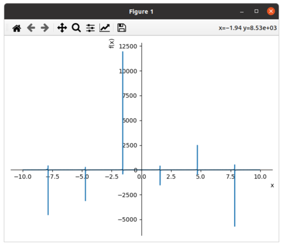
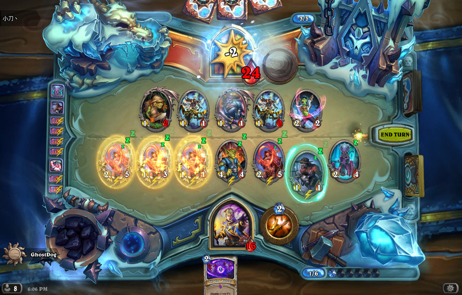
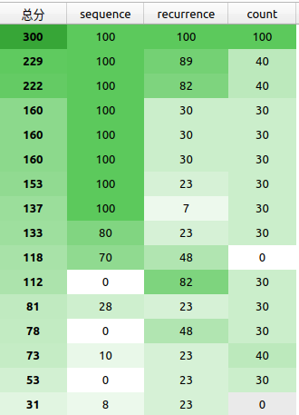

## 前言

虽然我不是一个文化课选手，但到了高三，我的生活也较以前发生了很大的变化——高三学长们全都去上大学了，机房里一下冷清了不少，一些同年级的选手也因为竞赛失利不得不面对高考，投入文化课生活。今年我校的集训队选手只有2个，实在是不像去年那样声势浩大，在没有了集体氛围后，我觉得我需要做点什么来让我保持一个学习的状态。

<!--more-->

在看了wyj的[高三文化课学习周记](https://2o181o28.github.io/)（因为wyj的博客文章的网址一直反复横跳，就直接挂博客主页了）后，我觉得这种记录的方式是个不错的办法。虽然我也不期望我可以像高三班级里的人一样没日没夜地学习，但至少我的学习状态和进度要能让我在进入大学时各个方面都不算太菜吧。

## 第一学期

### 第一周（~2020-09-06）

进入候选队是我现在在OI方面唯一一个想要取得的成就了，我本来有过在这个学期全力OI的想法，但奈何我高二太颓了，不仅现在英语水平没有达到我预期的水平，甚至连高中物理数学都没有学完。经过我的再三思考，我决定把OI的事推到集训队作业布置以后，在OI学习开始前先冲一波物理和英语。

这周的时间安排基本都是上午英语背单词+阅读，下午物理+体育锻炼+OI出题，晚上英语课。

我本来以为物理把电学学完就快要收尾了，没想到光学居然不比电学简单，或许是我几何和三角函数太弱了吧。

与进展缓慢的物理不同，我感觉我英语阅读的进步挺明显的，这周的刚开始的时候，我的TOEFL英语阅读平均还要错到2个，做的差的甚至会错4个，但一周结束的时候，我就平均只错1个了（尽管还是每篇文章都有点一遍看不懂的地方）。

本来我还打算每天中午到高三班级那里转转的，但那里压抑的学习氛围让我觉得有点怂，就咕了。

就一个暑假没怎么运动，我的体能就大幅下降了，明明上学期我还可以跑完4圈的，现在我跑3圈就累的不行，感觉练好3000米很难。

现在周六是我每周唯一的不用上课的一天，好不容易到了周六我本来准备好好地颓废一下，但因为太累了起不了床，等到开始颓废都已经中午了。NOI之后我就入了弹丸的坑，我本来准备把1代和V3的游戏都玩一遍的，但现在我发现时间完全不够，就只能看看实况解解馋。前几天看到我关注的up主中有两个都在安利信条，我晚上就去看了，虽然没有全部看懂，但给人的观影体验还是挺好的。

周日就到了全天英语时间，上了课我发现我的英语听力就和学龄前儿童一样，啥都听不懂，非常自闭。

### 第二周（~2020-09-13）

和上周相比，我的每日任务中新增了一项英语听抄和跟读，虽然这在老师眼中是1个小时就可以完成的任务，但我一般都要接近2个小时，这导致我晚上的时间被大幅挤占（~~打不了炉石了~~）。老师说坚持练习十几二十天听力水平就可以有不错的进步，希望如此。

上个周末好像是物理竞赛的初赛，没想到ys居然没过。下午zc来小机房的时候，告诉我他过了初赛，但完全不想停课，我就很好奇地搜了一下物竞的复赛卷子，发现题目都很恐怖，解答过程中的算式全是用奇怪方式组合在一起的字母，让人完全没有看下去的欲望（~~看不懂~~）。

实际上我的英语阅读水平根本没有进步，只是上周连续很多次只错0~1个让我膨胀了，现在我每篇错的个数已经增加到了2~3个，甚至有的时候一篇文章我觉得我读得很懂都可以错到3个。

这周学长们的英语分级考试结果出来了（1~4级，1级菜，4级强），轩导是4级，lj，wyj和lmq是3级，dwh和bly是2级。让我有点震惊的是dwh前面学英语学得这么肝，而且词汇量还超级多，还能轻松自如地读英文小说，居然都只有2级。而轩导就是一如既往地吊打全场，听说他在4级的人里面排名也是比较靠前的，真不知道他是怎么变得这么强的。

这次叉院的二选，居然所有去参加的学长都过了，获得了5/5的好成绩。这虽然是一件很让人高兴的事，但同时也让我变得压力巨大。以前我觉得就算没考上叉院也没什么，但现在我好像就不太能接受这个结果了。而且从面试的情况来看，OI的水平和成就好像也挺重要的，这就让我很纠结现在到底是侧重文化课还是OI。

这周六我终于把弹丸论破V3的实况看完了，感觉游戏整体还是不错了，结尾我也挺喜欢的，但感觉这么设置结尾会让角色的个人魅力有所下降。

这次周日又是全天英语，但这次的英语听力我居然从什么都听不懂变成稍微可以听懂一点了，感觉不错。

### 第三周（~2020-09-20）

现在感觉已经比较适应英语作业的量了，花在听抄和跟读上的时间也降下来了一点，~~感觉听力有进步~~。但我的阅读不知道为什么一直很拉跨，根本看不到我第一周只错0~1个时的影子。这周写作也开始了，但对我来说综合写作的难点还是在于听力，这周文章一共写了2篇，虽然我写得很慢，但感觉难度不算很大。

这周末好像物理复赛了，不知道大家考得怎么样。

这周的周二周三lzq居然都咕了没来学校，然后这两天我在学校就颓得很，在油管上云了好久的MC。我发现不知道为什么油管用流量的速度比B站块这么多，感觉油管看2个视频的流量够我B站看一下午。

在这周四周五的时候我不知道为什么突然就感受到了多校出题DDL的压力，开始肝数据，后悔出T1的时候给自己造数据挖了这个大坑，数据不能直接随的题真是太讨厌了。我现在都不知道我的数据到底强不强，希望不会被乱搞过去。

这周我终于结束的我的物理新课学习，感觉狭义相对论是真的难，我在网上搜了好久都找不到一个能让我很好理解质量变换公式的推导，就只好把这个当成是固有知识了。而且我是真的菜，在学完并且做完题后，我都没有意识到动能公式并不是仅仅只把 $m_0$ 改成 $m$，一直以为 $\frac12 m v^2$ 和 $mc^2-m_0c^2$ 是等价的。我在晚上做英语的时候，不知道为什么突然开始想这个问题，随便代了一组数据进去，才发现这两个并不等价。原来我上午做题的时候，列出来的式子不仅比他的难算，而且就算算出来了也是错的。

### 第四周（~2020-09-27）

周一开始了物理刷题计划，发现我现在还是一个不会做题的彩笔。而且我发现我好多以前的知识都忘了，甚至都把电势能和电场强度弄混了。

周二和周三跟lzq出去颓废了(~~老年生活~~)。周二我还勉强写完了英语作业，但周三外出时间太多我就把英语给咕了。这周因为机构有事，本来晚上的自习和课就都没了，而且老师也都咕的很，线上的作业也没有布置，所以我就咕的很心安理得。

周四一回来就是运动会，小机房吵得很，我就只好下去看比赛了，~~然后就没有学习~~。我感觉运动会还是挺有意思的，就一直和zc在下面看比赛，但lzq似乎不这么认为，我每次在机房看到他他都在出题，然后周五lzq就直接没来学校，很咕。周五我就一天都在看运动会，但一不小心忘了去看最后我们班的排名了。真不明白为什么周五学校没有晚饭，难道连高三的住宿生都不要吃饭吗？

虽然周六和周日理论上高三都要上课，但我周六直接咕了，周日又要全天英语，所以这周末我完全没受到调休的影响。

这应该是我这学期以来最颓的一周了吧，希望以后不要更颓。

### 第五周（~2020-10-04）

周一做物理又自闭了，好不容易刷到一道原题，当时我还会做，现在就已经不会了。我已经完全忘记我以前知道过辐射量是 $\sigma T^4$了。而我现在学的数学看上去就简单多了，我觉得数列和缩放是前几章里最有意思的部分了。还记得以前看dwh做缩放的时候用过一个 $\ln x\le x-1$，我觉得这是真的有用，而且让我凭空想肯定想不出来，这次我就用这个切了一个证 $(1+\frac1x)^x\le 3$，而且用这个方法可以直接证到 $e$。

周二跑1000米自闭了，好久没跑，跑完后难受得很，就跟去年和学长一起做体能测试的时候一样。这导致我这天咕了很多学习内容。

马上都10月了，不知道为什么这次集训队群里还这么安静，我印象中去年的时候大家都已经开始急了。看来是已经被CCF咕习惯了。

国庆前两天我都在颓废，OI和数学物理全都没碰，结果等到3号4号想要开始全面开工的时候发现英语作业多的要死。再加上3号早上有5部番剧首播，我看完后就发现好像没时间学别的了，就只能把英语先肝完，并把数学物理鸽了。4号我就一起来直接开工，总算是差不多完成了所有任务。

感觉数学的数列部分还是很有意思的，可惜我实在太菜了，好多题都不会做，尤其是需要裂项的题，我好多都裂不出来。我在做题的时候忽然想起来一个以前我想过的求 $\sum\limits_{i=1}^na^ii^2$ ，记得当时我挺快就想出来了，而这次我想了将近20min。而我做到的物理题就没什么意思了，感觉都是课内题的画风，没什么难度，可能这个"某校自找真题"的"某校"比较菜吧。

这个国庆和liji交流了一下，最让我震惊的是人工智能课的外教授课居然可以做到人均听不懂，而且据说还是常态，就很恐怖。

### 第六周（~2020-10-11）

这周一和周四两天我都来学校呆着了，不知道为什么一向早起的lzq都到的比我晚。

周一的时候我把数学物理的书都带到学校了，结果走的时候嫌它们重就没带回去，然后周二和周三就颓了两天。在这两天里我把IOI的day1看了一下，感觉不算太难，至少比去年简单多了，尽管我T1的判0没有完全想清楚。和T1相比，T2T3就简单多了，T2甚至给我一种CF简单题的感觉，乍一看很复杂，仔细一看好多东西都是花里胡哨的，完全没用。

和物理学习相比，我感觉学数学和英语要艰难的多。每次物理看完一个章节，我都会有一种我感觉我懂了的感觉，做了几道题就感觉自己真的懂了。而数学每次我看完一章，总会感觉它在说废话，但做做题又感觉自己全都不懂。而英语是最艰难的，我现在感觉有很多的单词我都是看到了可以一下就反应过来，但听上去就是听不出，这导致我现在被听力乱杀。

这周打了几把酒馆战棋，第一次玩到猫猫，发现猫是真的菜，不论我怎么苟活都熬不过别人，一个粮都没吃到。

周五就月考成绩就出来了，去了解了一下，感觉wyj考得还挺不错的，并没有全面崩盘，甚至化学都暴打了ys。语文和英语的除作文也达到了班均以上的水平，虽然作文的提升很缓慢，但已经可以和班里同学同步发展，共同富裕了。不过有点令我惊讶的是wyj的物理居然崩了，不懂为什么一个擅长数学的人会不擅长物理。这次ys应该算是正常发挥，就是语文老89了，而zc和jyg考得好像都不太行，而且jyg好像还没有达到班均水平，感觉有点艰难。

本来周六想在家颓一天的，但由于英语要上课，我就来了学校。结果到了学校后，我发现今天特别不想学习，刚好前几天听wyj讲了抗生，就特别想玩。我从贴吧里找了一个懒人包，运气不错，没有遇到一些人说的打开后是重生的问题。到现在我一共通关了2次，一次是Isaac，一次是AZ。我觉得抗生的水层虽然难了一点，但还可以接受，而矿车层就不一样了，我曾在11攻7延迟且会飞的状态下被打到进不了陵墓层。矿车层的小怪难度还可以接受，但boss实在是太变态了，根本打不过。

周日就是CSP初赛了，到现在我一张完整的模拟卷都没做过，就去考了。感觉卷子实在不难，我就没有检查，这导致我错了一个判断：谁能想到，一个叫`map`的数据结构，访问一次的复杂度竟然是 $O(n!)$ 的。

### 第七周（~2020-10-18）

这周就突然多了很多事，让我本来还算悠闲的生活变得十分忙碌~~尽管还是会颓废~~

周一上午的时候突然想起来系统升级的事，就去[尝试了一下](https://sunnuozhou.github.io/2020/10/12/Ubuntu-18-04%E5%8D%87%E7%BA%A7%E5%8E%86%E7%A8%8B/)，结果在升级途中集训队作业突然就不咕了，由此就开始了我忙碌的一周。

集训队作业一下来，我大概浏览了一下：

- 这次做ACM题

- 完成量从85%提升到了90%
- 不可以"泛做收获"了，必须交流题目

我看了一下我要搞的3道题，一个中档题，一个偏难的高精度，还有一个偏难的贪心，应该不是很麻烦，就一天一道把他们都搞完了。这一届的集训队是真的肝，刚发作业那天就有人把3题都弄好了，我都不知道怎么做到的。

这周的英语写作作业要写6篇，感觉很艰难。英语写作比阅读要动脑子多了，而我就不是很会动脑子。这一周的阅读终于恢复正常水平了，基本都错0~1个。数学和物理这周都是有空就做做，感觉物理知识忘得特别快，刚学完的电又快要不会了。而那本自招数学我就在水水过去，不想学几何，组合，概率部分又太简单了，完全没有数学分析有意思，可是数分我又有好多题不会或者要想好久。

这周二我还心血来潮把炉石改成英文了，结果第二天就是猎人的英雄之书，我感觉我英语还是不行，不仅不认识像 "the Horde"，"tauren" 这样的专有词汇，还不认识像 "solace" 这样看上去很常见的词，而且他们说话还不能暂停，我都来不及去查。

这周lzq咕得很，有3天没来学校。

周日英语模考了听力和阅读，感觉很难。阅读我30题错了3个，平时做的时候不感觉时间紧，但考试不知道为什么就感觉时间过得飞快，最后一道的3选都没能去原文中找。我听力还是很菜，听的时候好多细节都忽略了，让我各种挂题。还有一篇文章我从头到尾都没听懂他在讲什么，直到出了选项我才懂。文章的标题是"infrastructure"，然后我在听力中听到了很多个 "toll"，我完全不能把它和标题联系起来，就以为我听错了，很自闭。

### 第八周（~2020-10-23）

这周开始做集训队作业的试题泛做了，感觉今年的题比去年要简单一点（但难写），现在大概在以一天3题的速度进行。理论上，我只要能做到每个工作日做两题就可以准时完成任务了，所以现在进度还算可以。但ACM的计算几何含量是真得高，我现在已经跳过了3题了，比例远超过可以跳过的比例。

这周二我还把试题交流的任务弄完了，我都没想到我可以在这么短的时间内改编出一个集训队难度的题（而且我对这题的自我感觉还不错），我本来是预定在11月前弄完的。我在发现有试题交流的任务的时候我就是想好要在[Project Euler](https://projecteuler.net/)找题来改编（我有充分的自我认知我不能独立出出一道好题）。但我以前对[Project Euler](https://projecteuler.net/)都是只闻其名，从来没有上去做过题，当我咨询了一下xyx以及自己上去看了看后，大失所望：它即没有官方题解来让我一个一个去找有拓展性的算法，题目难度又不尽如人意。在我上去找的几道题中，大部分都是我需要花一部分时间想出来，然后感觉太简单，或者太难我不会做。结果我运气很好，没看太多道就遇到了一道本身已经有点难度，而且还有拓展性的题目。我稍微把这题拓展了一下，让它看上去没那么像PE题，并想出了一个还算有点意思的解法（至少我以前没见过），题就出好了。

这周我数学物理咕得很，几乎都没怎么做。

这周wyj让我在一个[测词汇量的网站](http://testyourvocab.com/)上测了词汇量，我突然对别人的词汇量产生了不少兴趣，就忽悠zc和lzq也测了词汇量，但结果让我感到非常疑惑，怀疑我并没有像测试网站上显示的一样有 $10^4+$ 词汇量，但在这个网站和墨墨背单词上测的词汇量是差不多的，总不能同时出一样的错吧。我第一次测词汇量是在高二下的时候，那时候测下来是 $9500+$，但在那之后我都一直只知道xyx $12000+$ 的词汇量和dwh $11000+$ 的词汇量，所以以为大家都吊打我，也没有产生疑惑。wyj测下来是 $6500+$，但以我对词汇量的了解，wyj应该远不止这个水平，在高二下我和wyj看xyx背单词的时候，就连xyx都夸赞wyj的词汇量多。而且lzq和zc分别是 $4500-$ 和 $5000-$，这说明一个正常的高中生的词汇量在 $5000$ 左右，也就是说我在学TOEFL前的词汇量应该比这个更少。然而我在机构背了 $3000$ 个左右的单词，在墨墨上也背了 $3000+$ 个单词，并且这两个之间应该还有不小的交集，所以理论上我的词汇量应该上不了 $10^4$ 才对。

这周四下午学校的网把`bilibili`给ban了，导致我中午看下饭视频受到了极大的阻碍，很不爽。

### 第九周（~2020-11-01）

这周开始有英语听力作业了，阅读也变成了一天3篇了，再加上我每天要做3到集训队作业题，感觉很肝。

一般来说，我的3道集训队作业题都可以在上午做完。但是我周三了两道把我搞自闭的题，要不是这天要做的一题在周二已经想好怎么做了，我觉得我甚至可能完不成每日任务。首先这题有个单纯形法题，我一眼就猜到了这题单纯形法，但英文不好（其实是眼瞎），漏看了一个条件，导致浪费了很久。当我写完了题并快速调对后，我`TLE on test 33`了，一开始我还以为我用 $\ge$ + $\le$ 来表示 $=$ 导致T了，但下数据一测，发现我跑的飞快，于是我就开始了我艰难的过题之路：

期间我使用的方法包括改编译器，改eps，改`double`和`long double`，改随机种子，改数组大小。其中的每一个版本就可以在我电脑上ac。然而这不是结束，做完这题后我发现下一题是计算几何，但由于我跳过的题太多了，我准备做这道计算几何，因为他看上去不难，然后我就写题半小时，调题调一年。

周二下午我还想了出题的事，一会儿就想好了要出的题，而且感觉质量还不错。结果过几天再一想，发现前几天想了道假题。

现在学校的网络管理很离谱，上周我发现b站本ban了，这周我发现居然支付宝都被ban了，害得我交个报名费都要开代理。以前ban战网还算可以理解，但现在连b站和支付宝这种老师都可能日常要用的都ban了就很离谱。而且我周五遇到了更惨的情况，我手机一不小心欠费了，导致我的手机不能用流量，于是我甚至不能用支付宝给手机充值。而且当我想使用银行卡时，我惊奇地发现居然这也上不去，我怀疑学校的网是用了白名单。最后我只好先用微信充个10块，有流量了再用支付宝充。

这周数学物理又是咕咕咕状态，感觉再过几天物理知识就又要归零了。

这周去体育锻炼的时候，我发现我引体向上已经可以不标准地做7个了！可惜我现在还是跑不动路，连跑1000都觉得累，真不知道lzq是怎么随随便便2000，3000的。

周末入正了isaac，获得我steam上的第一个全成就游戏。我发现我的英语水平还是不行，有些mod的介绍都不能完全看懂。

### 第十周（~2020-11-08）

这周继续做集训队作业，而且还没完成每天3题的目标，很难顶。而让我没完成目标的罪魁祸首就是[19年world final的I题](https://sunnuozhou.github.io/2020/11/05/ACM-ICPC-World-Finals-2019-I%E9%A2%98/)，我一看题面，觉得这像一个简单的模拟，结果写完一交发现过不去。仔细想一下发现这题需要模拟的步数可能上天，真不知道为什么题解里写直接模拟也是一组解法。我花了好久把模拟变成了记忆化搜索才过了题。

由于上周入正了以撒，我周一周二晚上都在玩它，这导致我这周普遍睡得很晚（虽然比起真正的高三学生还是不算晚）。

不同于集训队作业上的萎靡，我这周英语听力感觉都还不错，除了历史艺术类的lecture都没有错超过一个，课上conversation也基本都可以听懂。这比起我刚上课的时候一句也听不懂已经好很多了。而我的阅读也恢复正常了一点，至少分数都在25分以上了。

这周由于srf被ob强制调去了可以被看到的位置，csl也在备战期中考试，小机房的学习氛围好了不少。在我的印象里，这是我第二次尝试在小机房做阅读，这次就比上次好了很多，没有受到太多打扰。到了11月后，我就渐渐感受到了北大集训的压力，希望我前一段时间没学OI不会让我水平大幅下降。虽然这次我只要进个前30就不会不爽，但我真的很担心出现像去年的liji那样的暴毙情况。

lzq在上一周好不容易来了4天后，这周又开始咕了。而且他为了教小朋友上课还急剧放缓了日语，英语，和集训队作业的进程。感觉这样不太行。

这周还有一个意外就是体育的会考，我甚至都已经把这事给忘了。而且这次g0通知我的时候我刚好在做阅读没看QQ，导致我去报的时候编组已经结束了，我就只能一个人一组（好像），很不爽。

11月7号也是CSP2020开考的一天，但关于CSP的事我都写在[游记](https://sunnuozhou.github.io/2020/11/08/CSP2020%E6%B8%B8%E8%AE%B0/)里了，在这里就懒得写了。

### 第十一周（~2020-11-15）

这周依然是做集训队作业，但除了日常上午做3题之外，我还开了[Gomoku](https://ioihw20.duck-ac.cn/problem/299)这题，虽然正常做法是直接针对对面的算法输出必胜解，但很明显这么做非常没有意思，于是我决定写一个普适性算法，再加上srf他们的研究性学习的题目也是这个，我写完的AI还可以和别人的打架，很有趣。

这个计划是在周一看srf写这题的时候定下来的，他调了一下午还是没有过这个题。

我从周二开始写，周二的时候写了棋盘的框架和对面的算法，并且让对面的算法自己和自己下，发现对面的算法很垃圾，会走出很多很sb的举动，我当时以为我可以轻松打败它。

周三我写了自己的估价函数，并调对了它。这个东西是真的难写，我写挂了一万次。为了在周三写完它，我还花了我晚上宝贵的1个小时颓废时间来调试（其实是因为英语课下课早）。

周四我把它交到了OJ上，并获得了88分的好成绩，远远高于srf的67分。并且在我把这个算法丢给srf，和别人的算法打架时（当时大家的算法都没有搜索，只有一个估价函数），我获得了对阵srf的算法后手67/33，先手97/3，对阵czy的算法后手77/23，先手100/0，非常强大。虽然打不过csl的算法，但因为我们两个的算法都没有随机，所以并不能很好的说明问题。可惜我的算法被人类智慧轻松打败了。然后我加了一个对抗搜索，搜了5层，并通过了题目。这个我把我的程序丢给srf后，发现吊打别人的算法更加明显了，尽管后手不能100%胜。然而srf的多次尝试后，他成功地先后手都赢了我的AI。

晚上我把我的代码丢给了wyj，他让我的代码多搜了几层，并多搜了几种走法，但他说我的AI用脚下都可以赢，其原因是wyj搜了10层，而偶数层我的估价函数会返回对手的估值，导致变得很弱。但他告诉我了一个我的AI的致命漏洞，就是每次下棋只会向外拓展一圈，而我作为一个五子棋白痴，很明显在一开始写的时候并不明白这个道理。

周五的时候我又加强了一下我的AI，从拓展一圈变成了两圈（为了速度没有拓展更多），并且也多搜了几层，成功在完全不针对别的做法的情况下通过了题目。这次我把我的AI丢给srf后，成功先后手同时100%胜了别人的算法。srf，csl在多次尝试后先手赢了一句，后手就没赢过，虽然这个AI现在并没有很强，但这样的结果我已经很满意了。

这周还是班里期中考试的时候，听说这次语文和生物很难。ys考完语文的时候叫嚣着他连89都没有了，结果成绩一出来105分，吊打别人。而jyg这次语文也获得了班均98分，有了不少进步。这次wyj考完试时的表现和别人大不相同，别人考完语文都说语文难，考完英语都说听力难，就wyj考完语文和英语都说没有什么特殊的感觉，甚至觉得考得不错，看来他这次稳了。事实上，他语文的确获得了较大的进步，也取得了班均。

相比之下，我的学习情况就差了很多，这周的阅读一篇24，一篇25，很拉跨。

### 第十二周（~2020-11-22）

周一我又把wyj帮我改过的五子棋程序再改了改估价函数，并加了一个迭代加深的上限，让它在某些情况下变得快一点。但这个版本的AI貌似有一些奇怪的bug，会走一些令人难以理解的臭棋，但由于没人别人的AI和我打架，我就没有什么兴致再来改它了。

期中考试的具体名次已经出了，ys和wyj都进步神速，十分强大。

炉石的奖励系统更新了，我感觉其实没有网上很多人说的那么不堪，但也希望那些人能把奖励骂的更多一些。感觉这次新版本强的卡不多，而且这次我开了63包只出了4张橙，还都没什么用，很亏。而且看到网上很多人都说对决模式不行，但我感觉挺好玩的。

这周英语开始要写一整套的写作了，第一次写的时候我的独立写作连第二个论点都没写完，很艰难，但第二次写就好一些了，至少可以在规定的时间内写出一个正常的文章。我本来以为我的综合写作已经可以了，结果这周上课的时候老师给我提了不少要求，而且我按照老师的要求改完后，词数居然达到了413词！（要求是150~225词）感觉可能会写不完。

由于上周我阅读极其拉跨，我准备通过读一些英文的小说来提高一下阅读水平，为了让我更好地坚持，我决定先读一些我读过中文版的书。最终我决定读[《animal farm》](https://en.wikipedia.org/wiki/Animal_Farm)，这本书的中文版是我在升高一的暑假被wyj推荐读的，感觉是一个还算可以的用来锻炼水平的材料。真正读起文章我发现我的词汇量还是不够，每天就看一小会儿都能有十几个不认识的词。虽然我觉得跟读书的关系不大，但我这周的阅读的确有所提升，一篇是27/30，一篇是28/30。

这周依然没有做到每天3题的目标，我发现自己完全不会最小树形图，搞了半天才求对方案，感觉离完成集训队作业遥遥无期。现在北大集训的时间已经确定了，在12月7号，也就是NOIP的后2天，这让我不太想参加NOIP了。感觉现在我的OI水平并没有保持在一个比较好的状态，希望北大集训不要暴毙。

### 第十三周（~2020-11-29）

可能是阅读和写作变得熟练的缘故，这周我发现下午的时间多了一些，加上晚上的颓废会让我没时间在晚上看书，我就把书带到了学校里来看。这下我看书的时间就多了不少，平均每天可以看个一章。但是随之而来的一个巨大问题就是我每天要新背的单词多了不少，有的时候我一天的实际背诵量会达到我计划背诵量的150%。

这周的阅读还是保持着不错的水准（对我来说），做了一篇是9/10/9。所以我的主要精力是放在听力上的，现在我听力的状态是有的时候完全听不懂，然后错1~3个，更多的时候可以听懂，错0~1个。lzq的听力表现出了不同于阅读的高水平。有一篇我以前做的艺术历史类lecture，我当时完全听不懂，并错了4个，而lzq虽然也说着听不懂，却只错了1个。他甚至可以在完全不听听力的情况下，使用他的“排除法”排除2个错误选项。

这周往集训队OJ上交题的时候，我居然有一道题在CF上过了在OJ上没过。更让我震惊的是这居然是CF的原数据，而且我在自己电脑上测的时候也因为精度问题sqrt了负数，不知道怎么在CF上过得。

上周六的时候我溜去学校玩，当时做了一个wyj的物理题。这是电磁感应相关的，我大部分东西都忘了。题目中有2个足够长的无电阻导轨，两端都被带电阻的导线连接，在导轨偏右边的一个地方有一个均匀变化的磁场，在左边电阻的两侧连有电压表。题目第一问问了电压表的示数，我当时做的时候没怎么多想，就直接当左边没有电动势做了。后来我仔细一想，发现我根本不能理性地说明左边的电动势为0。我研究了一会儿，还是不会说明，就想知道班里是怎么讲的。结果zc告诉我班里是直接当电源在右边做的，很没意思。

周一不知道为什么学校组织了看电影，我就也跟着去了，但实际的内容并不如我想的有意思。

### 第十四周（~2020-12-06）

北大集训的前一周，感受到的压力还是挺大的，希望可以得到一个比去年好的成绩。

由于北大集训临近的影响，我这周的效率奇低，下午除了稍微学学英语以外就没做什么有意义的事，甚至周五连晚上的英语自习都咕了。

[《animal farm》](https://en.wikipedia.org/wiki/Animal_Farm)我现在已经看完了，总体感觉阅读难度可以接受，但其中有一些我不能理解的英文表达我也没有去求证，从下周开始准备换本书看了。

这周晚上的时候也没有心思看学习的东西，就一直在看动画区up主联动among us，感觉很有意思。

这周末就NOIP了，然而这次我并没有参加。考前给学弟们介绍了一下 `g++ -ftrapv -fsanitize=address`的科技，还差点讲错了。

考完后问了问srf的成绩，他告诉我他340，我本来以为这分挺低的，没想到是题难，整个江苏居然没多少人比340高，甚至有点集训队都不到300。而且这次djq又AK了，看来srf的队长危险了。

### 第十五周（~2020-12-13）

这周在北大集训，主要发生的事情：

- 通过不断地变菜和失误，我获得了37名，成功退役。
- 见到了很多nb的人，感觉自己被吊打。

详情见[2020北大集训游记](https://sunnuozhou.github.io/2020/12/07/2020%E5%8C%97%E5%A4%A7%E9%9B%86%E8%AE%AD%E6%B8%B8%E8%AE%B0/)。

### 第十六周（~2020-12-20）

从这周开始，我就要有一个和以前完全不同的时间安排了（或许会和最开始很像），但在第一天，我并没有完全想好要干些什么，就把各个我想做的事都做了一点，感觉还不错。

这周开始看[《Rita Hayworth and Shawshank Redemption》](https://en.wikipedia.org/wiki/Rita_Hayworth_and_Shawshank_Redemption)了，看了几页感觉可以坚持下来。然后这天就又新增了30+个不会的单词。我发现这本书比我看的上一本书难懂一万倍，有很多我读不透的句子，也有很多单词我推断出来的意思并没有出现在词典里，而如果我用词典里的意思代入就会读不通。

晚上的时候我发现我的Chrome上Google同步变成已暂停了，尝试登录发现他说找不到我的账号，而且我选择找回以及打开一些Google网页的时候都出现了错误。当时我稍微鼓捣了一会儿就又好了，我就没管它，第二天居然看到新闻上说昨天Google挂了，很震惊。

开始写OI生涯回忆了，不知道什么时候能写完。

这周有月考，但ys和wyj考得都不怎么好，数学班均有102分，但他们却都只有89分，这让我非常震惊。

开始进程：线性代数；继续进程：数学分析。我数学分析终于学完第一章了，感觉数学分析比线性代数难非常多，例题里全是一些我不会的大难题，不像线性代数一样讲得很基础。

物理的进程也恢复的，但我物理的算力已经归零了，连最基本的东西都算不对。

我越是学英语，就越觉得不能理解，为什么有很多意思相关的英语单词拼写完全不相关，比如`peninsula`(半岛)，`island`(岛)之间就毫不相干。如果我知道"岛"是什么，而不知道"半岛"是什么，那么我也可以知道这个东西和岛相关，但如果我不知道`peninsula`，我就完全没有信息量。

一再延期的体测终于在这周周五搞完了，我成功在接力中跑了倒数第一。

周五心血来潮改了改博客的配置，修改了一些外部链接和[about](https://sunnuozhou.github.io/about/)，并添加了友链。周末本来想像wyj一样搞个五子棋的网页的，但发现我完全不会html,js,css，于是就放弃了，期间反而帮wyj发现了一个bug。

### 第十七周（~2020-12-27）

这周我依旧在很普通地继续所有的学习进程，而lzq就不一样了，他正在搞成人仪式。但我看他一波操作，最后好多想法都被砍掉了，导致最终流程依旧和以前没什么区别。有一说一，我不觉得将高考动员大会和成人仪式放在一起可以有任何比较好的效果。

周一晚上，我照常去英语机构自习，然而当我想要离开的时候，我惊奇地发现门上居然挂了一把巨大的锁。周围乌黑的一片，一看就不像是还有人的样子，我就只好重返五楼询问老师怎么离开这栋建筑，并得知了可以从后面的楼梯走下去。我绕道后面（这是我从没有去过的地方），发现门被绳子系住了。我就想去看看可不可以从别的楼层找到后面的楼梯，但当我到3楼的时候，我发现这一层灯都没开，电梯是唯一的光源，再加上电梯的门旁边有铁栅栏门（尽管没锁），让我十分恐惧并返回了5楼。这次我尝试暴力解开了系着门的绳子，发现门后面是一副完全没有装修过的场景，水泥的地板和有点生锈的铁扶手，装修的工具散落在楼层间的平台上，而且没有灯。我又怂了，想问老师确认一下是不是这里，结果发现找不到人了。我又是一通乱走，但还是找不到别的出去的路，最后没有办法，选择开了手电筒走那个楼梯，走到大概2层的时候楼梯就逐渐变成了装修过的样子，旁边也有灯了，一切就都恢复正常了。

现在srf回班学习文化课了，但他看上去一点也没有把心思放在文化课上，经常来机房看知乎和下围棋，多次发表“不想好好考期末考试”，“觉得没什么好复习了”等言论，我觉得很不行。不过自从他被班主任抓回去后，就变学一点了。

月考的排名出来了，这次zc考得不错，击败了ys和wyj。

我目前已经把线性代数的第一章学完了，感觉还不错（第二章难了不少）。而数学分析书上的题是真的难，我基本每道都要做好久，有的题还不会用正常的方法做出来，比如求 $\lim_{n\to +\infty}n\sin(2\pi n!e)$，这种题如果不用 $e=\sum \frac1{n!}$，我根本不会做。

周四周五的时候搞了一下[sympy](http://sunnuozhou.github.io/2020/12/25/%E5%AE%9E%E7%94%A8%E6%95%B0%E5%AD%A6%E5%B7%A5%E5%85%B7sympy/)，感觉挺有意思的。虽说这个东西并没有非常nb，但还是可以在我做数学分析的题时帮到一些小忙的。

这周末做了第一次托福模考，拿了94分，感觉对我来说还行。

### 第十八周（~2021-01-03）

sympy太菜了，我就随便玩玩，就发现了好几个很菜的地方，比如它可以把 $\frac{\sin(x)-\sin(y)}{\cos(\frac{x+y}2)\sin(\frac{x-y}2)}$ 化成2，但不会化 $\frac{\sin(x)-\sin(y)}{\cos(\frac{x+y}2)}$。而且在某一种化简方法下，它还化成了 $-\frac{-\sin(x)+\sin(y)}{\cos(\frac{x+y}2)}$，非常愚蠢。而[wolframalpha](https://www.wolframalpha.com/)就会化简。

我不经意间，发现Ubuntu下`E-Mail`链接的应用是[thunderbird](https://www.thunderbird.net/zh-CN/)，而我以前从来没有了解过它，就尝试使用了一下。感觉这个应用的support做得就比较靠谱，我想要解决的问题都可以在[这里面](https://support.mozilla.org/en-US/products/thunderbird)找到解决办法，不像Google的support，说了和没说一样。我先把我的qq邮箱和gmail邮箱导到了这个里面，感觉还挺好的。浏览体验不求和Gmail媲美，至少已经比qq邮箱好很多了。然后我又将qq邮箱的联系人给导入了进去，感觉已经可以正常使用了（尽管我完全没有需求）。

这几天好多应用的年度报告都出来了，感觉挺有意思的。其中我觉得b站的报告做的不太行，它竟然因为我分多次看完了一个游戏实况，而认为我最喜欢的视频是这个游戏实况，并说我循环播放了16次。而且它猜测的最喜欢的up主也非常离谱，居然是根据看视频的次数，而没有考虑更新量。

DDL果然是最好的生产力，我看lzq他们管的成人仪式的事情，在周一的时候还悠闲得很，到周二周三就多了一坨事情，可能比上周加起来还多。最后我觉得成人仪式弄得还是不错的，就是本来说好的要保持严肃这条规定已经不知道被丢到哪里了，进行冠礼的时候全场都在笑。

这周突发奇想，以为冰法可以在高分段有不错的发挥。但在调试了十几局后，发现谁也打不过，是个菜比卡组。

忏悔不出所料地又跳票了，不知道还会不会再次跳票，希望我可以在上大学前玩到。

[《Rita Hayworth and Shawshank Redemption》](https://en.wikipedia.org/wiki/Rita_Hayworth_and_Shawshank_Redemption)我已经看完了，现在开始准备看我完全不了解剧情的书了，决定先从短篇看起。

### 第十九周（~2021-01-10）

从这周开始我每天晚上都要做英语的模考了，这导致我晚上到家开始颓废的时间晚了很多。但我真的觉得大量的模考对英语水平的提升并不大，最多提升提升答题技巧。我现在对英语的目标就是把托福的听力完全听懂，但现在来说这还十分困难，一套题里有一篇听力我能完全听懂就已经很好了。我现在觉得阅读其实也挺困难的，各种熟词生意让我十分自闭，尽管托福的阅读题目不能反应这一点，但我看小说的时候常常会有这种感觉。

现在我开始看[《I, Robot》](https://en.wikipedia.org/wiki/I,_Robot)了，不出我所料，这果然是一本wyj看过的小说。比起[《Rita Hayworth and Shawshank Redemption》](https://en.wikipedia.org/wiki/Rita_Hayworth_and_Shawshank_Redemption)，我觉得这本书的语言更让人容易理解一些。毕竟是第一次看不了解剧情的书，我也不希望开局就困难重重，完全理解错了都不知道。

线性代数和数学分析都看到第三章了，物理做的题也比以前多一些了，感觉状态不错。

虽然我发现在我学习数学的时候`sympy`用处不大，但在学习物理却体现了很大的帮助，比如我要求一个位移为 $\sqrt{1+at^2}$ 的物体的加速度变化情况的时候就可以直接`plot(diff(diff(sqrt(1+a*t**2))))`（不画图这个函数的二次导我一眼还看不出变化趋势）。

生涯回忆应该快写完了。

本来这周想重启跑步计划的，但当我作死地在刚变冷的周三去跑步时，我发现我跑一圈就冷得不行了，于是重启跑步计划又失败了。而和lzq的快乐乒乓球因为在室内没有风就不算太冷。

lzq的物理也开始学了，感觉他学得比我认真多了，每一题都会细细思考。我看他现在做的题，发现有的题我本来只会用几何方法做的题现在会用纯代数方法做了，感觉不错（说明我的三角函数有半个正常人水平了）。

下周就要考托福了，希望人没事。

### 第二十周（~2021-01-17）

现在我越来越觉得我的阅读水平和听力水平菜爆了，估计比班里的人菜一万倍。就连以前我觉得简单的托福阅读我现在也经常出现看不懂的情况了，比如在一个长句子里有一个虚拟语气，再省略if倒装，我就完全看不懂了。听力也是，我现在感觉只能凭借听到的零星几个词来猜选项，根本听不懂。

上周tlt考了第一次托福，发现考场上别人做口语的声音可能会成为很大的干扰。这就让我更虚了，本来我在很安静的情况下都拿不到什么好分数，更不要说有人干扰了。

学了这么久的线性代数，我感觉我根本没学到可以实际运用的东西，就比原来多会了一些概念和证明，感觉很无趣。好在马上要开始学行列式了，感觉这可能会开始有用一些了。

这周和wyj，jyg讨论物理问题的时候，我认为把速度拆到x，y轴分别考虑的时候，动能也可以分别考虑。但wyj和jyg都表示tjw说过这是错的，但他们又碰巧都忘记了反例。这就让我很自闭了，因为我怎么想也想不到反例，但又担心以后做题的时候因为这个错。后来我问了物理神仙tlt，他告诉我这是对的，那我就暂且当它是对的了。

jyg还问了我一个偏OI的，在他们数学书上出现的问题，我还不会做。我以为我的OI水平大幅下降了，没想到经过讨论，答案是错的。

虽然我已经吐槽了无数遍sympy的画图了，但这次是真的震撼到我了，$\tan(x)$ 可以画成这样我是没想到的，它就不能智能的判断一下有效坐标范围吗（尽管手动加一个坐标范围限制就可以看了）:

周四做了做数学分析的题，发现我菜的要死，一题做半天。有一题证明对于 $x\in[0,1],p\ge 2$，有 $(\frac{1+x}2)^p+(\frac{1-x}2)^p\le \frac12(1+x^p)$，我在已经证过对于 $x_1,x_2>0,p\ge1$ ，有 $(x_1+x_2)^p>x_1^p+x_2^p$ 的情况下，居然还想了半天。我以为左右两边在 $x=0$ 处恒等，结果一求导漏洞百出，把我自己搞晕了。幸亏wyj帮我发现是在 $x=1$ 处恒等而不是 $x=1$，要不然我可能还要再花很久时间（因为我以为这个方法行不通了）。

这周lzq是真的咕，一共只来了一天，其他时候全部处于失联状态，这导致这周tr要点外卖都开始来找我了。

[OI生涯回忆](https://sunnuozhou.github.io/2020/12/14/OI%E7%94%9F%E6%B6%AF%E5%9B%9E%E5%BF%86/)终于写完了！！但在上传qq空间的时候遇到了一点问题。我的字数超过了qq空间的字数上限，于是我准备像xyx一样用图片展示，但我的网页截图工具给我的博客截长图的时候背景会变成循环背景，很丑。于是我只能先用chrome的打印把网页变成pdf，再把pdf的每一页转成图片。然而pdf一共有17页，所以我还要合并图片才可以丢到qq里。

周五晚上基本没管明天要考试的事情，一直在颓废。自从上次我发现《我，机器人》有改编为电影后，就一直想找机会看，但看完感觉拍的并不好（相对于豆瓣的评分），一些翻转也都被我猜到了，倒是最后一幕对应“梦”的镜头还有些震撼。不过我小说都看一半了，电影里居然一点我看过的都没讲，我是不是给自己剧透了一大波？

这周六去考了托福，终于知道了原来3号楼上面的那些奇怪的空教室居然是考托福用的。第一次发现这些教室可能还是初升高的时候，当时完全不明白那些三面封锁的机考位是干嘛的。这次考试的阅读是真的简单，比我平时做的模考简单一万倍，我4篇做完还有14分钟。而听力我就不太行了，最后一篇完全没听懂，考到最后已经累爆了，幸好没有加试。独立口语和写作的题目都是往年的，可惜我并没有好好做过这两个。最后托福给的估分阅读30，听力27，被tlt力压一分，我是完全不能理解为什么我听力能有27，感觉自己至少蒙对了3个，希望最终成绩不要太差。

### 第二十一周（~2021-01-24）

可能是因为班里的自习比较多的原因，这周小机房比较闹腾。快乐归快乐，我的学习效率的确比没人的时候要低了一些。不过刚考完托福，稍微颓几天也是可以的。

白天的作业量依旧，但我现在晚上已经不在机构上晚自习了，改在学校里上，这导致我会挪用一部分晚上的时间来做白天的作业进而导致更颓，这就很不好了。幸好过了几天我的颓废程度有所下降了，基本上除了吃饭后的一小段时候都在学习，但我依然不能圆满完成我的学习计划，不是线性代数这一节特别多，就是数学分析的习题特别难，让我物理的做题计划进展缓慢。

这周lzq来了两天，我就快乐乒乓了两天，其中有一天还和tr他们碰到了，就一起快乐双打，我发现我的水平居然有正常人的水平了，很爽。

我对lzq不来学校还能不无聊的原因感到很好奇，但lzq并没有告诉我他都在干什么，只说看书可以大量消耗时间。于是为了~~消磨时间~~增加文化素养，我增加了阅读的书的数量，开启了双线程看书（一本中文一本英文）。

这周tlt一共给我做了两道数学题，其实都不难，但由于一题我用来比较烦的方法，误以为这是个难题，还丢给wyj做了，结果wyj使用了比我的方法更繁琐的做法。我觉得这非常有意思，就写了[一篇博客](https://sunnuozhou.github.io/2021/01/21/%E6%9C%89%E6%84%8F%E6%80%9D%E7%9A%84%E6%95%B0%E5%AD%A6%E9%A2%98/)记录了一下（然后一个下午的时间就没了）。

因为周末要八省联考，我从周五开始就没去学校，加上英语又刚考完了，我就好好地颓废了3天。

第一天醒来就被lzq告知炉石的迷你集合上线了，而且农夫的combo可以玩，我就快速上线组了一套农夫术开始玩耍。可惜由于天梯盗贼巨多，我的术士被打爆了，50%的胜率都没有。

后来我还按照以前机克牧的思路组了农夫牧，驰骋休闲模式，玩得很爽。

周日托福的成绩公布了，我104分，自我感觉很不错，口语和写作的成绩也都是我模考以来最高的。

周日ob还安排了yk学长给我讲数学，他给我推荐了几本书让我看，其中有我以前看过一点的《proofs from THE book》，当时我基本上都看不懂，希望现在可以有所改善。

### 第二十二周（~2021-01-31）

由于周一大家依然在考八省联考，我就只能在加学习。果不其然，效率极低，9点半才正式开始学习，看了看上次没看完的线代，又看了看积分，就跑去颓废了，整个上午一共只学了1个小时。

下午稍微变学了一点，背完单词开始做积分题。然而我是真的菜，做了近一个小时才做出来4道题。但后来做的时候稍微好一点了，周二我做8道题只花了40min。

《proofs from THE book》我也开始看了，看了一章后觉得当初因为第一章看不懂就弃疗的我是真的愚蠢，后面和OI相关的内容比前面要易于理解不少，而且这里面还有不少有用的东西，如“没有四元环的最大边数”等等。前几天看的时候都比较易于理解，但到后面就突然出现了一些“证明留作练习”的东西，有的我会证，有的我就不会了。

即使后面几天去了学校，也感觉没有前几周学了，每天看的东西少了很多。一方面原因是晚上暂时不上英语，减少了学习的氛围，一方面是我开始着手出题的事了。

这次出的题我打算原创两道，一道trick题，一道比较呆的数据结构题。在快出好的时候突然发现trick题可以被OI方法非常简单地通过，我本来以为再加强一下可以卡掉这个做法，想了半天怎么卡却发现在良定义范围内不可能卡，心态很崩。那道数据结构题我本来都担心暴力吊打标算了，结果标算跑的比我预想的快了10倍不止，让我成功把数据范围放大了10倍。后来我周末又弄了一会儿出题的事，终于想到可以卡掉简单做法的办法了。

周末还给xyx验了题，好久没写题了，居然代码水平没下降多少，很开心。我甚至还在一题和一个部分分上想到了比xyx更简单的做法。

逛b站的时候发现了一个[测中文词汇量的网站](https://www.arealme.cn/chinese-vocabulary-size-test/cn/)，我居然有8000多个，这个结果比我预想的好多了。

## 寒假

因为寒假里的事情不多，并且“周”这个概念的体现并不明显，我就懒得一周一周写了。

班级里期末考试结束了，wyj语文考了年级第一，是真的nb。wyj年级第7名，ys年级第20名，zc年级第41年，都挺不错的。wyj居然在第一个学期就完成了超越ys。不过这次期末是四校联考，而scz的成绩并不理想，wyj年级第7名，四校却要排到71名，ys年级第20名，四校要排到128名，这说明scz的顶尖选手跟省里的顶尖选手比还是有很大差距的（更何况四校并不能代表省里的水平）。

刚开始寒假生活的几天我都很颓，周二周四都在家颓了一整天，周三虽然去了学校却也没做什么正经的学习事，只弄了弄出题的事。感觉光是待在家里这个因素就会让我变颓不少，春节过后我觉得我要换个有学习氛围的地方去学了。

自从看完[《I, Robot》](https://en.wikipedia.org/wiki/I,_Robot)，我已经很久没好好看过英语相关的东西了（除了一些YouTube视频），下了以前的经济学人的文章在电脑里但我又懒得去看。

我从这周开始看[京极夏彦](https://zh.wikipedia.org/wiki/%E4%BA%AC%E6%9E%81%E5%A4%8F%E5%BD%A6)的[《魍魉之匣》](https://zh.wikipedia.org/wiki/%E9%AD%8D%E9%AD%89%E4%B9%8B%E5%8C%A3)了。我一向都还比较喜欢推理小说，但看过的日本小说不多，只有[江户川乱步](https://zh.wikipedia.org/wiki/%E6%B1%9F%E6%88%B6%E5%B7%9D%E4%BA%82%E6%AD%A5)的一些短篇小说和[东野圭吾](https://zh.wikipedia.org/wiki/%E6%9D%B1%E9%87%8E%E5%9C%AD%E5%90%BE)的[《解忧杂货店》](https://zh.wikipedia.org/wiki/%E8%A7%A3%E6%86%82%E9%9B%9C%E8%B2%A8%E5%BA%97)，并且也有挺长时间没看了。目前我觉得观感挺好的，由于我现在比较颓，花在看书上的时间也就比以前多了，一般一天会花两个小时左右在看书上。读中文书果然还是比读英文书要轻松多了，而且看纸质书的感受也要比电子书好一些。

WC2021结束了，国家队也选出来了，可惜我早已退役，不再是这一事件的经历者了。我校这次有两个前50名，考虑到刚考完期末考试，而我校选手又全员参与了期末，这个结果应该说是挺不错的了。不过这次srf居然大大失误，不仅没有保持住我校第一的位置，甚至没进前50名。不过策略上的问题总比实力上的问题好解决，到NOI的时候srf应该就不会犯这次的错误了。

清华参加了这次的联合宣讲，我也去听了一下，感觉还是蛮有意思的（尽管没有什么新的内容）。

[《魍魉之匣》](https://zh.wikipedia.org/wiki/%E9%AD%8D%E9%AD%89%E4%B9%8B%E5%8C%A3)好看极了，我一天看200+页，很快就把整本书看完了，并且准备开始找京极夏彦的整个京极堂系列看了。在去找之前，我开始看了[《副本》](https://zh.wikipedia.org/wiki/%E7%A2%B3%E8%AE%8A_(%E5%B0%8F%E8%AA%AA))，这是一本赛博朋克的小说，我以前没怎么看过，但这种类型还算是我感兴趣的。虽然我了解到这本书有被改编成电影，但由于上次看《I,robot》时对改编电影的失望，我并不是很想看。

脚上动了一个小手术，接下来一段时间走路都不太方便，于是我就整天都窝在床上，也变颓了不少。考虑到新年将近，整天颓废并没有给我太大的心理压力。

新年前夕wyj跟我讨论了代数数相关的问题，我发现我完全不会灵活使用我已学的线性代数知识，虽然用到的知识都是简单易懂的知识，但我就是不会往那个方面想。如果不是wyj提醒，我甚至连线性代数都不会去想。感觉学好线性代数还是困难重重的。

后来wyj还根据这个idea搞出一个OI题，经过我们的一番讨论，这题的质量还变得挺高的。我本来想把这题丢给lzq出，直接用在省选模拟赛上，可惜lzq不肯出。想着NOI前总归也要出题的，我就准备到NOI前再把这题用掉了。wyj给出了不错的idea让我也想再多出几个原创题，组个高质量模拟赛。可惜我细细思考了一会儿，发现偏数学方面的idea我也有一些，但考虑到我退役已久，再要出很多高质量的贪心/数据结构怕是有点困难了。

这次出题相较于上次给CSP出题，lzq变咕了很多，对验题的事也是一拖再拖，让我十分苦恼。虽说我在脑海里已经证明了无数遍，但没有人来帮我验一下，我总归还是比较虚的。

看了wyj的[寒假记录](https://2o181o28.github.io/2020/09/06/%E9%AB%98%E4%B8%89%E6%96%87%E5%8C%96%E8%AF%BE%E5%AD%A6%E4%B9%A0%E5%91%A8%E8%AE%B0/#%E5%AF%92%E5%81%87)，感觉wyj读书读的是真的多，相比之下，我看的就少多了。wyj可以一个下午看完三体（虽然是看过的情况下），而我一天一般也就看个50~250页。感觉自己果然还是太颓了。

和wyj出的题目出现了一些问题，经过一番讨论，我们把问题全部放到了模意义下。我本来以为这是个完美的解决办法，结果后来wyj发现存在一个算法可以在模意义下快速分解因式。搜索是个好东西，wyj通过翻代码找了一个小时找到的算法，我通过搜索不到10min就找到了，可惜这个算法我看不懂，只知道它的复杂度是多项式极的，跑的巨快。考虑到我在用中文的时候没有搜到相关内容，xyx也不会这个算法，我就当作没人会这个算法不管它了。后来想想，即使会这个算法，题目的难度也没有一下降至零，因为这个算法的时间复杂度是三方的，并不能把两个多项式全部分解，分解了小的多项式后还是需要一系列操作的。

这几天都不想学习，加上我发现我的数学分析和物理书全都掉在学校了，就只看了一点《proofs from THE book》。有大把的空闲时间，我很快就把题目给出好了（尽管我自己没写标算）。

## 第二学期

### 第零周？？？

我也不知道现在算不算第一周，毕竟学校还没正式开学，而我已经脱离了寒假生活，所以就不写在寒假里了。

在学校比在家里还是要热闹很多的，每天学的时间也多了一些，不算太颓了。但缺点是看书的环境和家里比实在是差太多了，光线要差很多。

这周最后几天高三都要上课，但我很懒，因为周日srf他们不训练，我就没来。周末两天在wyj的推荐下看了isaac的动物杯。这次我第一次现场看Isaac的比赛，发现暴毙巨多，只有几场是真的要比时间的，而且两边的世界线基本都差距很大。

### 第一周（~2021-02-28）

周一训练用的是我的题，T1大家基本都过了，T2居然一个A的都没有，最高的是srf，他居然不知道等比数列求和比是复数时的收敛条件，只有89分。而会判收敛的czy，csl等人都因为一些小错误反而没有srf分高。T3居然最高只有40分，出乎我的意料，好不容易我在比赛场上看到一个pcf写了70，结果常数爆炸，标算1.5s的东西他跑了12秒。

跑步计划要开始重启了，可是我今天跑了一圈就挺累了，很难顶。

lzq终于开始出题了，我就又把我和wyj出的题丢给lzq用了。鉴于上次我自己出的那套题最后一题基本没人做，我让lzq把这题放在了T2的位置，可惜的是大家都基本都发现T2才是最难的题了，结果最高分只有30分，效果很不好。

这周我都在学校上的晚自习，我晚上安排的是学英语，因为晚上人少一些，方便我读出来。我感觉学习的效率比以前在机构要低一些，但其实我现在在晚上安排的事情其实并不多，一共基本上只做两篇听力加跟读，所以影响不大。

这周不知道为什么感觉白天的时间有点不够用，我记得在去年我基本每天下午都有不少时间看书，但这周我不仅没怎么看书，甚至有一天连英语背词都没有在学校完成。

在学物理的时候，我越做越觉得我当前做的书题目质量差，就很不想做。于是我就试着去做了一做去年二招的物理，发现前五题对我来说还是比较简单的，但第六题第七题就不太行了。第六题大家都不会，连精通大学物理的tlt第一时间都没有会做，所以我觉得问题不大；而第七题貌似不是个难题，可惜我在数值计算的时候出了一些问题。在dang哥的推荐下，我开始做去年dang哥和bly做的《高中物理学》了，可是我第一天先做了几十页感觉貌似并不是很难，比以前做的直通车简单多了。

晚上我晚自习结束回去后基本都是颓炉石加看动物杯，动物杯一看就是为熬夜人士设计的，每次我都坚持不到最后。这周我炉石狂野终于进前200名了，很快乐（尽管不到一天就又出去了）。

周末wyj问了我一个[据说是他们作业的题目]()，要求 $\sum\limits_{i=2}^n(-1)^i(i-2)!\left\{\begin{matrix}n\\i\end{matrix}\right\}$，虽然wyj通过打表知道了结果是 $n-1$，但他不会证。我想了半天终于想出来一个像模像样的组合意义，但我觉得知道答案想组合意义就和知道原函数逆着求导写积分过程一样，完全对做题没有帮助。

这周跟以往比，没有周日的英语课，于是我的时间就多了不少，把《姑获鸟之夏》看完了，并且下了wyj推荐的《枪炮、病菌与钢铁》。

### 第二周（~2021-03-07）

上周期初考试的结果出来了，我所了解到的人排名都下降了，ys变成39名，wyj变成65名，而zc一不小心出了前70。而且不仅是我了解到的，就连wyj问过的所有人排名都下降了，很奇怪。

中午wyj给我推荐了一篇[短篇科幻小说](https://zhuanlan.zhihu.com/p/352696632)，并给了它很高的评价。文章确实不长，我一口气就看完了，叙事风格和描写我还是挺喜欢的，idea（在我看来）也很有意思，但感觉它讲的东西有点少，如果对于后续再给一点明示或暗示就更好了（当然也可能是我太菜了没读出来）。

我尝试看了一下《枪炮、病菌与钢铁》，感觉不是很有趣。我打算再读个10%~20%，如果还是不觉得有意思就弃了。

动物杯已经结束了，我又忘记把电子书带回家，这导致我晚上颓废完才9:30，感觉以后可以晚自习再上久一点。

周二ob要去弄武进的工作室相关的东西，说要带一个学生，就把我带过去了。感觉在全是领导老师的地方很不自在，幸好结束得比较早，10:00就回到scz了。

班里的老师终于讲了上周wyj问我的那个[数学题](https://sunnuozhou.github.io/2021/03/02/%E5%91%A8%E6%9C%AB%E4%BD%9C%E4%B8%9A%E4%B8%AD%E7%9A%84%E5%9B%B0%E9%9A%BE%E6%95%B0%E5%AD%A6%E9%A2%98/)，原来做题的关键在于原题给的提示性的公式。

把《高中物理学》的第一本力学看完了（最后的总复习还没做），发现这书质量还是不错的，除了最后机械波以外都讲得挺好，也有一些我不太会做的题目。希望我可以在高考前把这4本书刷完。

我把《proofs from THE book》最后两部分看完了，但概率方法相关的几节我是真的不懂。

这周最后几天的学习状态不知道为什么很差，什么都学不进去，做题也做的很慢。

英语课已经开始上了，这学期我没去机构上，而是像lzq一样找了ob联系的张老师。第一节课见识到了以前xyx写的作文，深感被吊打。

周末被lzq安利了[暗黑地牢](https://store.steampowered.com/app/262060/Darkest_Dungeon/)，我以前也看bly玩过这个游戏，观望了一下，发现整个游戏的系统没有特别复杂，游戏也挺有意思，就入了。周日下午基本一直在玩，前6周没遇到什么困难。

### 第三周（~2021-03-14）

被物理杀爆了，再也不敢说《高中物理学》不难了。做最后的总复习的时候连着8题能有7题不会做或做错，有的题我列出来的方程甚至连[wolframalpha](https://www.wolframalpha.com/)都不会解，真的是搞人心态。

周二全校填报综评，lzq被拉去给他们班校对填的内容和打印，甚至连晚饭都没吃，就非常负责。如果是我的话就肯定不会这么负责，一定是准时吃晚饭，准时晚自习，只拿空闲时间在完成任务。

八省联考的成绩出来了，但wyj，ys，zc都有一些地方发挥失常，成绩没有非常理想，而zcy这次考试就进步了不少。

现在感觉线性代数的学习困难重重，经常有概念搞不清。比如书上提到一个线性变换 $\textrm{T}$ 的"adjoint“$\textrm{T}^*$，满足 $\lt\textrm{T}(x),y\gt=\lt x,\textrm{T}^*(y)\gt$，我一开始没多想，以为这个“伴随矩阵”还有我不知道的奇怪性质，接着往后看，发现这个"adjoint"同时还是"conjugate transpose"，我就感觉不对劲了，网上一搜才发现，这个“adjoint”居然不是伴随矩阵的“伴随”，而是什么伴随函子这种我完全没有听过的中文名称，而伴随矩阵用的是 "adjugate matrix"这个词典里都没有的词。

自从上周末买了[暗黑地牢](https://store.steampowered.com/app/262060/Darkest_Dungeon/)，我就基本一直在玩它，连以撒都好几天不玩了。我一直在玩原版，而lzq就不仅下了很多mod，甚至还买了dlc，可惜我想买dlc的时候打折已经结束了，变得巨贵。感觉我英语水平还是不够，看wiki的时候地名基本都看不懂，像"warrens","cove","weald"这些词我全都不认得。而且外国人用的词汇真的和我想得差别很大，比如我想搜“逃离战斗”用的是"escape"和“evacuate”，而实际上用的是"retreat"，我搜"惊吓"用的是"scare"和"panic"，而实际是"surprise"。

现在感觉数学的学习举步维艰，就连看书上的推导我时不时都要往前翻一下确认概念，更不要说自己做题了。相比之下，物理知识的前后关联性就小多了，就可以学的轻松一些。但我做题是真的粗，平时做题经常少考虑情况，看图是怎么样就想当然的认为只有这一种情况，而且wyj考完物理后给我做他的物理题，我几乎从头粗到尾，不是少乘个 $\mu$，就是少加一个 $f\cdot t$。

### 第四周（~2021-03-18）

这周ob给我布置了好多任务，不仅要去局小给小学生讲题，还有教某个美国高中生USACO，感觉很艰难。我自己一道USACO题都要想半个小时，而且还不一定能想出来。

这周做张老师给我布置的英语presentation，一篇文章里光主要词汇我就有十几个不会，更不要说有相当数量的词我只能看着它才认识，基本没在哪里听过。我来来回回听几遍，也只能勉强听个大概。

这周数学分析基本没怎么动，线性代数倒是看了不少，终于把正交那章没打星的部分看完了，感觉学数学的状态又回来了一点。但我感觉我这么学下去，也就只能做到看懂别人的过程，要自己应用线性代数应该是不太可能的。我在《proofs from the book》里看到的关于线性代数的内容基本都是随便构造出一个矩阵，然后干一些事，可如果它不说，我根本不可能想到。

物理现在开始看电磁学了，但看到现在还没什么有趣的东西，都是一直在算，没有精妙的分析之类的东西。

周三在lzq的督促下成功跑完了人生中第二次3000m（尽管是很慢的速度），很爽。然后那天就颓了一晚上。

这周我没在学校颓暗黑地牢了，但吃完饭的时间都花在看[暗黑地牢的wiki](https://darkestdungeon.gamepedia.com/)上了。我把每个boss的剧情的文本看了一遍，这对于我这样一个不会英语的人来说还是写得挺好的，至少是我的作文完全达不到的水平。而且我的英语水平还不足以让我完全看懂所有内容，比如我就不能理解“*In financial desperation, I struck a bargain with the ancient things that surfaced in search of sacrifice when the moon was right. Their price was the delivery of an obscure idol and one other item of more troubling portent. The pact struck, my newfound accomplices slipped silently beneath the brackish water.*”中，"an obscure idol and one other item of more troubling portent"到底指什么，在翻译中，这东西被翻成“一个不起眼的偶像和另一个更令人不安的预兆”，其中我知道"idol"在这里应该指神像而不是偶像（毕竟是克系游戏），但根据后文，“*newfound accomplices*”应该是被献祭了的，但我完全不能理解这是对应的“*an obscure idol*”还是“*one other item of more troubling portent*”。

在周四的英语课里，我尝试运用[暗黑地牢的wiki](https://darkestdungeon.gamepedia.com/)里的文本，将我想说的句子融入到“*I could not store such a prodigious amount of offal, nor could I rid myself of it easily, possessed as it was by unnameable things from outer spheres.*”的句式中，成功写出了一个还算自然并且没有错误的倒装句，这让我很开心。

周五又跑了一次2000m，记了时，跑了11min28s，照这个架势，我离合格的3000m还相距甚远。lzq的乒乓水平突然变nb了好多，以前我都可以在他让我6个球的情况下和他五五开了，这几天忽然又被暴打。

### 第五周（~2021-03-28）

这周高三一模，但我感觉这阵势比起前面的八省联考要逊色不少，感觉就和普通的期中期末差不多。真不知道为什么有的学校综合评价会要参考一模的成绩。结果上，wyj是正常发挥，保持着年级前20的水平，而jyg就是进步巨大，一下冲进年级前40。ys这次考崩了，据他描述他前四门没上400。zc和zcy前四门对下来差不多，zcy稍高一点，但赋分的两门产生了巨大影响，导致zc有61名，而zcy只有160名。

这周那个美国高中生让我讲的题忽然就变水了一个数量级，从我需要想好久的USACO题变成的非常简单的CF题和某些JOI题。让我非常震惊的是，我一段时间不碰CF，现在CF上3200的题居然变得这么水。

上次上课后我让张老师给我在课后布置写作了，我写了两篇，发现我写作速度直线下降，以前紧赶慢赶还是能在30min内写完的，而这次我写的第一篇花了将近1个小时，第二篇也没在30min之内写出来。这次做的口语presentation终于不是变态难的东西了，好歹我大概能听懂，尽管不怎么会说。

物理的电磁学看完了，但感觉书上很多东西讲得都很不基础，经常让我难以理解。碰巧在我看到交流电的时候，一模里考了测交流电的副线圈电压应该怎么测，答案居然是空载！我觉得这非常离谱，空载的话相当于另一边没有电动势，自感巨大而几乎没有电阻，也就是有效功率接近于0，这测出来。更何况题目里还有加上小灯泡测这个选项。

这周我完全没看数学分析，但对线性代数的理解加深了挺多。经过我的仔细思考，我成功理解了对称矩阵必然可以正交对角化的原因，以及奇异值、特征值的一些性质。

周五应ob的要求去局小上了课，发现小学生比高中生积极多了，甚至我不提问都有人举手。我还顺带着去看了一下小学时的老师。

终于把暗黑地牢通关了，58周通关，感觉不错。

我去尝试了和lzq一起健身，以求在大学前获得13个引体向上的能力，健身房里有很多外形不同的用来拉的器械，但我完全没有看出它们功能上的区别。

这周末我终于满18岁了，去办理了功能齐全的银行卡，尽管我目前还完全不会理财。

### 第六周（~2021-04-05）

这周在学校颓得很，一周过去都没把物理的总复习题做完，周一比较咕，周二又是运动会，到了周三以撒和炉石的新版本同时发售了。

写了几篇作文还是感觉手速没有上来，30min内根本写不完写作，甚至连让步段都写不到。而且我觉得我现在作文也完全不知道怎么写，感觉经常一段写了两三句就没话说了。相比之下，我这周做口语的状态就好了不少，至少可以正常地说话了。

物理做题过程也是困难重重，我都做到总复习题了，都想不清电容器相关的好多东西，甚至电容器静电平衡是不是一瞬间我都想不清楚了（不过wyj也想错了）。而且我做题的时候还经常忽略串联电容器的带电量差不变，导致我做错题或不会做。

这次那个我要教的学生给我发的题里有一个我不会做的构造题，我本来想去问xyx，可惜xyx说他现在不搞OI，就没想。我自己又想了一会儿还是不会，就去问了神仙jly，居然连他也不会，那看来我不会做也是正常的了。不过他发过来的其他题都是简单题，真不懂为什么一道大难题可以被混在简单题里面。

忏悔出了，这就是我这周颓废的根源，刚出的那天我就打了一局，还误打误撞地直接把witness过了，让我以为难度不大。第二天我还直接叶子加圣体匣过了真结局，结果第三天就win streak: -14了。现在恶魔放是真的菜，我二层恶魔房已经进都不想进了。

炉石也新版本了，我直接88包3橙，心态很崩，用实际行动证明了炉石没有40包保底。

### 第七周（~2021-04-11）

因为周一是清明节，而我的清明又过得很无聊，这周的事情就比较少。

这周物理开始做热学了，但我感觉热学无聊的很，让我连一章后的小题的不怎么想做了，只想快点把这本书搞完。

这周去翻了一翻去年我最开始写的独立写作，发现我的写作还是进步了不少的，比起以前的呆呆文章，我现在也可以稍微写出一些让我满意的句子了。这周lzq的英语课被安排在了我上课之后，而且他也在小机房上课，于是我就成功瞻仰到了lzq的第一篇大作。lzq就很会思考句子和段落之间的关联，而我就只会一个一个句子丢上去。

我发现我的物理是真的弱，那些要积分的题都完全想不到，被wyj暴打。

这周班里在考二模的模拟，但这次考试的重要程度貌似很低，不知道最后会不会出个年级排名。

### 第八周（~2021-04-18）

这周物理看着无聊，就又去看了看往年的二选题目，这次去看了2019年，乍一看我还觉得挺难的，但仔细一算，发现有的题目特别好算（尽管我不知道对不对）。

lzq的英语作文水平进展飞速，才写第二篇作文，在有道词典的语法批改里就批到了25分，把语法错误全部删掉后甚至可以到27。相比之下，我一开始写的作文就只有21分，即使修改所有语法错误也只有23分，就很逊。（但这次写的有29）

ob又让我们出题了，这次我和lzq一起出一套，但DDL是劳动节，时间就很紧，而且我已经不会出题了，只能瞎搞搞质量很低的题目。

忏悔居然已经有人全成就了（虽然我猜用控制台刷的概率大，毕竟连以撒吧大吧主ysd都没有全成就），wyj发给我了一个。第二天wyj来指导我添加全成就存档，但我按他的方法怎么弄也弄不好（因为他在Ubuntu下弄的）。最后发现，如果要在steam云同步的情况下导入存档，一定要在remote文件夹里替换一个原有存档（比如一个只打了一局的新存档），而不能直接丢进去。

这周的很多一部分时间都花在出题上了，尽管原始的idea都比较快的搞出来了，但中途过程还是出现了根号比一个log快，假算法卡不掉，想好的做法是假的等等问题，导致每一题都变得和最初的idea差异很大（不想上次出题，我到最后也只变化了一处）。总体来说感觉题目已经不那么垃圾了，但比上次可能还是要差一点。lzq出的那个题本来可以是个很好的题目，但为了造数据方便，内容被砍了一半。

周五去局小上课，让我感受到了教学的艰难，我上课的绝大多数时间都花在了管理纪律上，导致教学效率很低。而且那里还没有麦克风之类可以发出巨大声音的东西，让管理都变得艰难。这让我失去了继续去上课的动力。

### 第九周（~2021-04-25）

周一和周二我把我要出的题的大部分内容都弄好了，并且lzq的题的标程也写好了，差不多就等lzq的数据了。

周一张老师没有给我布置作业，导致我周二才开始开始写作文，一共只写了两篇。我发现我英语水平下降了很多，一些非常常见的词我都想不起来了，像“extinct”和“colony”我都想不起来。感觉很艰难。

lzq周三在帮11班整理成绩，花了一天的时间，导致出题进度被搁置。lzq在分析成绩的时候用了各种标准分和方差，但我和wyj都一致认为这意义不大。

这次我终于一遍算对了wyj给我做的物理题了，我居然也可以不用sympy解7个未知数的方程了。

这次去局小上课lzq也一起去了，去讲他出的题。这次小朋友的吵闹程度有所下降，但lzq还是感受到了上课的艰难。

### 第十周（~2021-05-02）

周一过敏反应严重，鼻涕流个不停，眼睛也会痒，喷嚏很多。而且每次打喷嚏的时候都会让我的喉咙很难受，吃一个喉片好一段时间，再打个喷嚏就又难受了。在家里鸽了一天，物理英语都不在身边，也不想学数学，就颓了一天，只看了看考驾照相关的东西，以应对这周的考试。

这周比较颓，物理都没怎么看，看的部分也没怎么做题。好久不做题，我甚至都研究不清摩擦力做的功了，感觉自己变菜了很多。

wyj这周又奇思妙想出了[怪问题](https://2o181o28.github.io/2021/04/30/%E6%95%B4%E6%95%B0%E7%BA%BF%E6%80%A7%E9%80%92%E6%8E%A8%E6%9E%81%E9%99%90/)，而且这次不止我不会，连csl都不会做，然而wyj却异常强大，在两天后就证出来了。

我和lzq出的题这周先给校内用了，出了不少锅，甚至lzq的题标算都被暴打了，辛亏锅修的快，没出大问题。

这次校内好像全员都去参加了清华的夏令营，连srf这种已经有优惠政策的都被要求去了。

这周五过敏突然又加重了，很难受。

### 第十一周（~2021-05-09）

这周开头就是五一的五连休，我就没去学校。节假日里又生病了，还去挂了盐水，在我印象里我上次挂盐水都要到小学了，因为生病我还连脱敏的针都没打成。几乎每天都睡到10点才起床，基本没怎么干学习相关的事情。

上周末我还特地把物理和英语的书全都带回家了，结果也几乎没怎么动，物理只往后看了看，看到要做题的部分就不想做了，英语连翻都没翻开。

4号给外校做我和lzq出的题，发现我T3的spj还写锅了，没有判行和列的合法性，结果一改spj，发现榜上一个原来AK的人直接变到200分。第二天我又去看看榜，结果发现srf也无了，本来T3写的70分全部挂光，居然在校内测的时候也没有人发现。

告诉srf他爆零的消息的时候我正在颓废，结果srf自己程序找不着了，还要找我要。我趁着这个机会刚好去研究了一下从Windows下访问Linux文件系统的方法，根据知乎的回答，我先尝试了[Ext2Read](https://sourceforge.net/projects/ext2read/)和[Ext2Fsd Project](https://sourceforge.net/projects/ext2fsd/)，结果完全没用，Ext2Read打开后什么都看不到，而Ext2Fsd Project虽然装模作样的给我挂载了Linux，但当我尝试访问的时候居然说要先格式化。后来我在另一个问题里找到了[linux reader](https://www.diskinternals.com/linux-reader/)，这东西总算是能用了，目前还没遇到什么问题。

这周的2，3，4是二模，但令人震惊的是二模结束居然有外出实践这种活动。由于前几天没去学校，没怎么了解到有关二模的考试情况。

周四是srf和csl的题，他们的题是真的毒瘤，除了T2有两个人过以外，没有任何一题有人30分以上。

周五去参加了班里组织的实践，一天没怎么学习，而lzq连在外面都在背他的日语，就很学。目前已经出了物理，数学和语文三门成绩了，zc和wyj的物理这次都猛的很，而ys的数学也十分无敌。

### 第十二周（~2021-05-16）

二模的结果出来了，zc，wyj和ys都名列前茅，分别为第11名，第17名和第7名，其中ys和zc都是历史最高成绩。而zcy，jyg和qyl的成绩就不容乐观了，相较前几次考试都有所退步，和前者相比，贫富差距就显得巨大。

lzq开始看微积分了，我就也想去看看了，但我以前已经把数学分析前面的部分都看一遍了，就不想再看第二遍了。于是我就把以前xyx上传到github里的课件弄出来看了一看，可惜我没有课本，不能跟着做题。看了一两天，我突然又有点想练微积分了，于是就把好久不看的数学分析又捡了起来。做了几道反常积分的题，发现自己没有变得太菜。

周三又去了医院，回来的很晚就没去学校。在家里颓废，我自然打开了Windows。当我颓了一会儿，想要去学一会儿微积分的课件时，我发现我前几天装的linux reader居然没用了，仔细研究发现linux reader有个大问题，就是它居然不能读取我没有打开过的文件，完全不知道原因是什么。比如我尝试把一个文件夹复制出来，恰好只有我访问过的6个文件被成功复制了。

阳光高考平台的保送生名单公示出了，我惊奇地发现zhf去北大数院了，而没用待在图灵班。交流一下后感觉thu的茶园比起图灵班还是有不少优势的，希望我能成功进去。而且这次保送生名单中，去thu的那些数学和物理的国集写的都是去计算机类，而非交叉信息研究院，难道说今年信息竞赛可以和数学物理平起平坐了吗。

在QQ空间里看到zhf转发的一篇文章，里面的内容大致称 $\int\sqrt{(1-\frac 1x)}dx$ 是很好算的（为了方便写，我把常数都忽略了），于是我就尝试算一下，一开始我用 $\frac ax=\sin^2t$ 来三角换元，最后搞出来 $\int\frac{-2(1-\sin^2t)}{\sin^3t}dt$ 其中 $\int \frac 1{\sin t}dt$ 已经是经典结论了，而 $\int \frac 1{\sin^3 t}dt$

不是那么好算，虽然可以用 $u=\tan(\frac t2)$ 换元，变成 $\int \frac 2{1+u^2}(\frac{2u}{u^2+1})^{-3}du$，然后直接算。但这个有点太烦了，反过来的代换也充满了三角函数，不是很好算，我就没算。

后来我想起来对于 $\int x^{\alpha}(a+bx^{\beta})^{\gamma}$ 有一些套路的积分方法，而这个函数恰好就是这个形式的，我就试了一下，先令 $t=\frac 1x$，变成 $-\int t^{-2}(1-t)^{\frac 12}dt$，然后令 $u^2=1-t$，换元得 $2\int u(1-u^2)^{-2}udu$，化一下可以变成 $2(-\int \frac 1{1-u^2}du+\int \frac 1{(1-u^2)^2}du)$，这个看上去就好积多了。

算了一下，我算的结果是 $x \sqrt{\frac{x - 1}{x}} + \frac{\log{\left(\sqrt{\frac{x - 1}{x}} - 1 \right)}}{2} - \frac{\log{\left(\sqrt{\frac{x - 1}{x}} + 1 \right)}}{2}$，而sympy不太聪明（也可能是我不太聪明），把 $|x|<1$ 和 $|x|\ge 1$ 的情况都讨论了一下，其中 $|x|\ge 1$ 的结果是 $\- \frac{\sqrt{x}}{\sqrt{x - 1}} + \frac{x^{1.5}}{\sqrt{x - 1}} - \operatorname{acosh}{\left(\sqrt{x} \right)}$ 看上去和我的有点像又有点不像（至少sympy不认为他们完全一样），我随便代入几个值差都是 $10^{-20}$ 级别，我就假装我算对了。

更进一步的发现，直接换元 $u^2=\sqrt{(1-\frac 1x)}$ 好像就直接可以很好积分了，计算量比我以前的方法小了一万倍。

感觉这个方法是真的好用，连我以前不知道怎么不用 $\sinh(x)$ 算的 $\int \sqrt{(a^2+x^2)}$ 这类积分都可以算，尽管计算量大了很多，算出来的第一结果也难看很多，但至少是一个从头到尾都易于理解和思考的做法。

我发现我是真的菜，在微积分课件里有一个选做题我觉得很显然，但想了半天怎么也不会做，很自闭。到晚上我在家灵光一现，发现原来我最开始的感性理解就是错的，完全不是什么显然的东西，怪不得我想不通怎么证。

### 第十三周（~2021-05-23）

我现在用的这台Lenovo已经快用到4年了，为了在大学生活中不因为电脑问题而烦恼，我准备买一个新的电脑。先去电脑城了解了一波，看到Lenovo的thinkbook貌似不错，就准备回去在网上好好了解一下。一番观察下来，配置我还算是满意，但是这thinkbook不知道为什么和别的同配置的电脑比起来便宜这么多，就很怪。期间还看到有广受好评的thinkpad，但它引以为豪的键盘设计和摇杆设计都让我觉得十分愚蠢，不知道为什么这么多人喜欢。

推迟良久的学车计划终于开始了，先学了直角拐弯和扭曲的弯路，感觉十分困难。坐在车里的时候感觉对周围的事物完全无法掌控，一旦边界线被车身挡住，我就完全不能判断距离了，因此经常压线。

积分果然还是困难重重，我本以为我在上周的学习下，可以快速变强不少没想到还是菜得不行。在对 $\int_{-1}^1\frac{dx}{(2-x^2)\sqrt{1-x^2}}$ 积分的时候，我先理所当然的换元了 $\sin t=x$ 变成 $\int_{-\frac{\pi}2}^{\frac{\pi}2}\frac{dt}{2-\sin^2t}$，然后就卡住了。如果是不定积分，我可能就直接上万能代换了吧，但对于定积分，我就去想了半天能不能怎么拼拼凑凑，在不算原函数的情况下算出来，浪费了很多时间。后来还是在 $sympy$ 的提醒下，我才去尝试万能代换。万能代换一直被我认为是把计算量无限放大的做法，没想到在这个问题下这么好算，把其中的 $\frac12-\sin^2t$ 变成 $\cos 2t$ 后，展开的有理式更是只有两次。（有一说一，$sympy$ 不会算原式的积分是真的逊，还要我换完元才会算）

lzq要拔智齿了，但他拔智齿的过程貌似困难重重，去了几家医院都没搞定。而且据他描述，有的医生认为需要他的情况拔智齿需要把脸切开，就很恐怖。

一向以来学校活动的事情都是安排给lzq的，但这次我居然也被安排了。任务是做6月5号动员大会的暖场视频和PPT，但我既不会做视频又不会做PPT，感觉很难顶。问了一下lzq，他因为看牙的事把一些事情推了，怪不得被推到我头上。

新电脑终于到了，[开始配置](https://sunnuozhou.github.io/2021/05/22/%E9%85%8D%E7%BD%AE%E6%96%B0%E7%94%B5%E8%84%91%EF%BC%81/)!!!

### 第十四周（~2021-05-30）

这周干的事情基本可以分为配置电脑和准备动员大会、毕业典礼。

配置电脑的过程基本已经在[另一篇博客](https://sunnuozhou.github.io/2021/05/22/%E9%85%8D%E7%BD%AE%E6%96%B0%E7%94%B5%E8%84%91%EF%BC%81/)中讲了，在度过初期的一些奇怪错误后，基本就是一个一个软件转过去，没什么大事。

动员大会的事情问题也不是很大，各个方面交接一下，发现在回收派发下去的任务前没什么事，只要做一个PPT。不得不承认，Microsoft要钱的Power Point确实好用，比WPS好多了，可惜Linux我还是只能用WPS。

而关于毕业典礼的事就比较复杂了，首先我就完全不知道怎么在高考前征集节目，这种要沟通的事情一向是我最讨厌的。本来想向老师了解一下去年的毕业典礼，没想到老师那里根本没有，只能问学长要资料。然而我怂得很，向dang哥要到去年的总负责联系方式后都是让tlt问的。

本来以为毕业典礼要搞各种各样切合主题的节目，围绕主题搞一坨东西，但看一下去年流程，貌似没有这个必要。主要难点还是在征集节目。

尽管tlt很想总负责，我不是很想总负责，但由于种种主客观因素，交接并不顺利。但幸好胡主任说毕业典礼可以等高考完了再开始弄，这就让我没那么急了，可以等tlt来了之后慢慢搞。

在周五收到反馈后的事情一并留到下周记录。

### 第十五周（~2021-06-02）

总体都是在忙动员大会的事情，就说一说情况吧，毕竟这周基本没干什么别的事。

上周五开始回收布置下去的任务，结果非常不理想：

- 家长视频因为hab布置任务的问题全员超时，原本预定5min的视频，现在所有视频时长加起来有15min，让人非常难顶。幸好和hab交流一下，把时限延长到了10min。而且还有11班这个班级没交，为后续的事态发展埋下祸患。
- 学长视频&PPT一共收到不超过10个，而且靠谱如清华，交来的视频也才不到10s，根本不能做成一共5min的视频。
- 高一高二PPT没有收全，不过相比于前两项，这个的影响几乎没有。
- 教职工祝福语一个没有。

后两项还说好解决，PPT等他们交就行了，毕竟人在学校里，咕也咕不掉。教职工祝福语hab直接说用去年的，那也没事了。

而前两项就是噩梦的开端。

上周末，我看家长视频只缺一个班，就想着先把家长视频做一下，先从零开始学习剪辑视频。顺便说一句，作为一个免费开源软件，shotcut是真的好用，美中不足是模板较少不能做华丽特效，以及有时会未响应，但一般不会丢失进度所以问题不大，个人感觉比会声会影在剪辑方面好用。学得大差不差后，我把11个班都剪辑了一下，花了大半天的时间，终于从15min剪到9.5min。这时候，11班的视频发来了，时长是12班中第二长，而且风格和其他班级一点不搭，也很难通过剪辑减少时间。关键是这视频做得也不好，除了华丽的特效以外就是肉眼可见的呆，毫无意义的暖场开头，冗长到令人无聊的中间部分，倒是结尾做得还行。我一看到这个视频，立马去联系zl和剪视频的家长，一个都联系不上，没办法只能周一来学校搞。

周一我和周丽一商量，她居然觉得这个视频做得很好，让我直接放上去，还认为多两分钟没关系。这我是真的无语，所有视频时长加起来有18min，是肯定超时的，难道zl觉得因为她们班拖延两天，光荣地成为唯一一个迟交的班级，就可以获得只有其他班被剪辑，就她们班原长的权利吗。而且我提出一些在原项目上可以比较方便剪辑的缩短视频时长的方法，都被zl以家长忙一口回绝，明明把任务调派给家长就是她应该做的事。

晚上和家长交流一下，他们也一致认为这视频很不行，剪一剪比较好，我就准备开始自己剪一下，最后采用了多线程的剪辑方法，把视频缩到了1min20s，而且我认为做得比原视频好多了。

家长视频的问题就告一段落了，但学长视频的问题也依然存在，周末我看交的人这么少，赶紧去催人，一番交流下来，居然布置任务的人认为这个是自愿参加的，怪不得人少。没办法，我只能一边接着催，一边找认识的学长请他们弄点视频，双管齐下。最后的结果还可以接受，从认识的学长那里弄来了3个视频，占据了学长视频主要部分的一半。这次的优秀素材主要来源于清华，北大，交大和华中科技大学。

纵使我要到了这些素材，制作也是不简单的，因为有相当一部分素材质量不高。我模仿去年的视频，先把一些说的比较好的话拎出来做一段，既能有不错的效果，又能混时长。可惜我翻遍素材，发现能用上的话也就两三句，没办法，只能从往年的素材里扒几句出来。话选好后就是找bgm了，这是真的困难，找了半天找到那么一两首，但能找到效果不错的已经很好了。后面主体部分的剪辑不算太难（因为素材少剪不出花），但bgm只真的不好找，我试了好几首歌都不合适，最后只能拿前面用过的bgm在混一混。

周四wyj给我做了一个班里的物理题，是真的难，我完全不会做。题目大概可以简化为在 $(0,a)$ 处有一个质量为 $m$，电量为 $q$ 的带电粒子，在$(0,-a)$ 处有一个质量为 $m$，电量为 $-q$ 的带电粒子，有一垂直于两点连线的匀强磁场，场强为 $B$，保证两粒子不相撞，求两粒子最近距离。

这题明显有一个能量守恒，但其他方程不是很好列。于是我就打算尝试解一下微分方程，但这难解的很，化简一下大概是 $\frac{kq^2}4\times \frac1{y(t)^2}+\frac{B^2q^2}m y(t)+y''(t)m=0$，这东西至少我是不会解的。但是在化简的过程中居然有一个潜在的动量定理，将 $-mx''(t)=By'(t)q$ 两边积分得到 $-mx'(t)=Bqy(t)+C$，代入初始情况可以求出 $C$，配合能量守恒就可以求解了。本来以为这就是最简单的做法了，没想到可以对着微分方程直接搞，两边积分得 $-\frac{kq^2}4\times \frac1{y(t)}+\frac{B^2q^2}2m y(t)^2+y'(t)^2\frac m2=C$，代入初始条件求出 $C$，然后就可以直接解方程了。当然，在我自己的计算过程中，由于我求定积分不写 $C$ 的坏习惯，我两边积分的时候全部漏掉了 $C$，导致全算错了。

周日正式动员大会，排练的时间还是太少了，几乎没有完整地过一遍，导致有一些问题没有来得及修。我前面一再问hab是16：9的屏幕还是他给我的宽屏，他都说是宽屏，结果到会场一看，是16：9的屏幕，临时调整PPT，导致了一些不太协调的地方。

